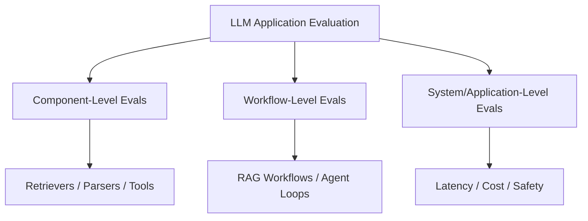
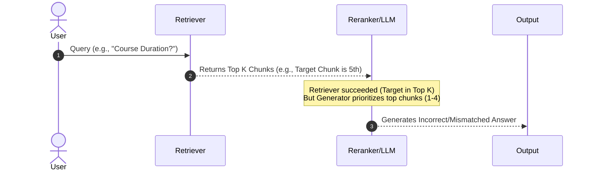
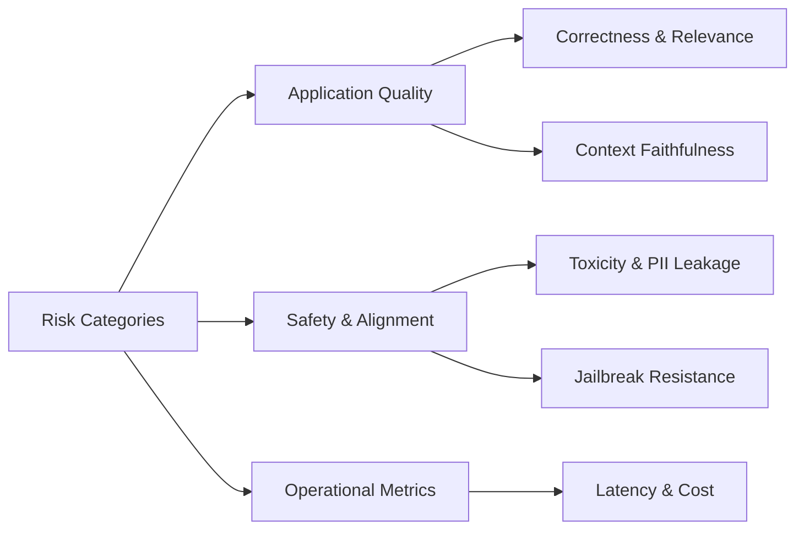

# Why Your AI Application Needs Multiple Eval Pipelines

## Core Overview
When building production-ready Large Language Model (LLM) applications, relying on a single evaluation pipeline is rarely sufficient. While a general model benchmark evaluates raw capability, evaluating an LLM application requires examining individual components, multi-component workflows, and overall system-level metrics across various operational, safety, and quality dimensions.

---

## 1. Reason 1: Multiple Failure Points
An LLM application consists of chained subsystems, each of which can fail independently or interact poorly with others. A breakdown can occur at three distinct structural levels.

### A. Component-Level Failures
Individual modules within the pipeline might fail to execute their specific duty:
* **Retrievers:** Fetching irrelevant or insufficient chunks from the database.
* **Generators / LLMs:** Hallucinating or failing to adhere to instructions despite receiving valid context.
* **Parsers / Tools:** Output parsing errors or selecting incorrect tool parameters.

### B. Workflow-Level Failures (Component Interactions)
Even when individual components pass isolated checks, their combination can still lead to failure.

* **Example:** In a Retrieval-Augmented Generation (RAG) system with $K=5$, the retriever successfully brings the correct chunk at rank 5. The retriever passes its component test. However, the generator focuses heavily on top-ranked chunks (ranks 1–4) and outputs an incorrect answer. Individually both performed as designed, but the **workflow failed**, necessitating a dedicated workflow-level evaluation (and architectural fixes like a Re-ranker).

### C. System & Application-Level Failures
System-level failures occur when the overall output meets correctness standards but violates operational bounds:
* **Latency:** High response times (e.g., 10+ seconds per query) making the app unsuitable for production.
* **Token Costs:** Over-budget consumption per user interaction.

---

## 2. Multi-Level Evaluation Hierarchy

| Evaluation Level | Target Scope | Key Focus / Examples |
| :--- | :--- | :--- |
| **Component Level** | Individual sub-modules | Prompt adherence, Retriever Recall, Tool Selection Accuracy, Output Parser correctness. |
| **Workflow Level** | Multi-component pipelines | RAG Faithfulness/Groundedness, Multi-turn Context Retention, Agent Error Recovery. |
| **Application Level** | End-to-end user experience | End-to-end Latency, Cost per Request, Token Efficiency, First-Token Latency (TTFT). |

---

## 3. Reason 2: Diverse Risk Categories
A single score cannot encompass the multi-dimensional requirements of real-world AI applications. Evaluation pipelines must be grouped by specific risk categories:

### Risk Taxonomy Breakdown

| Risk Category | Dimension | Scope / Metrics |
| :--- | :--- | :--- |
| **Application Quality** | General LLM | Correctness, Accuracy, Relevance, Completeness, Instruction Following. |
| | RAG Specific | Context Relevance, Retriever Recall, Groundedness / Faithfulness, Citation Accuracy. |
| | Agent Specific | Tool Selection, Parameter Correctness, Task Completion Rate, Error Recovery. |
| | Multi-turn Chatbot | Context Retention, Clarification Behavior on Ambiguous Inputs. |
| **Safety & Alignment** | Content Safety | Toxicity, Harmful Content (e.g., Self-harm, Illegal actions), Demographic Bias. |
| | Data & Security | PII / Sensitive Data Leakage, Prompt Injection, Jailbreak Resistance. |
| **Operational Performance** | Runtime Efficiency | End-to-End Latency, Time to First Token (TTFT), Latency under Load. |
| | Financial / Resource | Cost per Request, Token Efficiency, Failure/Error Rate. |

---

## Summary
* **Layered Evaluation:** Because errors occur across components, workflows, and global application constraints, a robust system requires dedicated evaluation pipelines at every level.
* **Separation of Concerns:** Quality, Safety, and Operational metrics address orthogonal risks — evaluating correctness alone will not prevent latency issues or security vulnerabilities.
* **Continuous Feedback:** Insights from production failures should continuously cycle back to update golden datasets and refine specialized evaluation pipelines.
