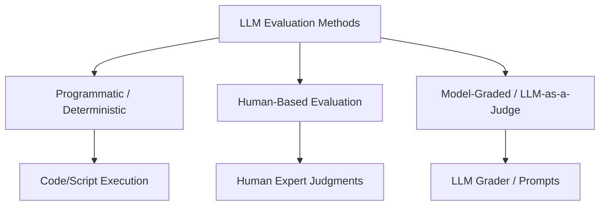
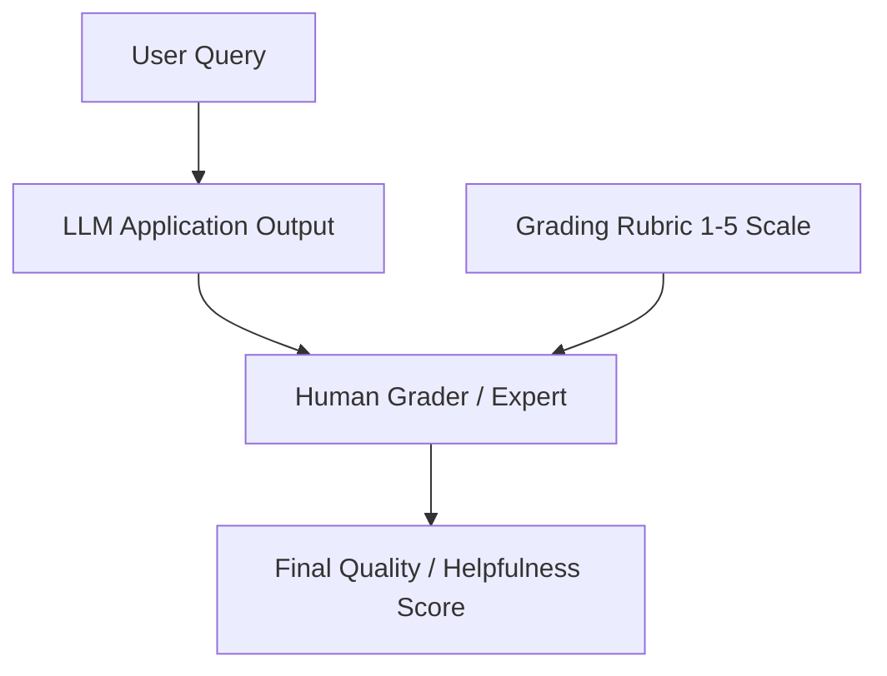
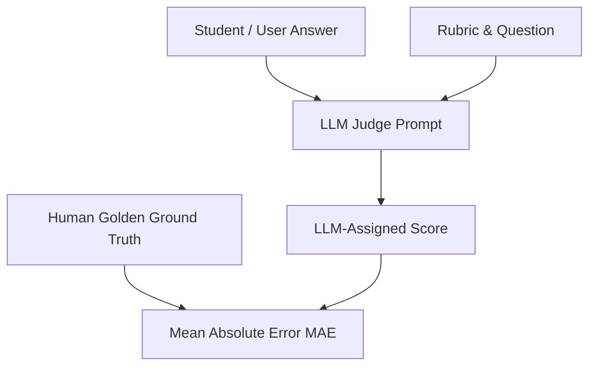
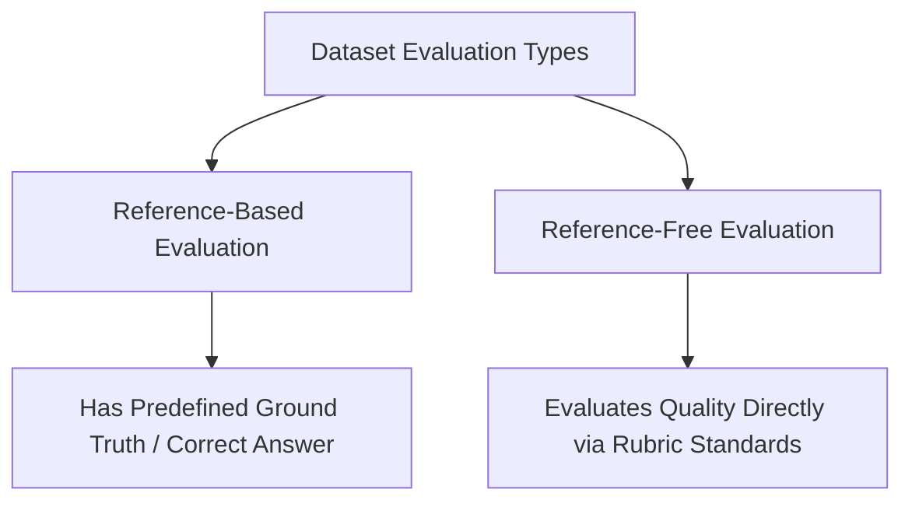

# LLM Evaluation Methods: Complete Guide

## Core Concept: What is an LLM Eval Method?
An **LLM Evaluation Method** is the specific mechanism or procedure used to judge whether an LLM or LLM-based application's output meets defined criteria. 

While the evaluation pipeline structures *what* to evaluate (components, workflows, or global application characteristics), the **evaluation method** defines *who or what executes* the judgment.



---

## 1. Programmatic (Deterministic) Evaluation

### Definition
Programmatic evaluation relies on traditional code algorithms and mathematical metrics to compute performance deterministically, without involving humans or LLMs during runtime execution.

```mermaid
graph TD
    A[Input Query] --> B[Retriever System]
    B --> C[Top-K Documents]
    C --> D[Python Script]
    D --> E[Golden Ground Truth]
    E --> F[Recall@K Score]
```

### Case Study: RAG Retriever Component Evaluation
* **Objective:** Evaluate if a RAG Retriever correctly pulls relevant documents from a vector database.
* **Success Metric:** **Recall@K**

  > Recall@K = (Number of Relevant Documents Retrieved in Top K) ÷ (Total Number of Relevant Documents in Ground Truth)

* **Golden Dataset:** A set of 50–100 realistic queries paired with human-annotated relevant document IDs (e.g., Document IDs `1001`, `1003`).

### Step-by-Step Workflow
1. Pass query *Q_i* to the retriever (e.g., *K=5*).
2. Obtain retrieved document IDs.
3. Use a Python script to compare retrieved IDs against golden document IDs.
4. Calculate Recall@K per row and average across all rows.

### Strategic Improvements
If Recall@K is below the desired target (e.g., 67%), system engineers can:
* Change or fine-tune embedding models.
* Implement query expansion techniques.
* Increase *K* parameter values.
* Introduce a Re-ranker stage.

---

## 2. Human-Based Evaluation

### Definition
Human-based evaluation leverages human expertise to grade nuances, tone, clarity, and overall helpfulness that automated scripts cannot easily evaluate.



### Case Study: End-to-End Chatbot Helpfulness
* **Target:** General customer support or educational platform chatbot.
* **Metric:** Helpfulness Rubric (1 to 5 scale).
  * **5:** Accurate, complete, well-toned, highly relevant.
  * **3:** Partially helpful or incomplete.
  * **1:** Unhelpful, incorrect, or irrelevant.

### Step-by-Step Workflow
1. Send evaluation dataset queries to the live chatbot to collect responses.
2. Provide human annotators with the query, chatbot response, and grading rubric.
3. Annotators assign scores based on manual review.

### Human Evaluation Types in LLM Workflows
1. **Direct Grading / Rating:** Assigning numerical scores or binary pass/fail based on rubrics.
2. **Red Teaming:** Adversarial human experts actively probing the system to expose safety vulnerabilities, jailbreaks, and failure modes.
3. **A/B Testing in Production:** End users rating responses or preferring one model variant over another.
4. **Golden Dataset Creation:** Domain experts curating ground-truth pairs and evaluation rubrics.
5. **Human-in-the-Loop (HITL):** Passing ambiguous or low-confidence edge cases to humans for final validation.

### Pros and Cons

| Feature | Advantage / Disadvantage | Description |
| :--- | :--- | :--- |
| **Reliability** | **Advantage** | High nuance detection, deep context understanding, trustworthy reasoning. |
| **Scalability & Cost** | **Disadvantage** | Extremely expensive, slow, and unfeasible at continuous production scale. |

---

## 3. Model-Graded Evaluation (LLM-as-a-Judge)

### Definition
Model-graded evaluation uses a powerful LLM (e.g., GPT-4o, Claude 3.5 Sonnet) acting as a "Judge" to grade responses produced by another LLM or application using explicit prompts and rubrics.



### Case Study: Automated Subjective Exam Grading (e.g., UPSC Mains Answers)
* **Problem:** Subjective essay grading requires domain experts, making large-scale manual grading prohibitively expensive.
* **Goal:** Build an automated LLM grading platform that mimics human expert grading behavior.
* **Success Metric:** **Mean Absolute Error (MAE)** between Human Expert Scores and LLM Judge Scores.

  > MAE = (1/N) × Σ |Score_Human − Score_LLM|  (summed over all N examples)

### Step-by-Step Workflow
1. **Rubric Definition:** Define multi-dimensional criteria (e.g., core concepts, logical flow, mechanisms, examples, balanced conclusion).
2. **Golden Dataset Curation:** Collect 50–100 student responses graded manually by human domain experts.
3. **LLM Judge Prompt Setup:** Instruct the judge model with explicit scoring parameters, constraints against verbosity/keyword-stuffing, and structured JSON output requirement containing assigned marks and reasoning.
4. **Execution & Comparison:** Pass the student answer to the LLM judge and calculate MAE against human ground truth.
5. **Iterative Refinement:** Systematically optimize the prompt, rubric, or judge model until MAE approaches zero.

---

## 4. Reference-Based vs. Reference-Free Evaluations



### Comparison Taxonomy

| Evaluation Type | Definition | Example Scenarios |
| :--- | :--- | :--- |
| **Reference-Based** | Evaluates outputs against a pre-defined "golden answer" or ground truth. | • **Retriever Recall:** Ground truth document IDs provided.<br/>• **UPSC Grading:** Human expert scores used as the golden reference. |
| **Reference-Free** | Evaluates output quality directly using criteria/rubrics without needing a per-item reference answer. | • **Helpfulness Rating:** Judging chatbot responses on a 1–5 scale purely against quality guidelines.<br/>• **Toxicity & Safety Checks:** Scanning for policy violations directly on the output. |

---

## Summary Matrix of LLM Evaluation Methods

| Method | Best Used For | Scalability | Cost | Precision / Nuance |
| :--- | :--- | :--- | :--- | :--- |
| **Programmatic** | Structured outputs, Retrieval Recall/Precision, exact rule matching. | High | Very Low | Deterministic / Low Nuance |
| **Human-Based** | Nuanced text, initial rubric validation, red-teaming, safety bounds. | Low | Very High | Highest / Gold Standard |
| **LLM-as-a-Judge** | Subjective evaluations, open-ended quality checks, scalable automation. | High | Medium | High (When properly calibrated) |
