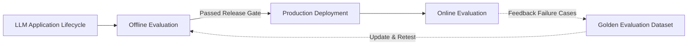
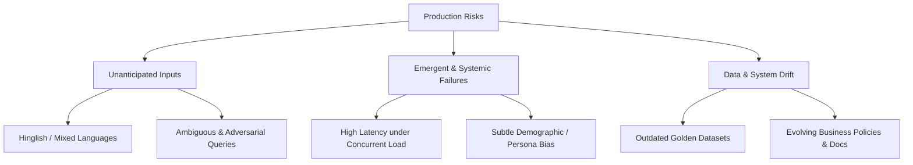
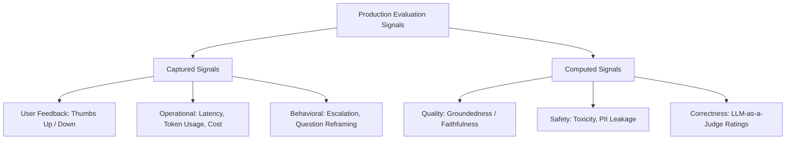
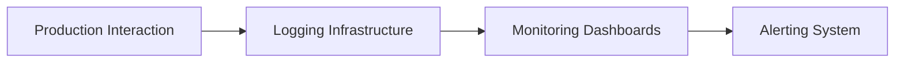
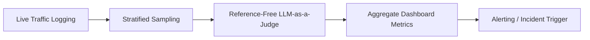
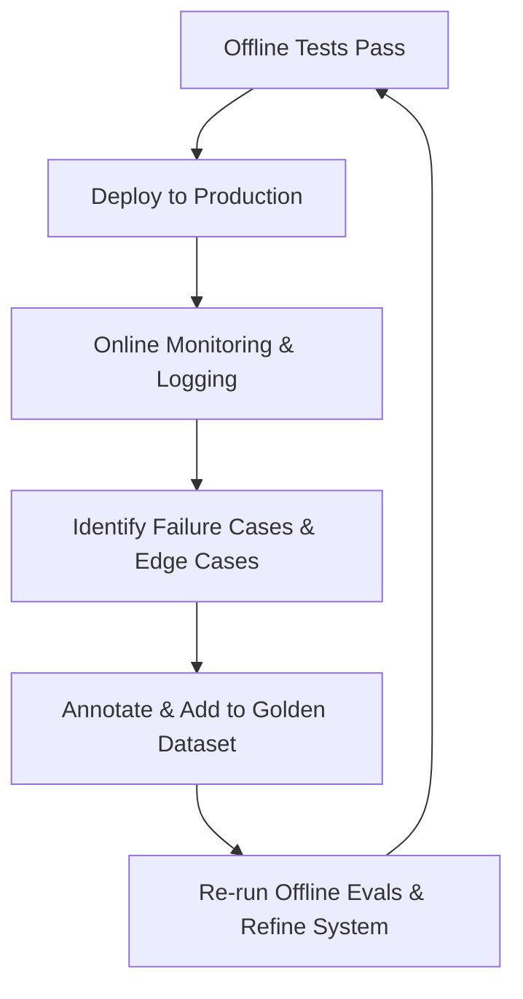

# Offline Evals vs. Online Evals: Complete Guide

## Core Overview
When building production-ready Large Language Model (LLM) applications, evaluation must occur across two main lifecycle phases: **Offline Evaluation** (before deployment) and **Online Evaluation** (after deployment in production). While offline evals verify that the system is *correct*, online evals ensure the system continues running *normally* under live real-world traffic.

---

## 1. Offline Evaluation (Pre-Deployment)

### Definition
**Offline Evaluation** refers to running evaluation pipelines on an LLM application before it is deployed to production. It relies on a pre-curated, fixed **Golden Evaluation Dataset** and known answer keys or expert-defined rubrics.

### Core Objectives & Benefits
1. **Pre-Release Testing & Release Gating:** Serves as a quality barrier in CI/CD pipelines (e.g., automatically deploying code only if the evaluation score exceeds 95%).
2. **Version & Architecture Comparison:** Benchmarking multiple system configurations (e.g., comparing OpenAi vs. Claude, testing different embedding models, re-rankers, or system prompts) on the exact same dataset.
3. **Regression Testing:** Verifying that a local improvement (e.g., tweaking a prompt to make the tone friendlier) does not silently degrade performance on other metrics or tasks.

---

## 2. Production Risks Uncovered After Deployment

Offline evaluation cannot catch all production failure modes. Once deployed, applications face three main categories of production risk:

1. **Unanticipated Inputs:** Real-world users generate diverse, unstructured, mixed-language (e.g., Hinglish), angry, or adversarial inputs that were never present in the golden dataset.
2. **Emergent & Systemic Failures:** Issues that only manifest at scale, such as high latency spikes during concurrent user loads or subtle biases observable only across thousands of sessions.
3. **Data & System Drift:** Over time, business policies, pricing, and underlying documentation change. As a result, the original golden dataset becomes obsolete, causing offline test scores to diverge from real user satisfaction.

---

## 3. Online Evaluation (Post-Deployment)

### Definition
**Online Evaluation** involves continuously monitoring and evaluating live production traffic as real users interact with the application. Unlike offline evals, online evals operate **without fixed ground-truth answer keys**.

### Signal Taxonomy in Production

Production evaluation tracks two distinct categories of signals:

1. **Captured Signals (Direct Telemetry):** Telemetry harvested directly without real-time computation, such as user feedback (thumbs up/down), latency, token costs, and escalation requests.
2. **Computed Signals (Runtime Evaluation):** Metrics calculated by secondary evaluation models (e.g., an LLM-as-a-Judge checking faithfulness, hallucination rates, or toxicity on production logs).

---

## 4. Architectural Flows for Online Evals

### A. Captured Signals Flow
For direct telemetry (e.g., latency, cost, error rates), data flows directly from logging to monitoring dashboards and automated alerting systems.

### B. Computed Signals Flow (Sampling & LLM-as-a-Judge)
Because running an LLM Judge on 100% of live traffic is cost-prohibitive, production pipelines use **stratified sampling** (prioritizing sessions with negative feedback, escalations, or sensitive topics) before invoking the evaluator.

### Engineering Best Practices for Logging
* **Non-Blocking Execution:** Asynchronous logging ensures evaluation operations do not add latency to the user interaction.
* **PII Masking:** Redacting sensitive personal data (e.g., credit card numbers, phone numbers) before pushing logs to observability platforms.
* **Late-Signal Attachment:** Correlating delayed user actions (e.g., an email sent to support hours later) back to the original session ID.

---

## 5. Offline vs. Online Evaluation Comparison

| Dimension | Offline Evaluation | Online Evaluation |
| :--- | :--- | :--- |
| **Execution Timing** | Pre-deployment (Development / CI/CD) | Post-deployment (Production runtime) |
| **Primary Goal** | Verify correctness and prevent regressions | Monitor normal operation, catch drift, and detect emergent bugs |
| **Data Source** | Fixed Golden Evaluation Dataset | Live production user traffic |
| **Ground Truth / Answer Key** | Available (Pre-defined references & expert scores) | Not available (Reference-free checks, baseline comparisons, user feedback) |
| **Primary Use Cases** | Release gating, CI/CD, A/B model/prompt comparison | Drift detection, incident alerting, real-world user feedback tracking |
| **Cost & Speed** | Fast, inexpensive, and highly repeatable | Continuous operation; requires sampling to manage costs |

---

## 6. The Self-Improving Evaluation Loop

Offline and online evals are not mutually exclusive; they form a continuous, closed-loop feedback cycle:

1. **Deployment:** Systems meeting offline thresholds are pushed to production.
2. **Monitoring:** Online evaluation captures edge cases, negative feedback, and unexpected failures.
3. **Dataset Curation:** Production failure cases are annotated and merged back into the Golden Evaluation Dataset.
4. **Iterative Refinement:** Offline evaluation suites are updated with these real-world failure cases, preventing future regressions.
