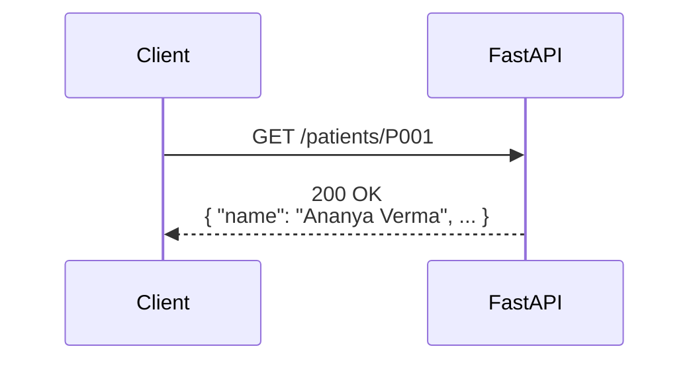
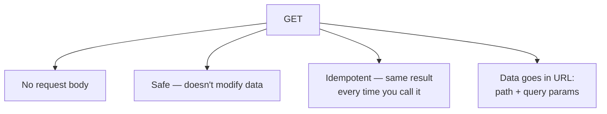

# The GET Method in FastAPI

## What GET Is For

`GET` is the HTTP method used to **retrieve** data from the server without changing anything. It's the most common method — every time you load a webpage or fetch a record, you're making a GET request.



## Key Properties of GET



- **No body** — a GET request doesn't carry a payload; any data you send goes in the URL itself (path or query parameters)
- **Safe** — calling GET should never change server state. It only reads.
- **Idempotent** — calling it once or a hundred times gives you the same result, since it isn't creating or modifying anything
- **Cacheable** — because it's read-only and repeatable, browsers and proxies can cache GET responses

## GET in Your Patient Management API

Your project already uses `@app.get(...)` for all three of its current routes:

```python
@app.get("/")
def hello():
    return {"message": "Patient Management system"}

@app.get("/about")
def about():
    return {"message": "A fully functional Patient Management system API."}

@app.get("/patients")
def patients():
    data = load_data()
    return data
```

Each one reads and returns data — nothing is created, changed, or deleted. That's the signal that GET is the right method to use.

A GET with a path parameter, like retrieving one specific patient, follows the same rule:

```python
@app.get("/patients/{patient_id}")
def get_patient(patient_id: str):
    data = load_data()
    if patient_id in data:
        return data[patient_id]
    raise HTTPException(status_code=404, detail="Patient not found")
```

`GET /patients/P002` reads Ravi Mehta's record and returns it — the underlying `patients.json` file is untouched.

## When *Not* to Use GET

If an action creates, updates, or deletes something — like adding a new patient record — GET is the wrong tool, even though it's tempting to "just add a parameter." That's what `POST`, `PUT`, and `DELETE` are for, which we can cover next.

## Quick Rule of Thumb

If the request's only job is to **read and return data**, it's a GET. If it changes anything on the server, it isn't.
