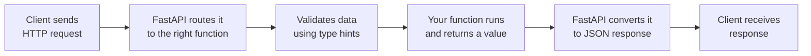

# How FastAPI Works (Simple Version)

## The Basic Flow



## Step by Step

1. **Request comes in** — a client hits an endpoint, e.g. `GET /items/5`
2. **Routing** — FastAPI matches the URL to the function you wrote with `@app.get("/items/{id}")`
3. **Validation** — if your function expects `id: int`, FastAPI checks and converts the input automatically
4. **Your code runs** — normal Python, doing whatever logic you wrote
5. **Response conversion** — whatever you return (dict, Pydantic model, etc.) gets turned into JSON
6. **Response sent back** — client gets the result, plus the correct status code and headers

## A Tiny Example

```python
from fastapi import FastAPI

app = FastAPI()

@app.get("/items/{item_id}")
def read_item(item_id: int):
    return {"item_id": item_id}
```

- `item_id: int` tells FastAPI to validate and convert the URL parameter to an integer
- The return value is automatically turned into a JSON response
- Docs at `/docs` are generated from this same code — nothing extra to write

That's the core loop: **request → route → validate → run → serialize → respond.**
