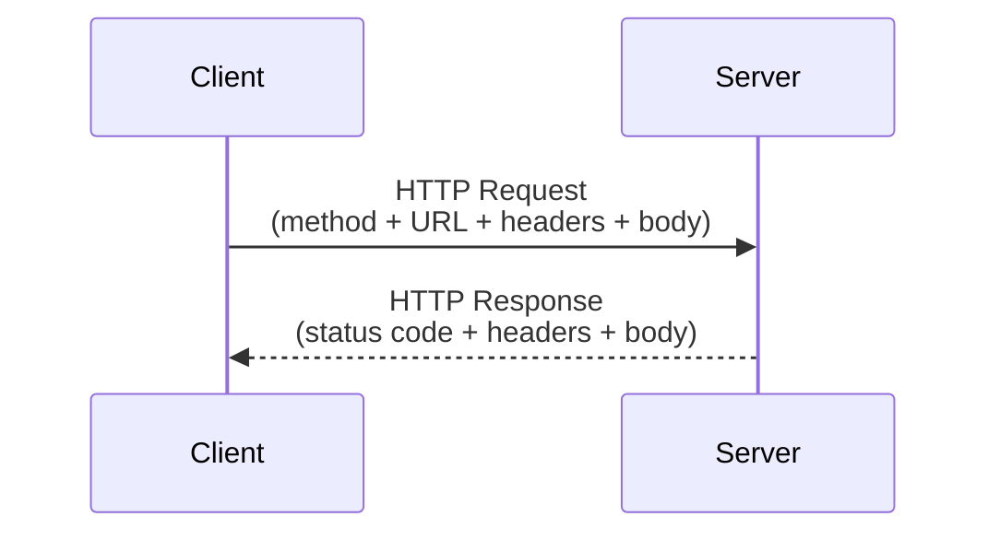
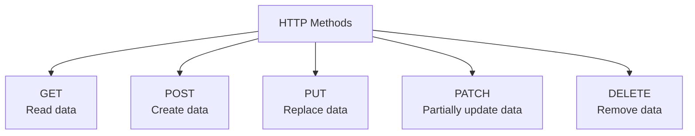

# HTTP and HTTP Methods

## What Is HTTP?

HTTP (HyperText Transfer Protocol) is the set of rules that lets a client (like a browser, or your frontend app) talk to a server (like a FastAPI app) over the internet. It's a **request-response** protocol: the client sends a request, the server sends back a response.



Every HTTP request has a **method** that tells the server *what kind of action* the client wants to perform.

## The Main HTTP Methods



| Method | Purpose | Has a body? | Safe to repeat? |
|---|---|---|---|
| **GET** | Retrieve a resource | No | Yes (idempotent) |
| **POST** | Create a new resource | Yes | No — creates a new one each time |
| **PUT** | Replace a resource entirely | Yes | Yes (idempotent) |
| **PATCH** | Update part of a resource | Yes | Usually yes |
| **DELETE** | Remove a resource | No (usually) | Yes (idempotent) |

**Idempotent** means: calling it once or ten times has the same end result. `DELETE /items/5` deletes item 5 whether you call it once or five times — item 5 is just gone. But `POST /items` called five times creates five new items.

## How This Maps to FastAPI

```python
from fastapi import FastAPI

app = FastAPI()

@app.get("/items/{id}")      # Read
def get_item(id: int): ...

@app.post("/items")          # Create
def create_item(): ...

@app.put("/items/{id}")      # Replace
def replace_item(id: int): ...

@app.patch("/items/{id}")    # Partial update
def update_item(id: int): ...

@app.delete("/items/{id}")   # Delete
def delete_item(id: int): ...
```

FastAPI uses these decorators (`@app.get`, `@app.post`, etc.) to bind a Python function directly to an HTTP method and a URL path.

## Status Codes, Briefly

The response also carries a **status code**, telling the client how it went:

- **2xx** — success (`200 OK`, `201 Created`, `204 No Content`)
- **4xx** — client made a mistake (`400 Bad Request`, `404 Not Found`)
- **5xx** — server made a mistake (`500 Internal Server Error`)

That's the core of HTTP: **a method saying what you want to do, a URL saying what you want to do it to, and a status code saying how it went.**
