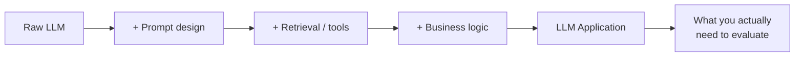
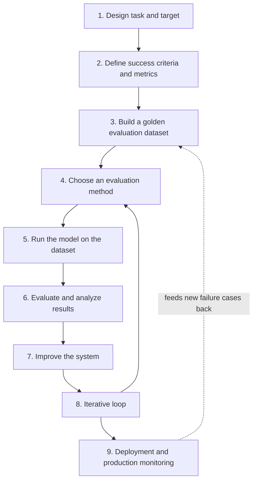
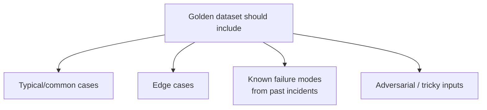
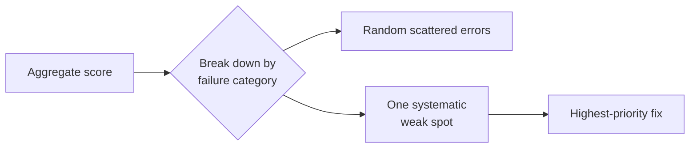
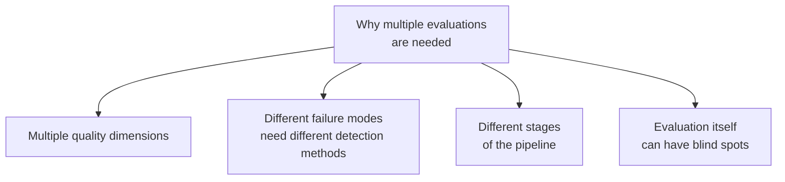

# LLM Application Evaluation: The Full Workflow

## What Is LLM Application Evaluation?

This is a step up from evaluating a raw model. An **LLM application** wraps a model with prompts, retrieval, tools, and business logic — so evaluating it means judging the *whole system's* behavior on the tasks it's actually built for, not the model's general capability in isolation.

A model can be excellent on benchmarks and still make your specific application fail — because the failure lives in the prompt, the retrieval step, or how errors are handled, not in the model itself.

## The Nine-Step Workflow

### 1. Design the Task and Target

Define precisely what the application is supposed to do, and for whom. "Summarize customer support tickets for triage" is a target; "be a good chatbot" is not. Without a sharp task definition, every later step has nothing concrete to check against.

### 2. Define Success Criteria and Metrics

Translate the task into measurable criteria. For a support-ticket summarizer: does it capture the customer's actual issue, does it flag urgency correctly, does it stay under a length limit. Each criterion needs a metric or judging method attached to it — this is where the evaluation-vs-metrics distinction matters: the criteria are the questions, metrics are how you'll answer them.

### 3. Build a Golden Evaluation Dataset

A **golden dataset** is a curated set of inputs with known-correct (or expert-approved) outputs or labels. It should reflect real usage: typical cases, edge cases, and known hard cases, not just easy examples.

This dataset becomes the fixed yardstick every future version of the application gets measured against — similar in spirit to a benchmark, but specific to your task rather than general-purpose.

### 4. Choose an Evaluation Method

Decide *how* outputs will be judged:

| Method | Good for | Tradeoff |
|---|---|---|
| Exact match / rule-based | Structured outputs (classification, extraction) | Can't judge nuance or open-ended text |
| Automated metrics (ROUGE, etc.) | Quick, cheap signal | Correlates imperfectly with real quality |
| LLM-as-judge | Open-ended text, scoring against a rubric | Judge model has its own biases/errors |
| Human review | Highest fidelity, catches subtle issues | Slow, expensive, hard to scale |

Most serious evaluations combine more than one.

### 5. Run the Model on the Evaluation Dataset

Execute the application (not just the raw model) against every item in the golden dataset, capturing full outputs and any intermediate steps (retrieved documents, tool calls) for later inspection.

### 6. Evaluate and Analyze Results

Score the outputs using the method from step 4, then look past the aggregate number — group failures by type. "72% pass rate" hides whether the 28% failing is random noise or one systematic weak spot (e.g. always mishandling refund requests).

### 7. Improve the System (Prompt and Model Optimization)

Fix what step 6 found — this might mean rewriting the prompt, adjusting retrieval, adding few-shot examples, switching models, or adding a validation/guardrail step. Note that "improve the model" is often the smallest lever available; prompt and system-level fixes are usually faster and cheaper.

### 8. Iterative Evaluation and Improvement Loop

Re-run steps 4–7 after each change. This isn't a one-time pass — it's a loop, because a fix for one failure category can introduce regressions elsewhere. The golden dataset from step 3 is what makes this loop trustworthy: without a fixed yardstick, you can't tell whether a change actually helped.

### 9. Deployment and Production Monitoring

Once shipped, real-world traffic will surface cases your golden dataset didn't anticipate. Production monitoring — logging outputs, tracking user feedback/complaints, sampling for periodic review — closes the loop by feeding new failure cases back into the golden dataset (step 3), starting the cycle again.

## Why One LLM Application Needs Multiple Evaluations

A single evaluation almost never covers everything that can go wrong, for a few concrete reasons:

- **Multiple quality dimensions** — correctness, safety, tone, latency, and cost are all "quality," but a single metric can't capture all of them at once. A response can be factually correct and still be unsafe, too slow, or off-brand.
- **Different failure modes need different detection methods** — hallucination needs factual-consistency checking; tone problems need human or LLM-judge review; format errors need rule-based checks. One evaluation method won't catch all of these.
- **Different stages of the pipeline can each fail independently** — retrieval can return the wrong documents even if the model reasons perfectly over whatever it's given; evaluating only the final output can miss that the retrieval step is the actual problem.
- **Evaluation methods have their own blind spots** — automated metrics miss nuance, LLM-judges inherit their own biases, golden datasets can't cover every real-world case. Layering multiple evaluation approaches compensates for each one's individual weaknesses.
- **Pre-deployment vs. post-deployment needs differ** — a golden dataset evaluation tells you if the system is *ready to ship*; production monitoring tells you if it's *still working* under real, evolving usage. These are different questions requiring different evaluation setups.

## Summary

- LLM application evaluation judges the whole system — prompt, retrieval, tools, and model together — not just the underlying model
- The workflow is a loop, not a line: steps 4–8 repeat every time the system changes, and production (step 9) feeds new cases back into the golden dataset
- No single evaluation is sufficient, because quality has multiple dimensions, failures happen at different pipeline stages, and every evaluation method has its own blind spots — so applications need a layered set of evaluations, not one
