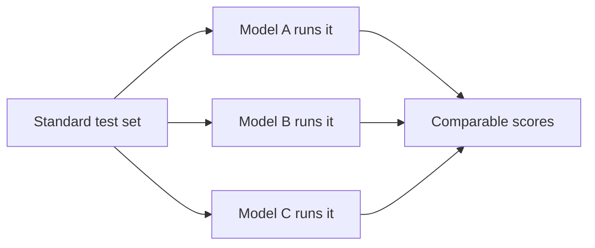
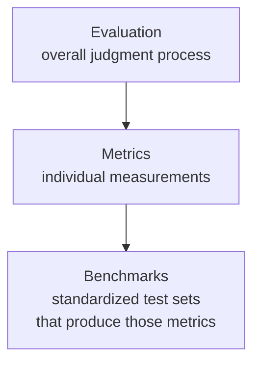
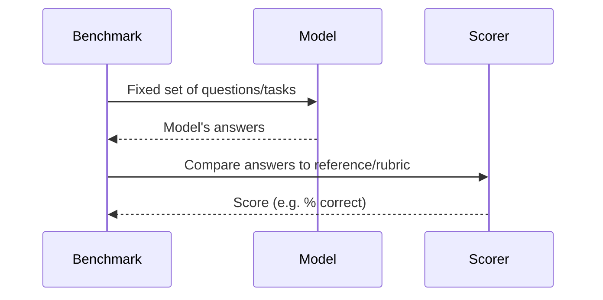
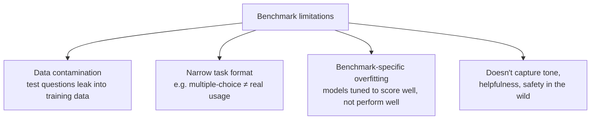
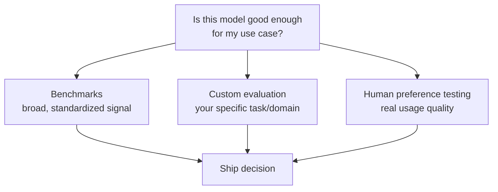

# What Are LLM Benchmarks?

## What Is a Benchmark?

A benchmark is a **standardized test set** used to measure and compare LLM performance. It's a fixed, published set of tasks or questions, run the same way across different models, so results can be compared apples-to-apples.

## How a Benchmark Fits with Evaluation and Metrics

A benchmark is a specific kind of evaluation tool: it packages a fixed test set with a defined scoring metric, so anyone can reproduce the same measurement.

- **Metric** — the measurement itself (e.g. accuracy)
- **Benchmark** — the specific, fixed test set + scoring rule that produces that metric, published so results are comparable across models

## Common Categories of Benchmarks

| Category | What it tests | Examples |
|---|---|---|
| General knowledge / reasoning | Broad academic and world knowledge | MMLU, ARC |
| Math | Multi-step mathematical reasoning | GSM8K, MATH |
| Code | Ability to write correct, working code | HumanEval, MBPP |
| Commonsense reasoning | Everyday logical inference | HellaSwag, WinoGrande |
| Truthfulness | Resistance to confidently stating falsehoods | TruthfulQA |
| Conversational quality | Helpfulness/preference in open dialogue | Chatbot Arena (human preference-based) |
| Safety | Refusal of harmful requests, robustness | Various red-teaming suites |

## How a Typical Benchmark Works

For something like MMLU, this means thousands of multiple-choice questions across dozens of subjects, scored by exact match against the known correct answer — a metric that's simple, reproducible, and easy to compare across model releases.

## Why Benchmarks Are Useful

- **Comparability** — same test, same rules, across every model that runs it
- **Tracking progress over time** — you can see a field's capability improve release over release
- **Cheap and fast** — often fully automated, no human raters needed

## Why Benchmarks Alone Aren't Enough

This is the same gap noted in the evaluation-vs-metrics distinction — benchmarks are just one class of metric, and they have real limitations:

- **Contamination** — if benchmark questions were in a model's training data, its score is inflated and doesn't reflect real capability
- **Format mismatch** — multiple-choice accuracy doesn't necessarily predict quality in open-ended, real-world conversation
- **Goodhart's law in practice** — once a benchmark becomes a target, teams can optimize for it specifically, which can decouple the score from actual usefulness
- **Saturation** — as models improve, older benchmarks stop being able to distinguish between them (many models now score near-ceiling on early benchmarks)

## Where Benchmarks Fit in the Bigger Picture

Benchmarks are a useful first-pass signal — especially for comparing models before you've built anything — but they're rarely sufficient on their own for deciding whether a model fits your specific use case. That typically still needs a task-specific evaluation layered on top.

## Summary

- A benchmark is a fixed, standardized test set + scoring rule, used to compare models consistently
- It's one specific *tool* within the broader evaluation process, not a replacement for it
- Useful for broad comparability and tracking progress, but vulnerable to contamination, saturation, and format mismatch with real-world use
