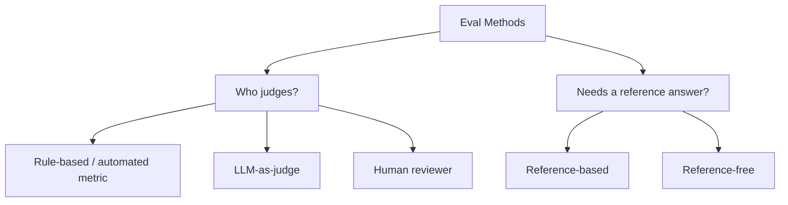
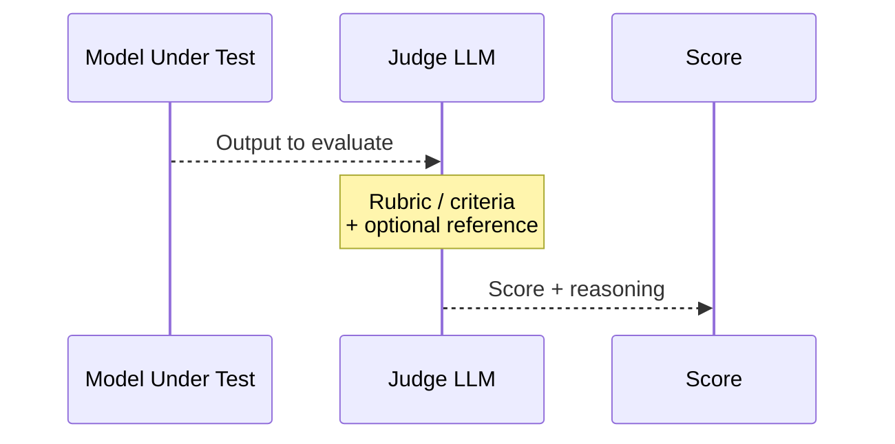
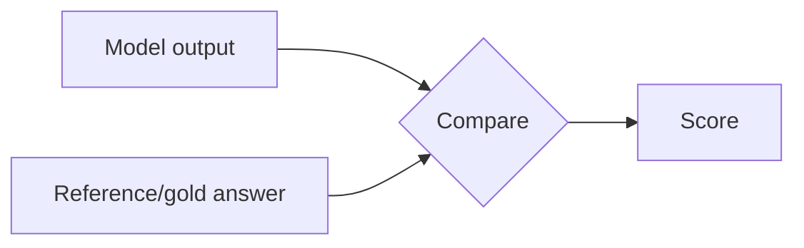
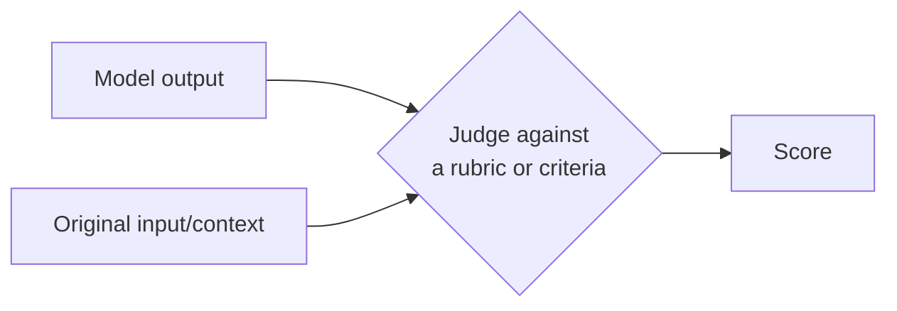
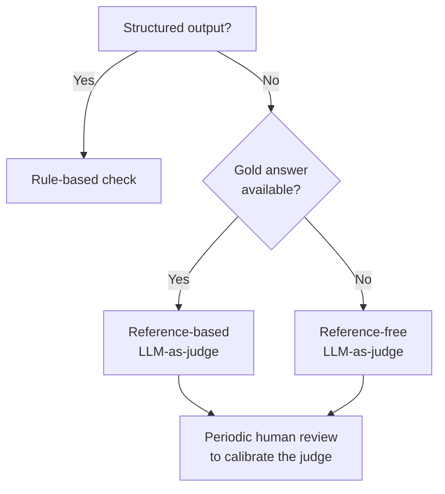

# LLM Eval Methods: LLM-as-Judge, Reference-Based vs. Reference-Free

## The Landscape of Eval Methods

Evaluation methods differ along two mostly-independent axes: **who or what does the judging**, and **whether a "correct answer" is required to judge against**.



Any judge (rule-based, LLM, or human) can be applied in either a reference-based or reference-free way — the two axes combine, they don't replace each other.

## Method 1: Rule-Based / Automated Metrics

Deterministic checks — string match, regex, ROUGE/BLEU overlap, JSON schema validation. Fast, cheap, fully reproducible.

```python
def eval_exact_match(prediction: str, reference: str) -> bool:
    return prediction.strip().lower() == reference.strip().lower()
```

**Good for:** structured outputs, classification, extraction tasks with one correct answer.
**Weak for:** open-ended text, where many different wordings can all be equally correct.

## Method 2: LLM-as-Judge

Use a (usually stronger or separately-tuned) LLM to score another model's output against a rubric, rather than an exact answer.



```python
judge_prompt = """
You are evaluating a customer support response for helpfulness and accuracy.

Customer question: {question}
Response to evaluate: {response}

Rate the response from 1-5 on:
- Correctness: does it address the actual issue?
- Tone: is it professional and empathetic?

Return your score and a one-sentence justification.
"""
```

**Good for:** open-ended text, nuanced quality dimensions (tone, helpfulness, coherence) that rule-based checks can't capture, and scaling past what human review can afford.
**Weak for:** the judge inherits its own biases and blind spots — it can be fooled by confident-sounding wrong answers, tends to favor longer responses, and can be inconsistent across runs without careful prompt design.

### Making LLM-as-Judge More Reliable

- **Clear rubrics** — vague instructions ("rate the quality") produce noisy scores; specific criteria produce consistent ones
- **Few-shot examples** — showing the judge 2-3 scored examples anchors its scale
- **Pairwise comparison over absolute scoring** — "which response is better, A or B?" tends to be more consistent than "rate this 1-10" in isolation
- **Multiple judge calls, averaged** — reduces the effect of any single run's noise

## Reference-Based Evaluation

The output is compared against a **known correct (or expert-approved) answer** — the "reference" or "gold" answer.



```python
def reference_based_eval(prediction: str, reference: str, judge_llm) -> int:
    prompt = f"""
    Reference answer: {reference}
    Model's answer: {prediction}
    Does the model's answer convey the same information as the reference? Score 1-5.
    """
    return judge_llm(prompt)
```

**Good for:** tasks with a clear correct answer — factual Q&A, translation, summarization where you have expert-written summaries, code that must pass specific test cases.
**Weak for:** tasks where multiple valid answers exist (open-ended generation, creative writing, multi-turn conversation) — penalizing a correct-but-differently-worded answer for not matching the reference exactly.

## Reference-Free Evaluation

The output is judged on its own merits — coherence, relevance to the input, internal consistency — with no gold answer required.



```python
def reference_free_eval(question: str, response: str, judge_llm) -> int:
    prompt = f"""
    Question: {question}
    Response: {response}
    Is this response relevant, coherent, and factually plausible given the question? Score 1-5.
    """
    return judge_llm(prompt)
```

**Good for:** open-ended generation, cases where no single correct answer exists, evaluating live production traffic where no gold answer was ever written, catching issues like hallucination or incoherence that aren't about matching a reference.
**Weak for:** can't verify factual correctness against ground truth — a response can be coherent, well-written, and confidently wrong, and a reference-free eval may not catch that.

## Side-by-Side Comparison

| | Reference-Based | Reference-Free |
|---|---|---|
| Requires | A gold/expert answer per input | Just the input + output |
| Best for | Tasks with one correct answer | Open-ended, multi-valid-answer tasks |
| Cost to build | High — writing gold answers is expensive | Lower — no gold answers needed |
| Catches factual errors | Yes, directly | Only indirectly, if at all |
| Catches incoherence/irrelevance | Not directly | Yes, directly |
| Scales to production traffic | Hard — no gold answer for live queries | Easy — works on any output |

## Combining All of This in Practice



A mature eval setup rarely picks just one approach. Golden-dataset pre-release testing tends to lean reference-based (you wrote the gold answers). Production monitoring tends to lean reference-free (live traffic has no gold answer). Both usually use LLM-as-judge for open-ended text, with human review sampled periodically to check the judge itself hasn't drifted.

## Summary

- Judge type (rule-based / LLM / human) and reference requirement (based / free) are independent choices that combine
- **LLM-as-judge** scales past human review for nuanced, open-ended quality but inherits its own biases — mitigate with clear rubrics, few-shot anchoring, and pairwise comparison
- **Reference-based** evals need gold answers and suit tasks with one correct answer; they catch factual errors directly
- **Reference-free** evals work without gold answers and suit open-ended or production-traffic evaluation; they catch incoherence but not confident wrongness
