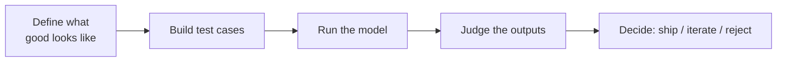
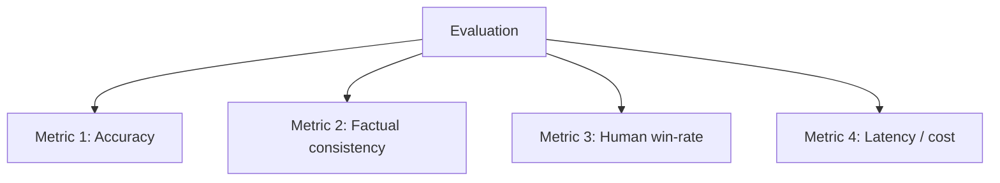
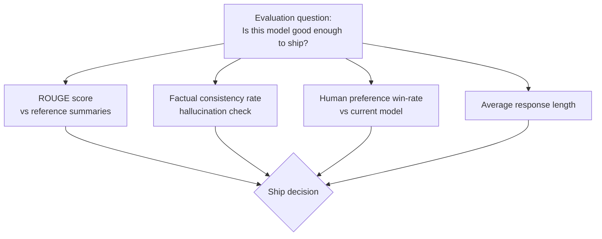

# LLM Evaluation vs. Metrics

## What Is LLM Evaluation?

LLM evaluation is the overall process of judging how well a model performs at a task — correctness, helpfulness, safety, reasoning, tone, or whatever dimension matters for its intended use. It's a *process*: design test cases, run the model against them, judge the outputs.

Judging can be done several ways:

- **Automated metrics** — a formula scores the output
- **LLM-as-judge** — another model rates the output against a rubric
- **Human raters** — people score or compare outputs directly

## What Is a Metric?

A metric is one specific, usually numeric, measurement used *inside* an evaluation. It's a tool, not the whole process.

## The Core Distinction

| | Evaluation | Metric |
|---|---|---|
| What it is | The overall framework for judging model quality | A single quantifiable measurement |
| Scope | Combines multiple metrics + qualitative judgment | One narrow, specific number |
| Answers | "Is this model good enough for X?" | "What's the accuracy on this test set?" |
| Example | Full assessment of a summarization model before shipping | ROUGE score, exact-match rate, latency |

An evaluation is like a research question. Metrics are the individual pieces of evidence you gather to answer it.

## A Worked Example: Shipping a Summarization Model

No single metric answers the evaluation question on its own. ROUGE can be high while the summary is subtly wrong; factual consistency can be perfect while the summary reads awkwardly. The evaluation combines them into a judgment call.

## Why This Gets Harder for LLMs Specifically

Traditional ML tasks (classification, regression) usually have one correct answer, so a single metric like accuracy or F1 is often sufficient. LLM outputs are open-ended — there's rarely one "correct" summary, translation, or chat response — so metrics alone tend to under-measure quality.

This is why **LLM-as-judge** and **human preference comparisons** have become standard alongside traditional metrics: they can assess things (tone, helpfulness, coherence) that a formula-based metric can't capture on its own.

## Common Failure Mode

A rigorous-*looking* evaluation can still be weak if it's built on the wrong metrics:

- Relying only on BLEU/ROUGE, which correlate poorly with actual output quality
- Testing only one narrow metric and missing whole classes of failure (e.g. checking accuracy but never checking for harmful or biased outputs)
- Treating a benchmark leaderboard score as the whole evaluation, when it's really just one metric among many needed

## Summary

- **Evaluation** = the process and question ("is this model good enough?")
- **Metric** = one measurement feeding into that process
- Good evaluations combine multiple metrics — often automated + LLM-judge + human — because LLM outputs rarely have one right answer
