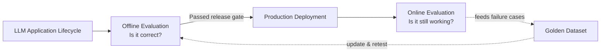
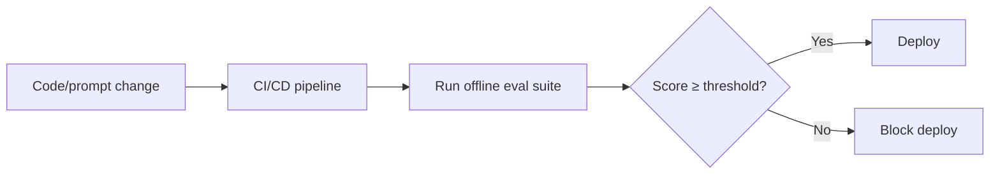
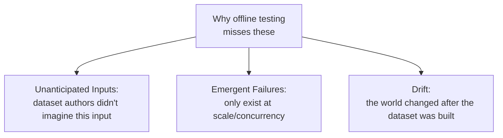
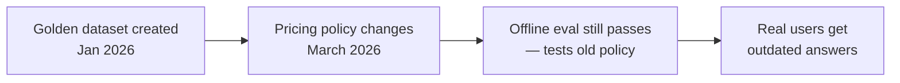
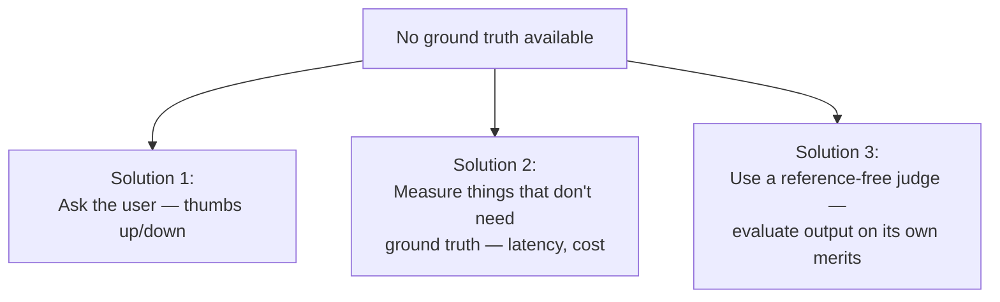
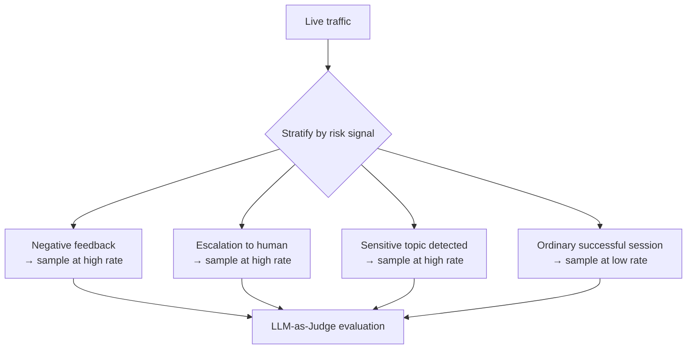
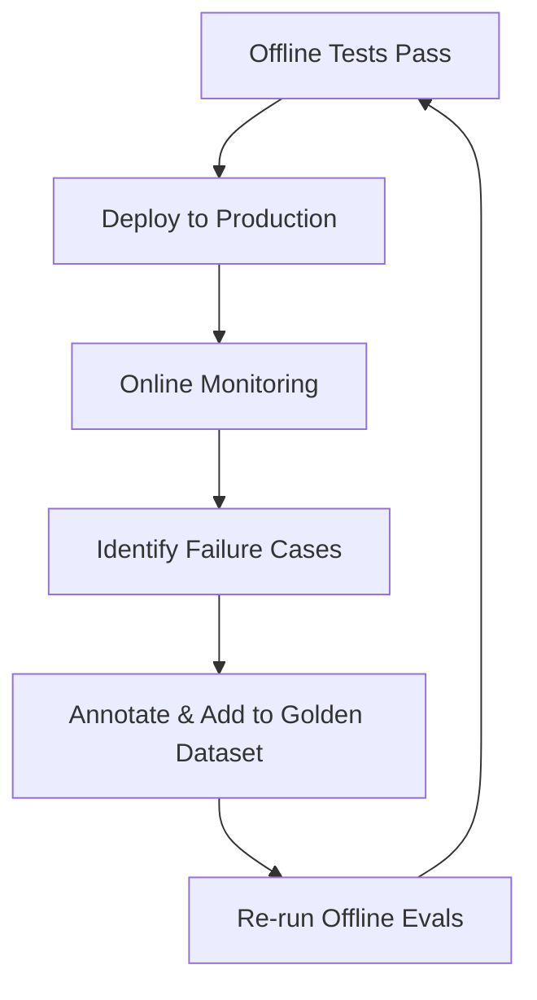

# Offline vs. Online Evals, In Depth

This builds on the core offline/online distinction with deeper explanations, worked examples, and the reasoning behind each design choice — not just what each phase does, but why it's structured that way.

## The Fundamental Split: "Is It Correct?" vs. "Is It Still Working?"



These are different questions because they're asked at different points with different available information. Pre-deployment, you have full control over the test set and time to run expensive checks. Post-deployment, you have real user behavior you couldn't have anticipated, but far less tolerance for slow or costly checks on every single request. The two phases exist because neither question can be answered by the other's method.

## 1. Offline Evaluation: Why It Exists and What It Actually Buys You

### The Core Idea

Offline evaluation runs your system against a **fixed, known dataset** where you already know (or an expert has already judged) what a good answer looks like. Because the dataset and the correct answers don't change, you can compare results across time and across configurations with confidence — any difference in score reflects a real difference in the system, not noise from a shifting test set.

### Why Each Objective Matters

**Release gating** isn't just "run tests before shipping" — it's specifically about having a numeric threshold that blocks a deploy automatically. This matters because it removes a human judgment call from the release path. Without a gate, "is this good enough to ship" becomes a subjective call made under time pressure; with a gate, the bar was set deliberately, in advance, without that pressure.



**Version and architecture comparison** works because the dataset is held constant while you vary one thing — the model, the embedding, the prompt. This is the same logic as a controlled experiment: change one variable, hold everything else fixed, and any score difference is attributable to that one variable.

```python
results = {}
for config_name, system in [("gpt-based", system_a), ("claude-based", system_b)]:
    scores = [evaluate(system.run(item.input), item.golden_answer) for item in golden_dataset]
    results[config_name] = sum(scores) / len(scores)
# Same dataset, same scoring function — only the system under test changes
```

**Regression testing** catches a specific failure pattern: a fix targeted at one problem quietly breaking something that used to work. This only works if the dataset used for regression checks is the *same* dataset run before and after — a changing dataset can't tell you whether a score change is a regression or just a different test.

### What Offline Evaluation Structurally Cannot Do

Because the dataset is fixed and built in advance, offline evaluation is bounded by what you thought to include. It's a closed-world test — a system can max out its offline score while remaining completely untested against anything that dataset didn't anticipate.

## 2. Production Risks: Why These Three Categories Specifically

The three risk categories in the original guide aren't arbitrary — they represent three distinct reasons a fixed dataset fails to anticipate reality.



**Unanticipated inputs** fail because a golden dataset is written by a small group of people trying to imagine how users will behave. Real users are far more numerous and varied than the imagination of a dataset-writing team — mixed-language queries, sarcasm, typos, adversarial phrasing, and simply unexpected phrasing all fall outside what a handful of authors thought to test.

**Emergent and systemic failures** fail differently — they're not about any single input being unusual, but about properties that only exist when many requests interact (concurrent load causing latency spikes) or when you aggregate across many sessions (a bias that's invisible in any one response but clear across a thousand). No per-item offline test, run one item at a time, can surface a pattern that only exists in aggregate or under concurrency.

**Data and system drift** fails for a third, unrelated reason: the dataset was correct *when it was written*, but the world moved. A pricing policy documented in the golden dataset's reference answers can become wrong the day prices change — the test isn't broken, reality is just different now.



This distinction matters operationally: unanticipated inputs are fixed by broadening your dataset, emergent failures are fixed by load/aggregate testing, and drift is fixed by a refresh cadence — three different fixes for three different root causes.

## 3. Online Evaluation: Why "No Ground Truth" Is the Defining Constraint

The single hardest constraint on online evaluation is that nobody has written a correct answer for the query a live user just sent. Every technique in online evaluation exists specifically to work around that missing ground truth.



### Captured vs. Computed Signals — Why the Split Matters

Captured signals are essentially free — they're already happening as a byproduct of serving the request (how long it took, what it cost, whether the user clicked "thumbs down"). Computed signals require *extra* work — running a separate model or process specifically to produce a judgment that wasn't going to exist otherwise (an LLM judge scoring faithfulness).

This distinction drives architecture: captured signals can be logged synchronously with near-zero cost, so you can afford to log 100% of traffic. Computed signals cost real money and time per evaluation, so you can't run them on everything — which is exactly why stratified sampling exists.

## 4. Why Stratified Sampling, Specifically

Running an LLM judge on every production request scales linearly with traffic and cost — at high volume this becomes prohibitively expensive. Random sampling would reduce cost, but it wastes most of its budget re-confirming that ordinary, successful interactions are fine, while rarely catching the rare-but-important failure cases.

**Stratified sampling** solves this by deliberately over-representing the sessions most likely to contain a problem:



```python
def sampling_rate(session):
    if session.user_feedback == "thumbs_down":
        return 1.0   # always evaluate
    if session.escalated_to_human:
        return 1.0
    if session.topic in SENSITIVE_TOPICS:
        return 0.5
    return 0.02      # light background sampling of "normal" traffic
```

The low-rate background sampling of ordinary traffic still matters — it's how you'd detect a *systemic* problem that isn't triggering escalations or thumbs-down yet, like a slow quality drift nobody has complained about.

## 5. The Engineering Constraints Behind "Best Practices"

Each logging best practice solves a specific operational failure mode, not just a generic good habit:

| Practice | The failure it prevents |
|---|---|
| **Non-blocking / async logging** | Evaluation code running synchronously would add latency to every user-facing response — unacceptable for a production system |
| **PII masking before logging** | Sensitive data sitting in logs/observability tools becomes a compliance and security liability the moment it's stored anywhere outside the original request |
| **Late-signal attachment** | User signals often arrive after the session ends (a support email sent hours later) — without a session ID to correlate against, that signal is unusable |

## 6. Why the Loop Has to Be Closed, Not Just Sequential



If failure cases found in production never made it back into the golden dataset, the same failure could resurface after a future change, undetected, because nothing in the offline suite would test for it. The loop closing — production failures becoming new offline test cases — is what makes the offline suite get *stronger* over time instead of staying fixed at whatever the dataset authors originally imagined. This is the direct fix for the "unanticipated inputs" risk from section 2: today's unanticipated input becomes tomorrow's anticipated one, once it's been through this loop.

## Summary: The Underlying Logic

| Question | Offline | Online |
|---|---|---|
| Why does it exist? | Need a controlled, repeatable check before risking real users | Need to catch what a fixed dataset structurally can't anticipate |
| Why fixed dataset / no ground truth? | Enables fair comparison across versions and time | Ground truth doesn't exist yet for traffic that just happened |
| Why sampling in one but not the other? | Offline sets are small and pre-built — no sampling needed | Live traffic volume makes 100% coverage cost-prohibitive |
| How do they connect? | Offline gates every deploy | Online findings become tomorrow's offline test cases |

Offline and online evaluation aren't two separate systems bolted together — they're two halves of one feedback loop, each compensating for a limitation the other one structurally has.
