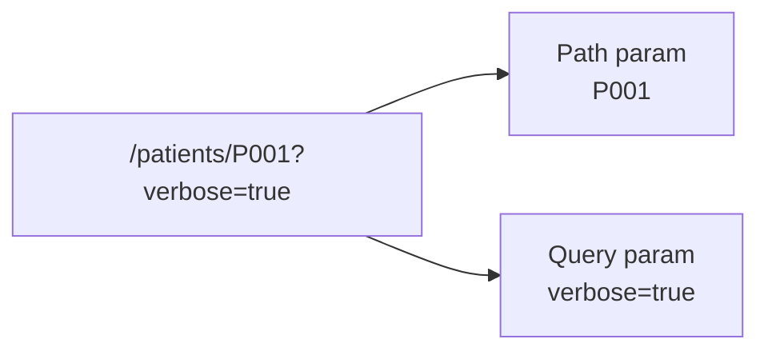
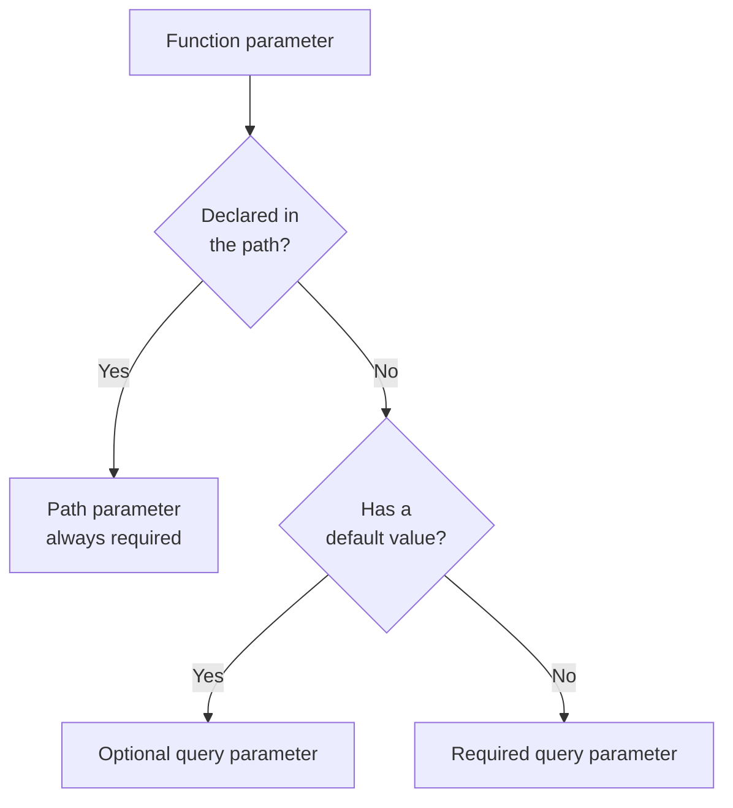

# Path and Query Parameters in FastAPI

A URL has two places to carry data to the server: the **path** itself, and the **query string** after a `?`. FastAPI treats both as ordinary Python function parameters — it just needs to know which is which.



We'll use a real example throughout: a **Patient Management System** API, where patient records are keyed by ID (`P001`, `P002`, ...) and stored with fields like `name`, `city`, `age`, `bmi`, and `verdict`.

```python
from fastapi import FastAPI
import json

app = FastAPI()

def load_data():
    with open("patients.json", "r") as file:
        return json.load(file)

@app.get("/patients")
def patients():
    data = load_data()
    return data
```

This existing `/patients` endpoint returns *every* record. Path and query parameters are how we narrow that down to one record, or filter/sort the list.

## Path Parameters

Path parameters are **part of the URL structure** — they identify a specific resource. You declare them with curly braces in the route, and as a normal argument in the function.

```python
from fastapi import HTTPException

@app.get("/patients/{patient_id}")
def get_patient(patient_id: str):
    data = load_data()
    if patient_id in data:
        return data[patient_id]
    raise HTTPException(status_code=404, detail="Patient not found")
```

- `GET /patients/P001` → `patient_id = "P001"` → returns Ananya Verma's record
- `GET /patients/P999` → `patient_id = "P999"` → not in the data, so we raise a `404`
- Since patient IDs are strings like `"P001"`, the type hint is `str`, not `int` — FastAPI validates whatever type you declare
- Path parameters are usually **required** — they're baked into the URL, so there's no way to "omit" one

## Query Parameters

Query parameters are anything declared in the function that is **not** part of the path. They come after `?` in the URL, separated by `&`.

```python
@app.get("/patients")
def patients(sort_by: str = "name", order: str = "asc"):
    data = load_data()
    sorted_data = sorted(
        data.items(),
        key=lambda item: item[1].get(sort_by, ""),
        reverse=(order == "desc"),
    )
    return dict(sorted_data)
```

- `GET /patients?sort_by=bmi&order=desc` → sorts all patients by BMI, highest first
- `GET /patients` → `sort_by = "name"`, `order = "asc"` (defaults kick in)
- Giving a parameter a default value makes it **optional**; no default makes it **required**



## Combining Both

```python
@app.get("/patients/{patient_id}/summary")
def patient_summary(patient_id: str, verbose: bool = False):
    data = load_data()
    if patient_id not in data:
        raise HTTPException(status_code=404, detail="Patient not found")
    record = data[patient_id]
    if verbose:
        return record
    return {"name": record["name"], "verdict": record["verdict"]}
```

`GET /patients/P003/summary?verbose=true` → `patient_id="P003"` (path, identifies Sneha Kulkarni's record), `verbose=True` (query, controls how much detail comes back).

## Quick Rule of Thumb

- **Path param** → identifies *which* resource (`/patients/{patient_id}`)
- **Query param** → filters, sorts, or shapes the response for *that* resource (`?sort_by=bmi&order=desc`)

FastAPI figures out which is which automatically by matching function parameter names against the `{}` placeholders in your route — no extra configuration needed.
