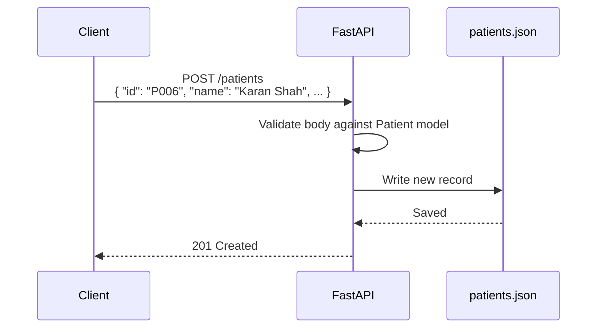
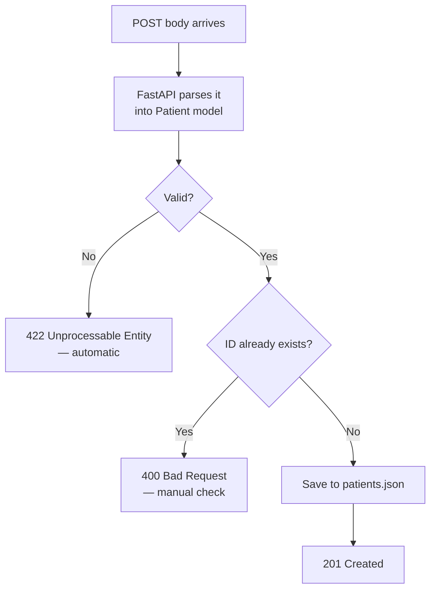

# The POST Method, In Depth

## What POST Does

`POST` is the HTTP method used to **create** a new resource on the server. Unlike `GET`, it carries a **request body** — the data needed to create that resource — and it is *not* idempotent: calling it twice creates two resources, not one.



## Key Properties

| Property | GET | POST |
|---|---|---|
| Purpose | Read | Create |
| Has a body | No | Yes |
| Idempotent | Yes | No — repeat calls create duplicates |
| Safe (no side effects) | Yes | No |
| Typical success code | `200 OK` | `201 Created` |

## Defining the Request Body with Pydantic

POST needs a shape for the incoming data. This is exactly what the `Patient` model from the Pydantic article gives you:

```python
from pydantic import BaseModel, Field, computed_field

class Patient(BaseModel):
    id: str = Field(..., description="Unique patient identifier, e.g. P006")
    name: str = Field(..., min_length=2, max_length=50)
    city: str
    age: int = Field(..., gt=0, lt=120)
    gender: str
    height: float = Field(..., gt=0, description="Height in meters")
    weight: float = Field(..., gt=0, description="Weight in kg")

    @computed_field
    @property
    def bmi(self) -> float:
        return round(self.weight / (self.height ** 2), 2)

    @computed_field
    @property
    def verdict(self) -> str:
        if self.bmi < 18.5:
            return "Underweight"
        elif self.bmi < 25:
            return "Normal"
        elif self.bmi < 30:
            return "Overweight"
        return "Obese"
```

Notice the client only ever sends `id`, `name`, `city`, `age`, `gender`, `height`, `weight` — `bmi` and `verdict` are computed, never trusted from client input.

## The Endpoint

```python
from fastapi import FastAPI, HTTPException
import json

app = FastAPI()

def load_data():
    with open("patients.json", "r") as file:
        return json.load(file)

def save_data(data):
    with open("patients.json", "w") as file:
        json.dump(data, file, indent=4)

@app.post("/patients")
def create_patient(patient: Patient):
    data = load_data()

    if patient.id in data:
        raise HTTPException(status_code=400, detail="Patient already exists")

    # exclude id since it's used as the dict key, not stored inside the record
    data[patient.id] = patient.model_dump(exclude={"id"})
    save_data(data)

    return {"message": f"Patient {patient.name} created successfully"}
```



## Two Layers of Validation

There are two separate checks happening here, and it's worth keeping them distinct:

1. **Shape validation** — handled entirely by Pydantic/FastAPI. Wrong types, missing required fields, `age` out of range → automatic `422`, no code written by you.
2. **Business-rule validation** — things Pydantic can't know, like "does this ID already exist in `patients.json`?" This is *your* responsibility, checked inside the route function, typically raised with `HTTPException`.

## Returning the Right Status Code

By default FastAPI returns `200 OK` even for POST. To follow HTTP conventions properly, set it explicitly:

```python
from fastapi import status

@app.post("/patients", status_code=status.HTTP_201_CREATED)
def create_patient(patient: Patient):
    ...
```

`201 Created` communicates precisely what happened: a new resource now exists.

## Why Not Just Use GET for Everything?

You technically *could* stuff creation logic into a GET-like endpoint — but it would be wrong. GET is assumed safe by browsers, proxies, and crawlers; things like link prefetching or automatic retries can and will call GET endpoints without the user asking. If GET secretly created patient records, prefetching a page could silently create duplicate patients. POST doesn't carry that assumption — it's understood to have side effects, so nothing calls it accidentally.

## Summary

- `POST` creates; it is not idempotent and not safe
- The request body's shape comes from a Pydantic model — validation is automatic
- Business-rule checks (duplicates, permissions, etc.) still need to be written explicitly
- Return `201 Created` on success, not the default `200`
