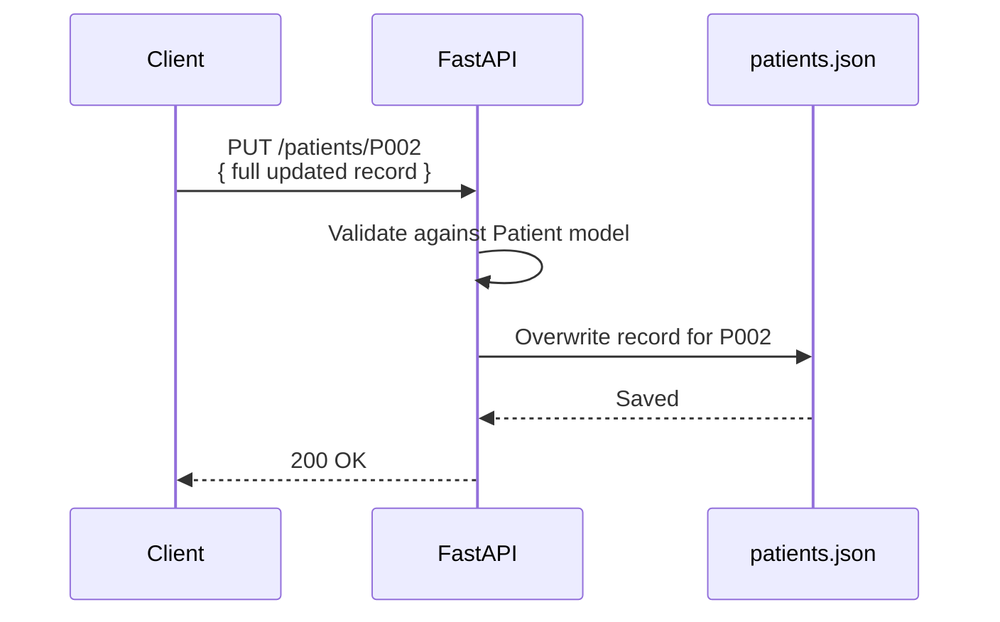
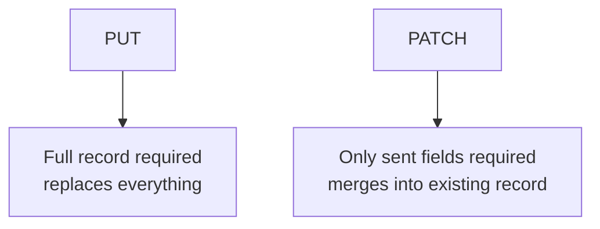
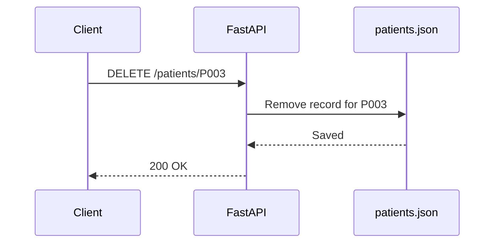
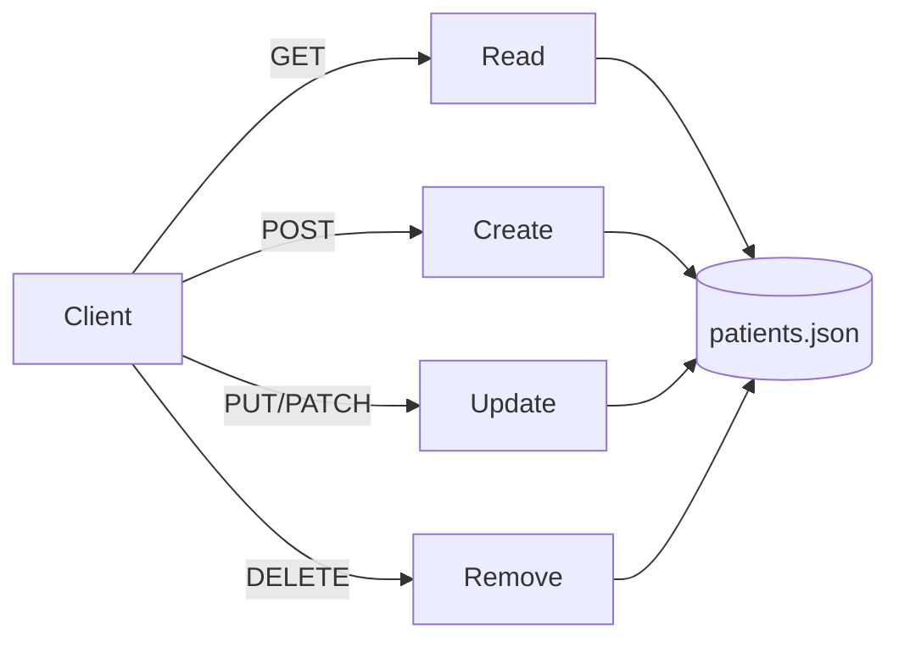

# PUT and DELETE Methods, In Depth

## PUT: Replacing a Resource

`PUT` updates an existing resource. Strictly, HTTP defines `PUT` as a full **replacement** — the body you send should represent the complete new state of that resource, not just the fields you're changing.



### Why PUT Is Idempotent

Call `PUT /patients/P002` once with the same body, or five times — the record ends up in exactly the same state either way. That's the idempotency guarantee `PUT` makes, and it's what separates it from `POST`.

### The Endpoint

```python
from fastapi import FastAPI, HTTPException
import json

app = FastAPI()

def load_data():
    with open("patients.json", "r") as file:
        return json.load(file)

def save_data(data):
    with open("patients.json", "w") as file:
        json.dump(data, file, indent=4)

@app.put("/patients/{patient_id}")
def update_patient(patient_id: str, patient: Patient):
    data = load_data()

    if patient_id not in data:
        raise HTTPException(status_code=404, detail="Patient not found")

    # full replacement: overwrite the entire record
    data[patient_id] = patient.model_dump(exclude={"id"})
    save_data(data)

    return {"message": f"Patient {patient_id} updated successfully"}
```

Because it's a full replacement, any field the client omits from the body isn't just "left alone" — it's genuinely missing, and Pydantic's required-field validation will reject the request. That's the correct behavior for `PUT`.

## When You Actually Want Partial Updates: PATCH

In practice, most "edit one field" UIs don't want to resend the entire record. That's what `PATCH` is for — it isn't strictly `PUT`, but it's worth contrasting here since the two get confused constantly.

```python
from typing import Optional
from pydantic import BaseModel

class PatientUpdate(BaseModel):
    name: Optional[str] = None
    city: Optional[str] = None
    age: Optional[int] = None
    gender: Optional[str] = None
    height: Optional[float] = None
    weight: Optional[float] = None

@app.patch("/patients/{patient_id}")
def patch_patient(patient_id: str, update: PatientUpdate):
    data = load_data()

    if patient_id not in data:
        raise HTTPException(status_code=404, detail="Patient not found")

    stored = data[patient_id]
    updates = update.model_dump(exclude_unset=True)  # only fields actually sent
    stored.update(updates)

    # recompute derived fields if height/weight changed
    stored["bmi"] = round(stored["weight"] / (stored["height"] ** 2), 2)
    stored["verdict"] = (
        "Underweight" if stored["bmi"] < 18.5 else
        "Normal" if stored["bmi"] < 25 else
        "Overweight" if stored["bmi"] < 30 else
        "Obese"
    )

    data[patient_id] = stored
    save_data(data)
    return {"message": f"Patient {patient_id} patched successfully"}
```

`exclude_unset=True` is the key detail — it only includes fields the client actually sent, so `weight=95` alone doesn't accidentally overwrite `name` with `None`.



## DELETE: Removing a Resource

`DELETE` removes a resource. Like `GET`, it typically has no body — the URL alone identifies what to remove.



### The Endpoint

```python
@app.delete("/patients/{patient_id}")
def delete_patient(patient_id: str):
    data = load_data()

    if patient_id not in data:
        raise HTTPException(status_code=404, detail="Patient not found")

    del data[patient_id]
    save_data(data)

    return {"message": f"Patient {patient_id} deleted successfully"}
```

### Why DELETE Is Idempotent (Even Though It Feels Destructive)

Call `DELETE /patients/P003` once: `P003` is gone, response is `200 OK` (or `204 No Content`). Call it again: `P003` is *still* gone — same end state. Whether you return `404` on the second call or a quiet `200` is a design choice, but the resource's final state is identical either way, which is what idempotency actually means. It's not about the response being identical every time — it's about the server ending up in the same state.

## Full Picture: All Five Methods on `/patients`

| Method | Route | Effect | Idempotent |
|---|---|---|---|
| `GET` | `/patients` | List all | Yes |
| `GET` | `/patients/{id}` | Read one | Yes |
| `POST` | `/patients` | Create new | No |
| `PUT` | `/patients/{id}` | Replace entirely | Yes |
| `PATCH` | `/patients/{id}` | Partial update | Usually yes |
| `DELETE` | `/patients/{id}` | Remove | Yes |



## Summary

- **PUT** = full replacement of a resource; missing fields should fail validation, not be silently kept
- **PATCH** = partial update; use `exclude_unset=True` so only explicitly sent fields are applied
- **DELETE** = removal, no body needed, idempotent because the end state (resource gone) doesn't change on repeat calls
- Derived fields like `bmi`/`verdict` need to be recomputed on every write path that touches `height` or `weight` — PUT, PATCH, and POST alike
