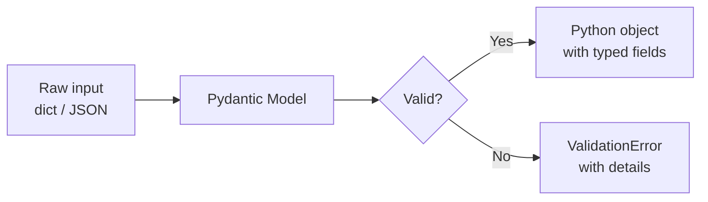
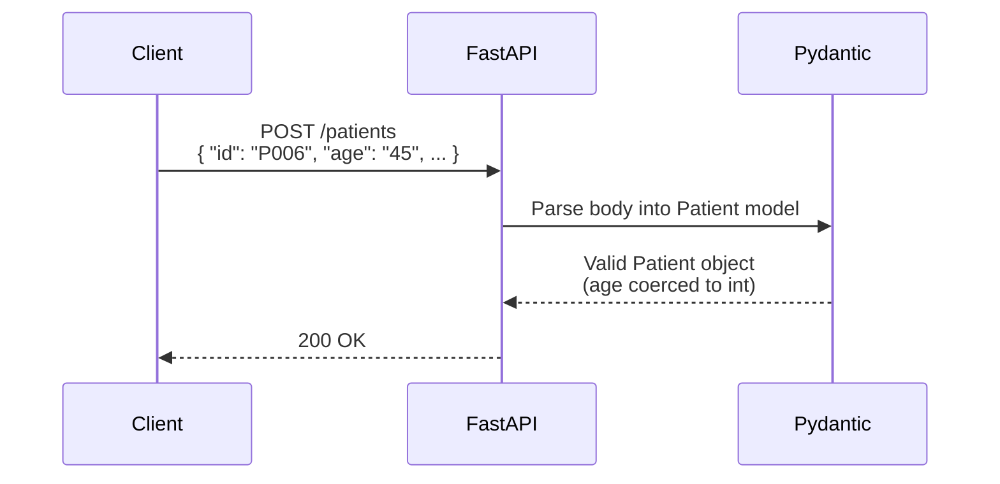
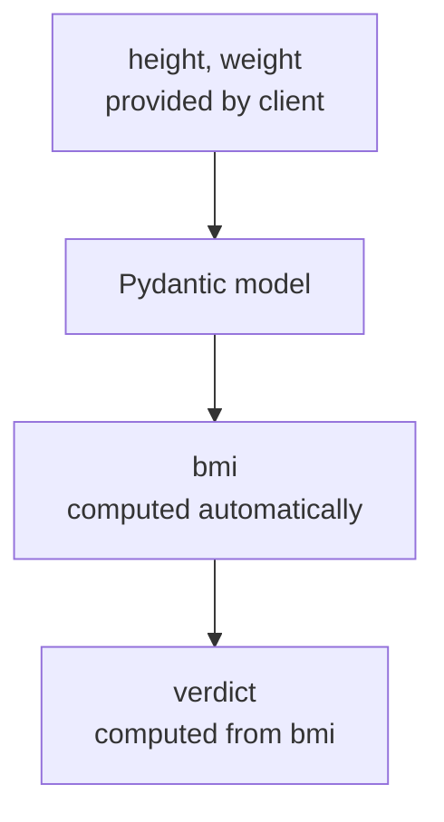
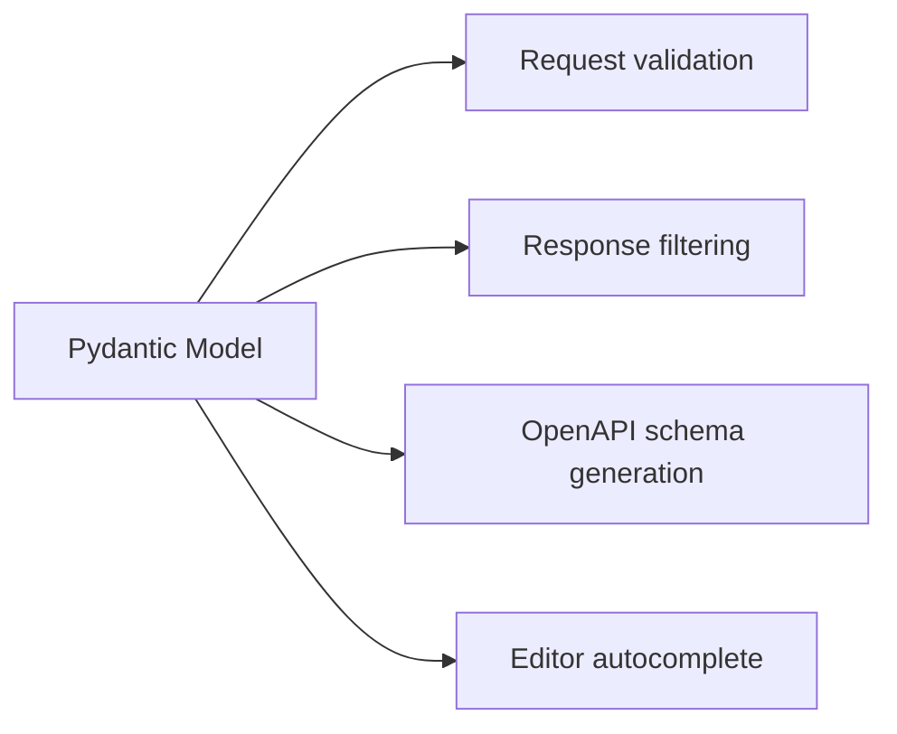

# Pydantic, In Depth

## What Pydantic Actually Does

Pydantic is a data validation library. You describe the *shape* of your data once, as a Python class with type hints, and Pydantic:

- **Validates** incoming data against that shape
- **Converts** compatible types automatically (e.g. `"28"` → `28` for an `int` field)
- **Raises clear errors** when data doesn't fit
- **Serializes** the object back to dict/JSON on the way out



FastAPI uses Pydantic for exactly this: request bodies, response bodies, and settings are all Pydantic models under the hood.

## The Basic Model

```python
from pydantic import BaseModel

class Patient(BaseModel):
    id: str
    name: str
    city: str
    age: int
    gender: str
    height: float
    weight: float
```

This one class definition gives you validation, parsing, and — inside FastAPI — automatic docs, all at once. Compare this to your current `patients.json` structure: this model *is* the schema for one record in that file.

```python
data = {
    "id": "P006",
    "name": "Karan Shah",
    "city": "Delhi",
    "age": "45",       # note: passed as a string
    "gender": "male",
    "height": 1.72,
    "weight": 80.0,
}

patient = Patient(**data)
print(patient.age)        # 45 (int) — Pydantic coerced the string
print(type(patient.age))  # <class 'int'>
```

## Using It as a Request Body in FastAPI

```python
from fastapi import FastAPI
from pydantic import BaseModel

app = FastAPI()

class Patient(BaseModel):
    id: str
    name: str
    city: str
    age: int
    gender: str
    height: float
    weight: float

@app.post("/patients")
def create_patient(patient: Patient):
    return {"message": f"Patient {patient.name} added successfully"}
```



If the client sends `age: "not a number"`, Pydantic raises a validation error, and FastAPI automatically turns that into a `422 Unprocessable Entity` response — you never write that error-handling code yourself.

## `Field()` — Adding Constraints and Metadata

Plain type hints only get you type checking. `Field()` lets you add real constraints.

```python
from pydantic import BaseModel, Field

class Patient(BaseModel):
    id: str = Field(..., description="Unique patient identifier")
    name: str = Field(..., min_length=2, max_length=50)
    age: int = Field(..., gt=0, lt=120)
    height: float = Field(..., gt=0, description="Height in meters")
    weight: float = Field(..., gt=0, description="Weight in kg")
```

- `...` means the field is **required** (no default)
- `gt=0, lt=120` — age must be greater than 0 and less than 120
- `min_length` / `max_length` — string length bounds
- `description` — shows up in the auto-generated `/docs`

Send `age: -5` and Pydantic rejects it before your function body ever runs.

## Computed Fields: BMI as an Example

Your patient data already stores `bmi` and `verdict` — but those are *derived* from height and weight, not independent inputs. Pydantic can compute them for you.

```python
from pydantic import BaseModel, computed_field

class Patient(BaseModel):
    name: str
    height: float   # meters
    weight: float   # kg

    @computed_field
    @property
    def bmi(self) -> float:
        return round(self.weight / (self.height ** 2), 2)

    @computed_field
    @property
    def verdict(self) -> str:
        if self.bmi < 18.5:
            return "Underweight"
        elif self.bmi < 25:
            return "Normal"
        elif self.bmi < 30:
            return "Overweight"
        return "Obese"
```



Now the client only ever sends `height` and `weight` — `bmi` and `verdict` can never be inconsistent with them, because they're never independently settable.

## Custom Validators

For rules `Field()` can't express, use `@field_validator`.

```python
from pydantic import BaseModel, field_validator

class Patient(BaseModel):
    gender: str

    @field_validator("gender")
    @classmethod
    def validate_gender(cls, value):
        allowed = {"male", "female", "other"}
        if value.lower() not in allowed:
            raise ValueError(f"gender must be one of {allowed}")
        return value.lower()
```

This runs during model construction — same as any other validation — and folds custom business rules into the same error-handling path FastAPI already uses.

## Nested Models

Models can contain other models, which is common once data has structure.

```python
from pydantic import BaseModel

class Address(BaseModel):
    city: str
    state: str
    pincode: str

class Patient(BaseModel):
    name: str
    age: int
    address: Address
```

```json
{
  "name": "Ananya Verma",
  "age": 28,
  "address": { "city": "Guwahati", "state": "Assam", "pincode": "781001" }
}
```

Pydantic validates the nested `address` object recursively — no extra code needed.

## Optional Fields and Defaults

```python
from typing import Optional
from pydantic import BaseModel

class PatientUpdate(BaseModel):
    name: Optional[str] = None
    age: Optional[int] = None
    weight: Optional[float] = None
```

This pattern is standard for `PATCH` endpoints — every field is optional, so the client only sends what it wants to change.

## Why FastAPI Leans on Pydantic So Heavily



One model definition, four jobs. This is the same idea from FastAPI's overall philosophy — type hints as the single source of truth — just applied specifically to data shape rather than the whole framework.

## Summary

| Feature | Purpose |
|---|---|
| `BaseModel` | Defines the shape of your data |
| Type hints | Basic type validation + coercion |
| `Field()` | Constraints (`gt`, `min_length`, etc.) + metadata |
| `@computed_field` | Derived, read-only fields (like `bmi`) |
| `@field_validator` | Custom business-rule validation |
| Nested models | Structured, recursively validated data |
| `Optional[...]` | Fields that may be omitted, common for updates |
