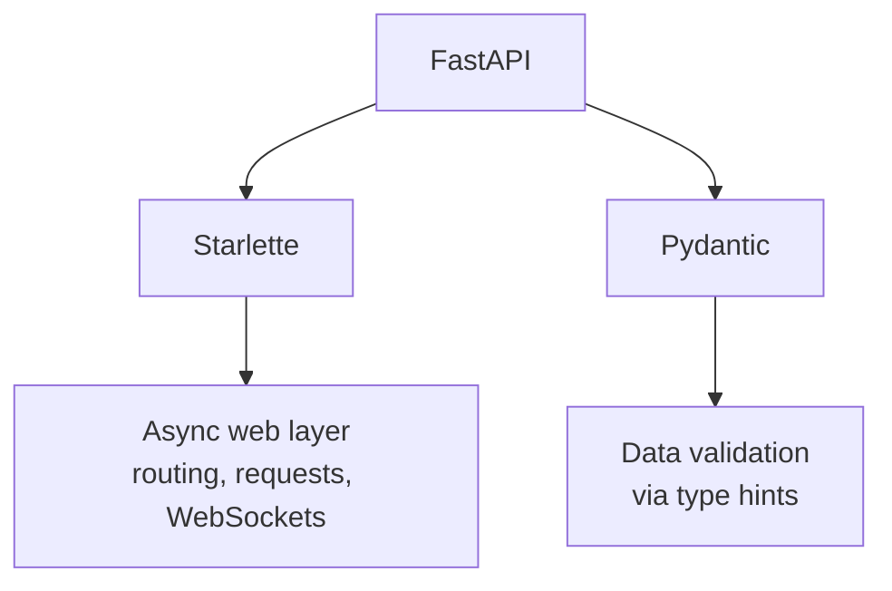
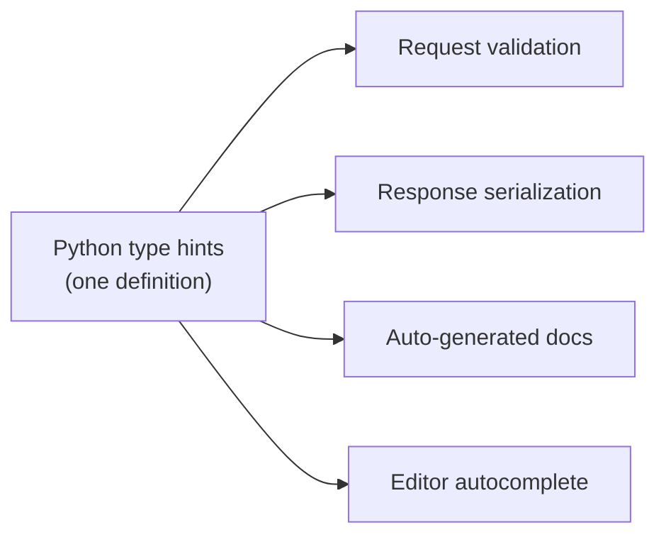
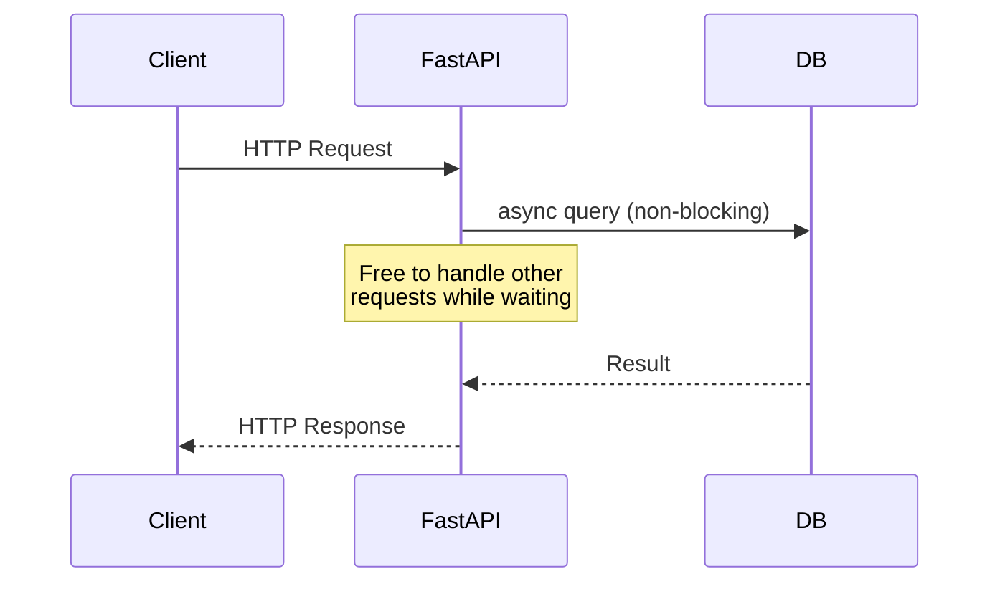
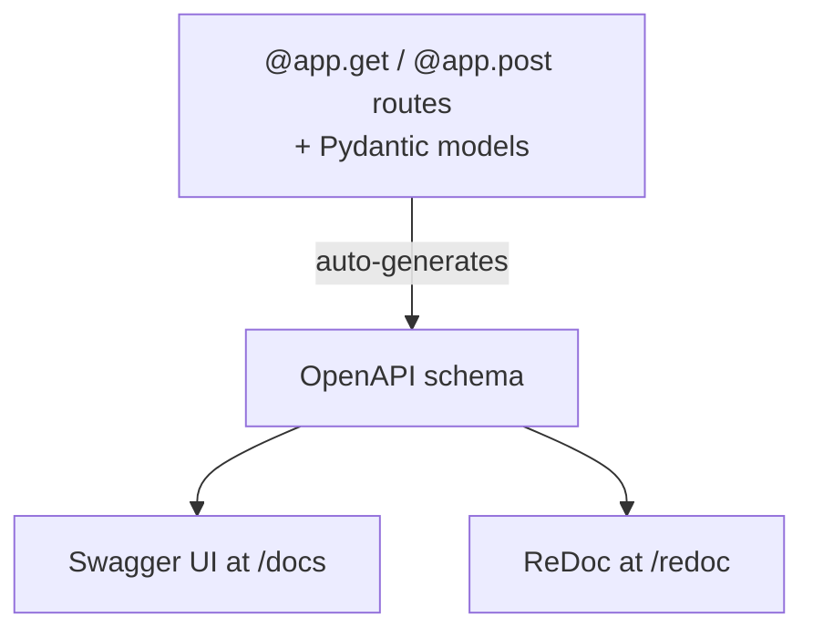

# What Is FastAPI? And the Philosophy Behind It

## What Is FastAPI?

FastAPI is a modern Python web framework for building APIs, built on top of two libraries:

- **Starlette** — handles the web/networking layer (routing, requests, responses, WebSockets)
- **Pydantic** — handles data validation and serialization using Python type hints

It was created by Sebastián Ramírez in 2018, and it's now one of the most widely used Python API frameworks, alongside Django and Flask.

## The Core Philosophy

FastAPI's design rests on a simple idea: **your type hints are the single source of truth**. Instead of writing your data model once for validation, once for docs, and once for editor autocomplete, you write it *once* as a Python type hint — FastAPI derives everything else from it.

This single decision cascades into FastAPI's five stated goals:

| Goal | What it means in practice |
|---|---|
| **Fast to run** | Built on async I/O (Starlette/ASGI); performance close to Node.js/Go for I/O-bound work |
| **Fast to code** | Type hints give you autocomplete and fewer manual checks — often 2-3x faster development |
| **Fewer bugs** | ~40% of human-caused errors caught before runtime, thanks to type validation |
| **Intuitive** | Great editor support; you rarely need to guess a function's shape |
| **Standards-based** | Built on open standards: OpenAPI (formerly Swagger) and JSON Schema, not a proprietary spec |

## Async-First, Not Async-Only

FastAPI embraces Python's `async`/`await` as a first-class citizen, but doesn't force it on you.

You can write a route as a normal `def` function (FastAPI runs it in a thread pool) or an `async def` function (FastAPI runs it directly on the event loop). This flexibility is deliberate — it doesn't punish you for using a sync-only database driver.

## Documentation as a Byproduct, Not an Afterthought

Because every endpoint's inputs and outputs are already defined via type hints, FastAPI generates interactive API docs automatically — no separate documentation step.

This reflects a broader philosophy: **documentation should be impossible to let go stale**, because it's generated from the same code that runs the API, not maintained separately.

## How This Differs from Flask and Django

| | Flask | Django REST Framework | FastAPI |
|---|---|---|---|
| Validation | Manual / extensions | Serializer classes | Native, via type hints |
| Async support | Bolted on later | Bolted on later | Native from the start |
| Docs | Manual (extensions) | Manual (extensions) | Automatic |
| Philosophy | Minimalist, unopinionated | "Batteries included" | "Types are the contract" |

Flask gives you freedom but little structure. Django gives you structure but its own conventions. FastAPI's bet is narrower and more specific: standard Python type hints, applied consistently, can *replace* most of the boilerplate both approaches require.

## The One-Sentence Summary

FastAPI's philosophy is that **the type hints you'd write anyway — for your own sanity — should be enough to give you validation, serialization, docs, and editor support for free.** Everything else in the framework's design follows from taking that idea seriously.
