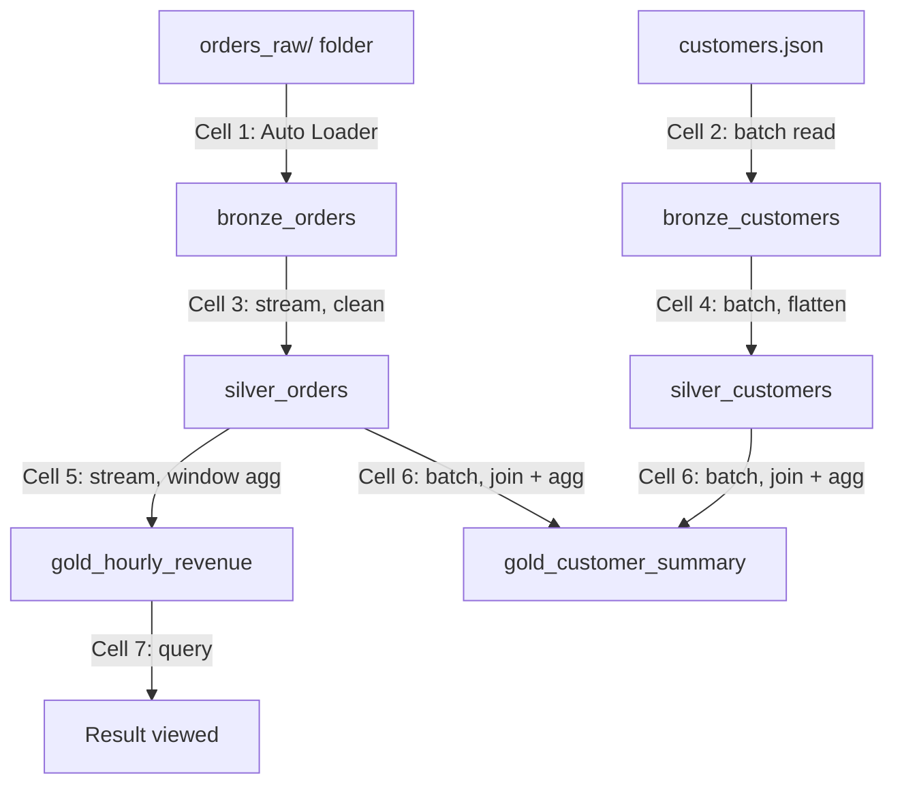

# Cell-by-Cell Walkthrough: Auto Loader and Multi-Hop Architecture Notebook

## Cell 1: Bronze — Auto Loader Ingestion of Orders

```python
from pyspark.sql.types import StructType, StructField, StringType, IntegerType, DoubleType, ArrayType

orders_schema = StructType([
    StructField("order_id", IntegerType()),
    StructField("timestamp", StringType()),
    StructField("customer_id", IntegerType()),
    StructField("quantity", IntegerType()),
    StructField("total", DoubleType()),
    StructField("books", ArrayType(
        StructType([
            StructField("book_id", IntegerType()),
            StructField("qty", IntegerType())
        ])
    ))
])

bronze_orders_df = (spark.readStream
    .format("cloudFiles")
    .option("cloudFiles.format", "json")
    .option("cloudFiles.schemaLocation", "/Volumes/demoworkspace_new/default/my_volume/ecommerce/schemas/orders")
    .schema(orders_schema)
    .load("/Volumes/demoworkspace_new/default/my_volume/ecommerce/orders_raw/"))

(bronze_orders_df.writeStream
    .format("delta")
    .outputMode("append")
    .option("checkpointLocation", "/Volumes/demoworkspace_new/default/my_volume/ecommerce/checkpoints/bronze_orders")
    .trigger(availableNow=True)
    .table("bronze_orders"))
```

**Explanation:** This cell defines the exact shape of an order record — including `books`, a nested array of `{book_id, qty}` structs — then uses that schema to open an Auto Loader stream (`cloudFiles`) against a folder (`orders_raw/`), and writes whatever it finds straight into a Delta table with no transformation.

**What it's doing:** Creating the bronze layer for orders. Note this reads from a *folder* (`orders_raw/`), not a single file — this is the correct real-world pattern, since Auto Loader is built to watch a directory for new files landing over time, rather than read one static file. `cloudFiles.schemaLocation` gives Auto Loader a place to persist that schema across restarts, `trigger(availableNow=True)` means it processes everything currently sitting in the folder and then stops (rather than running forever), and the dedicated checkpoint (`checkpoints/bronze_orders`) is what lets a re-run pick up only files it hasn't already ingested.

## Cell 2: Bronze — Batch Load of Customers

```python
customers_df = spark.read.json("/Volumes/demoworkspace_new/default/my_volume/ecommerce/customers.json")
customers_df.write.format("delta").mode("overwrite").saveAsTable("bronze_customers")
```

**Explanation:** Reads the customers JSON file as a plain (non-streaming) DataFrame, then writes it out as a Delta table, replacing any previous contents entirely.

**What it's doing:** Populating `bronze_customers`. This is deliberately *not* a streaming read — customers.json is a single reference file rather than a folder that grows over time, so a simple batch load with `mode("overwrite")` is the right tool; there's no incremental-ingestion problem to solve here the way there is for orders.

## Cell 3: Silver — Cleaning the Orders Stream

```python
from pyspark.sql.functions import to_timestamp, col

silver_orders_df = (spark.readStream.table("bronze_orders")
    .withColumn("timestamp", to_timestamp("timestamp"))
    .dropDuplicates(["order_id"])
    .filter(col("total") > 0))

(silver_orders_df.writeStream
    .format("delta")
    .outputMode("append")
    .option("checkpointLocation", "/Volumes/demoworkspace_new/default/my_volume/ecommerce/checkpoints/silver_orders")
    .trigger(availableNow=True)
    .table("silver_orders"))
```

**Explanation:** Reads `bronze_orders` as a stream (not a static table — `readStream.table(...)`), converts the `timestamp` column from its raw string form into a real `TimestampType`, removes duplicate `order_id`s, and drops any row where `total` isn't a positive number, then writes the cleaned result into a new Delta table.

**What it's doing:** Building the silver layer for orders. Reading `bronze_orders` with `readStream` (rather than `read`) is what makes this a genuinely incremental step — each run only processes bronze rows this silver stream hasn't already consumed, tracked via its own separate checkpoint (`checkpoints/silver_orders`). This is the layer where raw data becomes *trustworthy*: type-correct and free of duplicates or obviously bad rows.

## Cell 4: Silver — Flattening the Customers Table

```python
silver_customers_df = (spark.read.table("bronze_customers")
    .select(
        "customer_id",
        "email",
        col("profile.first_name").alias("first_name"),
        col("profile.last_name").alias("last_name"),
        col("profile.gender").alias("gender"),
        col("profile.address.city").alias("city"),
        col("profile.address.country").alias("country"),
        to_timestamp("updated_at").alias("updated_at")
    ))

silver_customers_df.write.format("delta").mode("overwrite").saveAsTable("silver_customers")
```

**Explanation:** Reads `bronze_customers` as a static (batch) DataFrame, pulls specific fields out of the nested `profile` struct (`profile.first_name`, `profile.address.city`, etc.) and renames each with `.alias(...)`, casts `updated_at` to a real timestamp, then overwrites `silver_customers` with the flattened result.

**What it's doing:** Turning deeply nested customer JSON into a flat, easy-to-query table. This is a batch job, not a stream — matching cell 2's batch load of customers — since the source data isn't arriving incrementally. Dot notation (`profile.address.city`) works here because Spark parsed the nested JSON into actual struct columns when it read the file, so reaching into a nested field is just attribute-style access.

## Cell 5: Gold — Hourly Revenue Aggregation

```python
from pyspark.sql.functions import window, sum as _sum

gold_hourly_revenue_df = (spark.readStream.table("silver_orders")
    .withWatermark("timestamp", "10 minutes")
    .groupBy(window("timestamp", "1 hour"))
    .agg(_sum("total").alias("revenue")))

(gold_hourly_revenue_df.writeStream
    .format("delta")
    .outputMode("append")
    .option("checkpointLocation", "/Volumes/demoworkspace_new/default/my_volume/ecommerce/checkpoints/gold_hourly_revenue")
    .trigger(availableNow=True)
    .table("gold_hourly_revenue"))
```

**Explanation:** Streams `silver_orders`, declares a 10-minute watermark on `timestamp` (tolerating up to 10 minutes of late-arriving data), groups rows into 1-hour tumbling windows, sums `total` within each window as `revenue`, and appends the result into `gold_hourly_revenue`.

**What it's doing:** Producing the first gold table — a genuinely aggregated, dashboard-ready metric. The `outputMode("append")` choice here is deliberate and specific: for a windowed aggregation, `append` mode only emits a window's result once the watermark has moved past that window's end, meaning each window is written exactly once, as a finished number — not repeatedly revised the way `update` mode would. The watermark is what makes this safe to run as an unbounded stream at all; without it, Spark would have to keep every window's state forever, since it could never be sure no more data would arrive for an old window.

## Cell 6: Gold — Customer Order Summary

```python
customer_summary_df = (spark.read.table("silver_orders")
    .join(spark.read.table("silver_customers"), on="customer_id", how="inner")
    .groupBy("customer_id", "first_name", "last_name", "city")
    .agg(
        _sum("total").alias("total_spent"),
        _sum("quantity").alias("total_items_ordered")
    ))

customer_summary_df.write.format("delta").mode("overwrite").saveAsTable("gold_customer_summary")
```

**Explanation:** Reads both `silver_orders` and `silver_customers` as static DataFrames, inner-joins them on `customer_id`, groups by customer identity fields, sums `total` and `quantity` per customer, and overwrites `gold_customer_summary` with the result.

**What it's doing:** Producing the second gold table — a per-customer business summary combining two different silver tables. This is a batch job (`spark.read`, not `readStream`) rather than a streaming one, which makes sense here: it's recomputing a full summary from the current state of both silver tables each time it's run, rather than incrementally appending new results the way the hourly revenue stream does.

## Cell 7: Querying the Result

```sql
%sql
SELECT * FROM gold_hourly_revenue;
```

**Explanation:** A plain SQL query against the finished gold table.

**What it's doing:** Verifying the pipeline's output — this is where you'd actually look at the hourly revenue numbers the whole bronze → silver → gold chain produced, confirming the earlier cells ran correctly end to end.

## The Pipeline as a Whole



| Cell | Layer | Mode | Key operation |
|---|---|---|---|
| 1 | Bronze (orders) | Streaming (Auto Loader) | Raw ingestion, schema applied, no transformation |
| 2 | Bronze (customers) | Batch | Raw load, no transformation |
| 3 | Silver (orders) | Streaming | Type cast, dedupe, filter |
| 4 | Silver (customers) | Batch | Flatten nested struct fields |
| 5 | Gold (hourly revenue) | Streaming | Watermark + windowed aggregation |
| 6 | Gold (customer summary) | Batch | Join across two silver tables + aggregation |
| 7 | — | Query | Inspect the final result |

A pattern worth noticing across the whole notebook: **orders stays streaming through every layer** (it's the fast-moving, continuously arriving data), while **customers stays batch throughout** (it's slower-moving reference data) — and gold tables mix and match streaming vs. batch depending on what each specific output actually needs.
