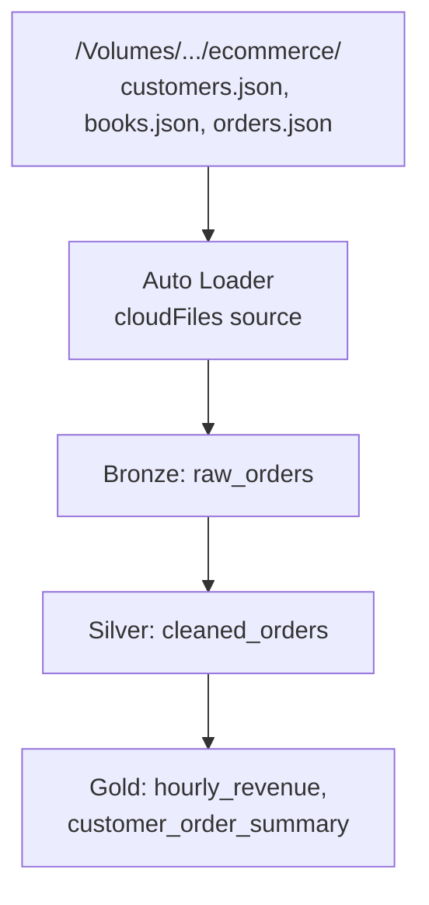
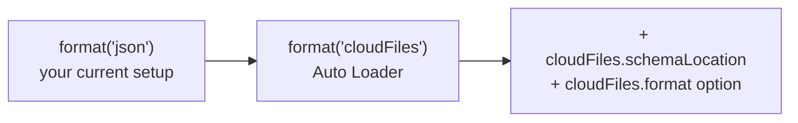
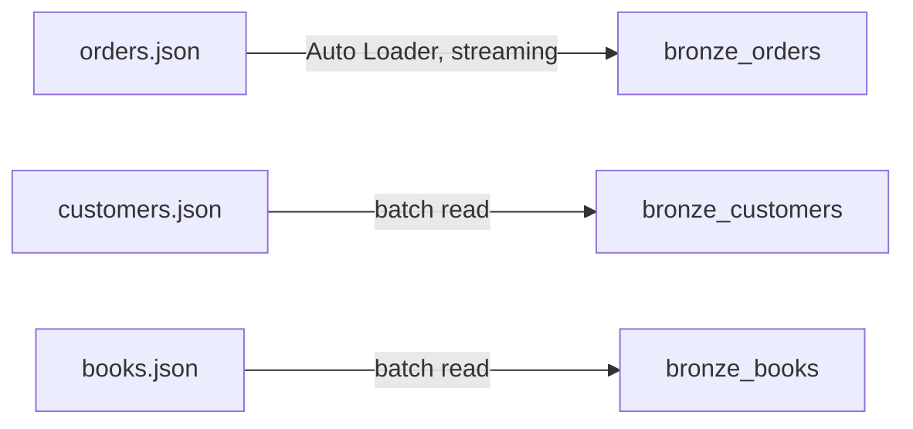
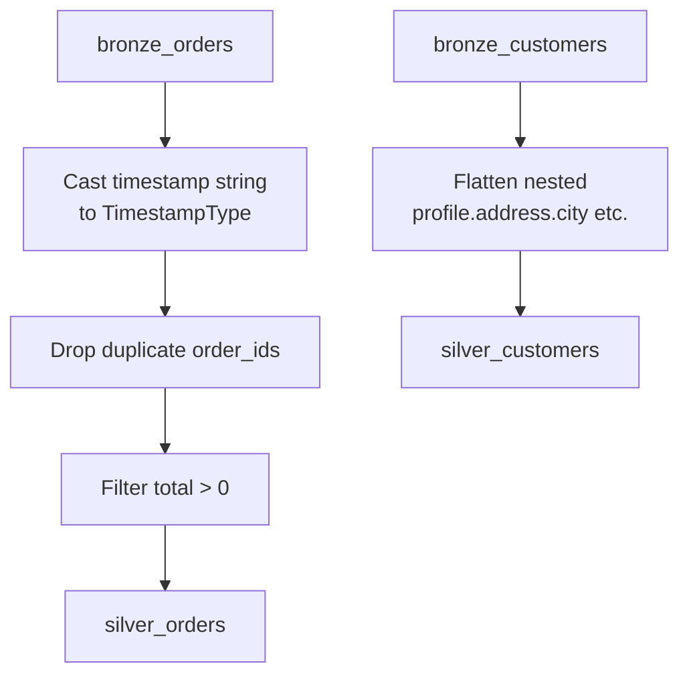
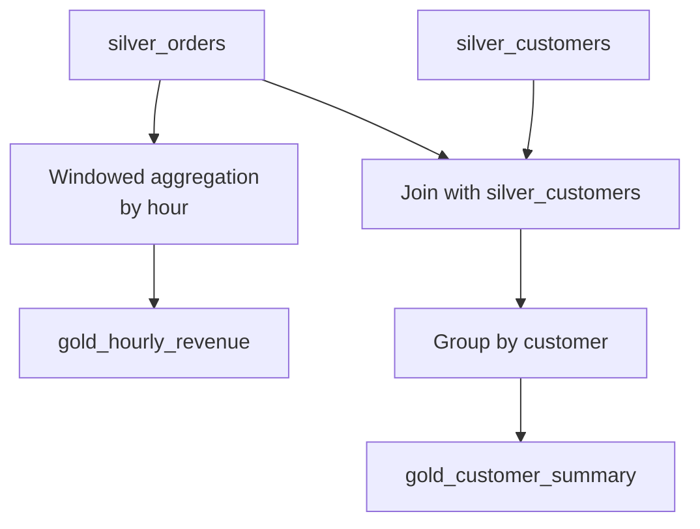
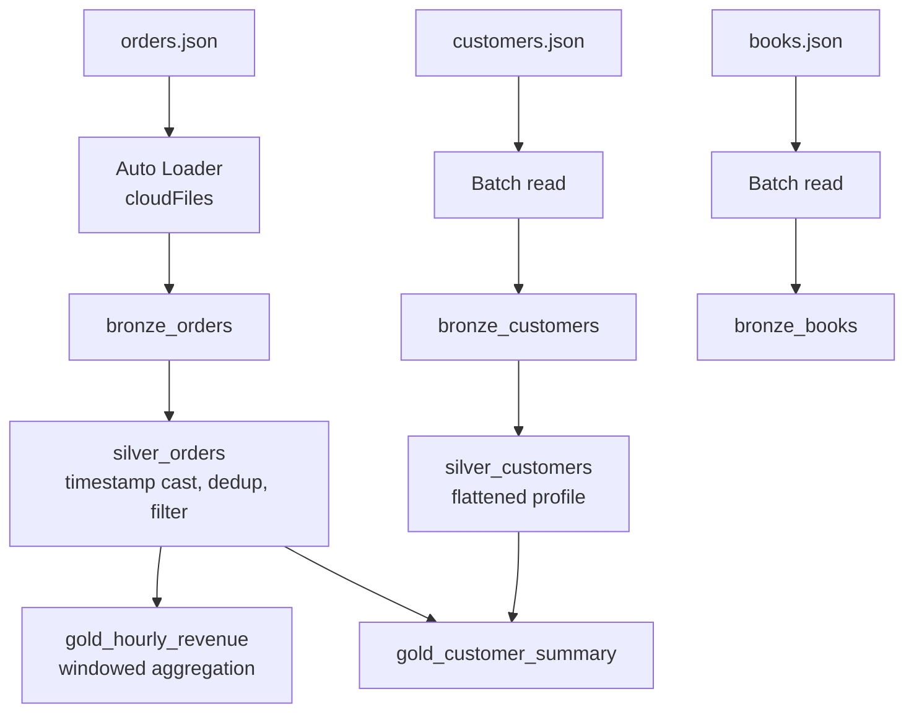

# Complete Example: Auto Loader + Multi-Hop Architecture

This builds directly on your notebook's setup — the `ecommerce` volume with `customers.json`, `books.json`, and `orders.json`, and the `orders_schema` you already defined — and extends it into a full bronze → silver → gold pipeline using Auto Loader instead of the plain `json` source.



## Step 0: What Changes from Your Notebook

Your notebook currently reads with `.format("json")` directly. For a real Auto Loader setup, the only change needed is the format and a schema location — everything else (the `orders_schema` you already wrote, the checkpoint pattern) carries over directly.



## Step 1: Bronze Layer — Raw Ingestion via Auto Loader

```python
from pyspark.sql.types import StructType, StructField, StringType, IntegerType, DoubleType, ArrayType

orders_schema = StructType([
    StructField("order_id", IntegerType()),
    StructField("timestamp", StringType()),
    StructField("customer_id", IntegerType()),
    StructField("quantity", IntegerType()),
    StructField("total", DoubleType()),
    StructField("books", ArrayType(
        StructType([
            StructField("book_id", IntegerType()),
            StructField("qty", IntegerType())
        ])
    ))
])

bronze_orders_df = (spark.readStream
    .format("cloudFiles")
    .option("cloudFiles.format", "json")
    .option("cloudFiles.schemaLocation", "/Volumes/demoworkspace_new/default/my_volume/ecommerce/schemas/orders")
    .schema(orders_schema)
    .load("/Volumes/demoworkspace_new/default/my_volume/ecommerce/orders.json"))

(bronze_orders_df.writeStream
    .format("delta")
    .outputMode("append")
    .option("checkpointLocation", "/Volumes/demoworkspace_new/default/my_volume/ecommerce/checkpoints/bronze_orders")
    .trigger(availableNow=True)
    .table("bronze_orders"))
```

Same for customers and books — these are smaller, less frequently changing reference files, so they're read as simple batch loads rather than streamed, though Auto Loader would work for them too if they arrived incrementally:

```python
customers_df = spark.read.json("/Volumes/demoworkspace_new/default/my_volume/ecommerce/customers.json")
customers_df.write.format("delta").mode("overwrite").saveAsTable("bronze_customers")

books_df = spark.read.json("/Volumes/demoworkspace_new/default/my_volume/ecommerce/books.json")
books_df.write.format("delta").mode("overwrite").saveAsTable("bronze_books")
```



**What's still raw here:** `timestamp` is still a string, nested `profile`/`address` fields in customers aren't flattened, and no filtering or deduplication has happened. That's intentional — bronze preserves exactly what arrived.

## Step 2: Silver Layer — Cleaned and Conformed

```python
from pyspark.sql.functions import to_timestamp, col

silver_orders_df = (spark.readStream.table("bronze_orders")
    .withColumn("timestamp", to_timestamp("timestamp"))
    .dropDuplicates(["order_id"])
    .filter(col("total") > 0))

(silver_orders_df.writeStream
    .format("delta")
    .outputMode("append")
    .option("checkpointLocation", "/Volumes/demoworkspace_new/default/my_volume/ecommerce/checkpoints/silver_orders")
    .trigger(availableNow=True)
    .table("silver_orders"))
```

Flatten the nested customer profile while building silver_customers:

```python
silver_customers_df = (spark.read.table("bronze_customers")
    .select(
        "customer_id",
        "email",
        col("profile.first_name").alias("first_name"),
        col("profile.last_name").alias("last_name"),
        col("profile.gender").alias("gender"),
        col("profile.address.city").alias("city"),
        col("profile.address.country").alias("country"),
        to_timestamp("updated_at").alias("updated_at")
    ))

silver_customers_df.write.format("delta").mode("overwrite").saveAsTable("silver_customers")
```



**Why flatten customers here and not in bronze:** bronze exists specifically to preserve the original nested structure exactly as it arrived — flattening is a transformation decision, and transformation decisions belong in silver, not bronze.

## Step 3: Gold Layer — Business-Ready Aggregates

### Gold Table 1: Hourly Revenue

```python
from pyspark.sql.functions import window, sum as _sum

gold_hourly_revenue_df = (spark.readStream.table("silver_orders")
    .withWatermark("timestamp", "10 minutes")
    .groupBy(window("timestamp", "1 hour"))
    .agg(_sum("total").alias("revenue")))

(gold_hourly_revenue_df.writeStream
    .format("delta")
    .outputMode("update")
    .option("checkpointLocation", "/Volumes/demoworkspace_new/default/my_volume/ecommerce/checkpoints/gold_hourly_revenue")
    .trigger(availableNow=True)
    .table("gold_hourly_revenue"))
```

### Gold Table 2: Customer Order Summary (Joining Orders with Customers)

```python
customer_summary_df = (spark.read.table("silver_orders")
    .join(spark.read.table("silver_customers"), on="customer_id", how="inner")
    .groupBy("customer_id", "first_name", "last_name", "city")
    .agg(
        _sum("total").alias("total_spent"),
        _sum("quantity").alias("total_items_ordered")
    ))

customer_summary_df.write.format("delta").mode("overwrite").saveAsTable("gold_customer_summary")
```



## The Full Pipeline, End to End



### Checking What Auto Loader Has Processed

```sql
%sql
DESCRIBE HISTORY bronze_orders;

SELECT * FROM bronze_orders ORDER BY order_id DESC LIMIT 5;
```

### Running the Whole Pipeline Once (as it's currently configured)

Every write above uses `.trigger(availableNow=True)`, matching the pattern already in your notebook — each stage processes whatever's currently available, then stops, rather than running as a truly always-on stream. To turn this into a continuous pipeline instead, swap `availableNow=True` for `processingTime="1 minute"` (or similar) on each streaming write, and each layer will keep picking up new data as it lands in the layer before it.

## Summary

| Layer | Source | Key operations | Output table |
|---|---|---|---|
| Bronze | `orders.json` via Auto Loader; `customers.json`/`books.json` via batch read | None — preserve as-is | `bronze_orders`, `bronze_customers`, `bronze_books` |
| Silver | Bronze tables | Cast types, dedupe, filter, flatten nested fields | `silver_orders`, `silver_customers` |
| Gold | Silver tables | Windowed aggregation, joins, grouping | `gold_hourly_revenue`, `gold_customer_summary` |

The same `orders_schema` and checkpoint-per-query pattern from your original notebook carries through every stage — each layer is just another Structured Streaming (or batch) job reading the table before it.
