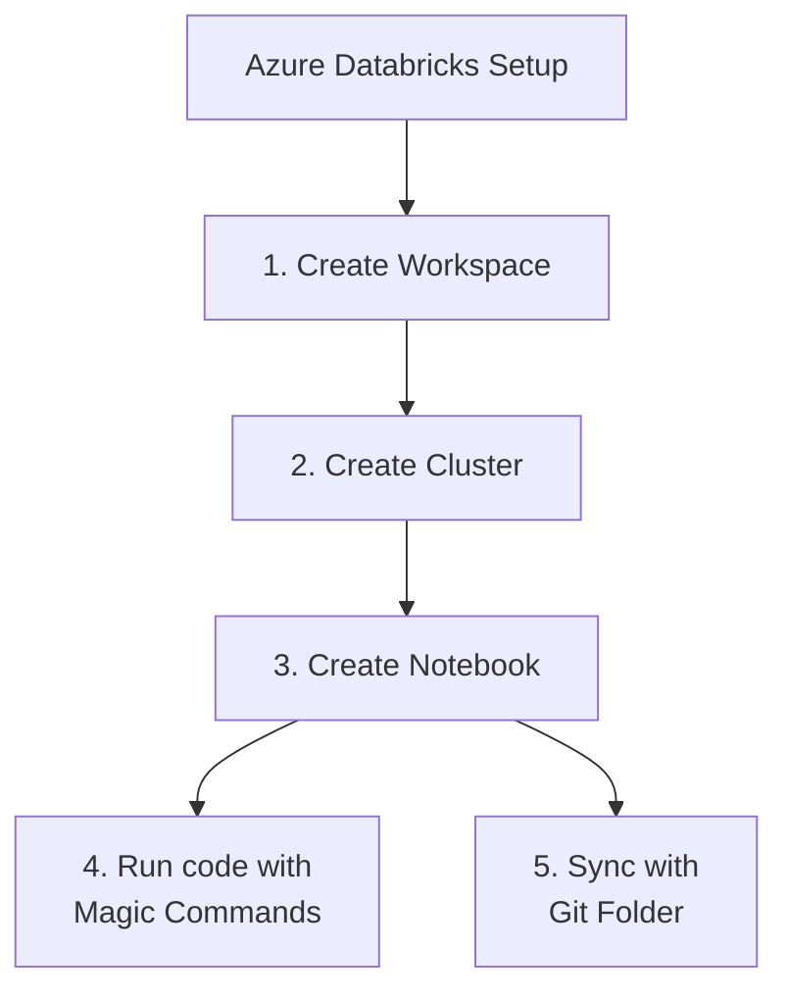
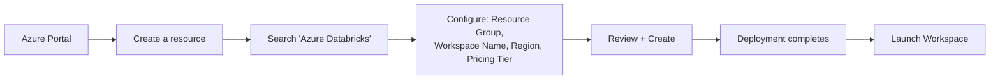
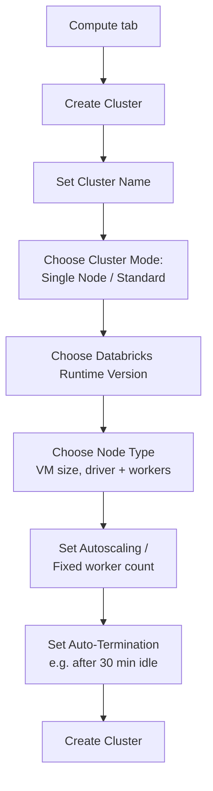
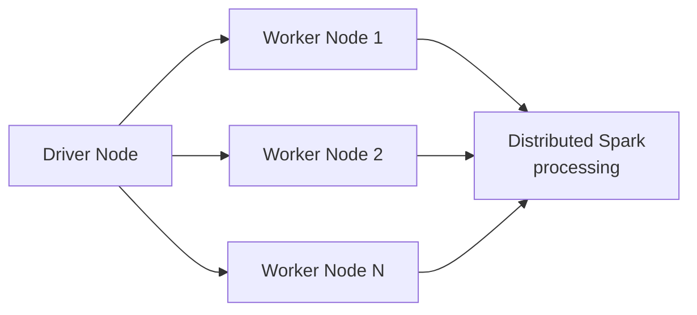
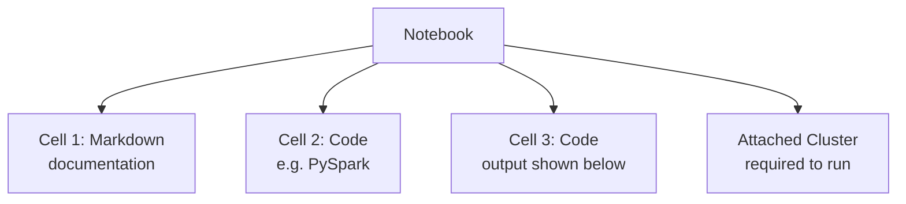
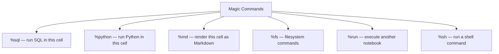
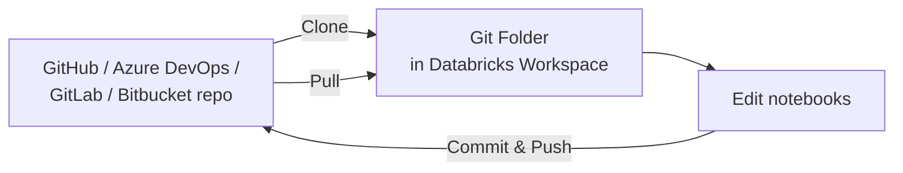
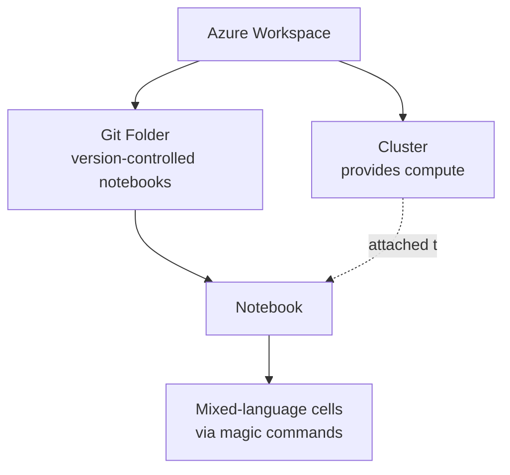

# Databricks on Azure: Workspace, Clusters, Notebooks, Magic Commands, and Git Folders

## Overview



This is the typical order you'd set things up in: a workspace is the container for everything, a cluster is the compute that runs your code, and notebooks are where you actually write and execute it.

## 1. Databricks Workspace Creation in Azure

The **workspace** is the top-level Databricks environment — it's an Azure resource, provisioned like any other, that houses your clusters, notebooks, jobs, and data connections.



### Steps

1. Sign in to the **Azure Portal**
2. Click **Create a resource** → search for **Azure Databricks**
3. Fill in the configuration:
   - **Subscription** and **Resource Group** — where this resource lives billing/organization-wise
   - **Workspace name** — a unique name for this Databricks instance
   - **Region** — pick one close to your data/users for latency and cost
   - **Pricing tier** — Standard, Premium, or Trial (Premium adds features like fine-grained access control and Unity Catalog)
4. Click **Review + Create**, then **Create** — Azure provisions the underlying resources (a managed resource group, storage, networking)
5. Once deployment finishes, click **Go to resource** → **Launch Workspace**, which opens the Databricks UI in a new tab, authenticated via Azure Active Directory

The workspace itself doesn't cost anything extra beyond the compute you actually run inside it — you're billed for clusters, not for the workspace existing.

## 2. Cluster Creation

A **cluster** is the actual compute — a group of virtual machines running Spark — that executes your notebook code. Nothing runs until a cluster is attached and running.



### Steps

1. In the left sidebar, go to **Compute** → **Create Cluster**
2. **Cluster name** — something identifiable, e.g. `dev-cluster`
3. **Cluster mode:**
   - **Single Node** — one machine, good for small jobs/testing, cheapest
   - **Standard** — a driver node plus multiple worker nodes, for real distributed workloads
4. **Databricks Runtime Version** — bundles a Spark version with pre-installed libraries; pick a current LTS version unless you need something specific
5. **Node type** — the VM size for driver and worker nodes (affects cost and available memory/cores)
6. **Autoscaling** — set a min/max worker range so the cluster grows under load and shrinks when idle, instead of a fixed worker count
7. **Auto-termination** — shuts the cluster down after N minutes of inactivity, which matters a lot for cost control since idle clusters still bill
8. Click **Create Cluster** — it takes a few minutes to spin up the underlying VMs



The driver coordinates the job; the workers actually execute the distributed computation in parallel.

## 3. Notebook ("Workbook")

A **notebook** is the primary interface for writing and running code in Databricks — a sequence of cells you execute individually, mixing code, output, and markdown documentation, similar in spirit to Jupyter.



### Creating One

1. Go to **Workspace** in the sidebar → navigate to (or create) a folder
2. Click **Create** → **Notebook**
3. Give it a name, choose a **default language** (Python, SQL, Scala, or R — you can still mix languages per cell using magic commands)
4. **Attach** it to a running cluster from the dropdown at the top — without an attached cluster, cells won't execute
5. Write code in a cell, press **Shift+Enter** to run it and move to the next cell

Each cell runs independently and keeps its state (variables, dataframes) available to later cells in the same session, so you can build up a pipeline step by step and inspect output at each stage.

## 4. Magic Commands (`%sql`, etc.)

**Magic commands** let you override a notebook's default language for a single cell, or invoke special notebook behaviors — they always appear as the first line of a cell, prefixed with `%`.



### Example: `%sql` in a Python-default notebook

```sql
%sql
SELECT city, COUNT(*) AS patient_count
FROM patients
GROUP BY city
ORDER BY patient_count DESC
```

Even though the notebook's default language is Python, this cell runs as SQL and shows a query result table directly below it.

### Other Common Ones

| Magic Command | Purpose |
|---|---|
| `%python` | Force a cell to run as Python |
| `%md` | Render the cell as formatted Markdown (documentation, not code) |
| `%fs` | Run filesystem commands against DBFS (e.g. `%fs ls /mnt/data`) |
| `%run` | Execute another notebook's code inline, sharing its variables into the current one |
| `%sh` | Run a shell command directly on the driver node |

Magic commands are why a single Databricks notebook can comfortably mix SQL queries, Python transformation logic, and Markdown documentation, without needing separate files for each.

## 5. Git Folder

A **Git folder** (formerly called "Repos") lets you connect a folder in your Databricks workspace directly to a Git repository — so notebooks can be version-controlled, branched, and reviewed like normal code, instead of living only inside Databricks.



### Setting One Up

1. In the sidebar, go to **Workspace** → **Create** → **Git folder**
2. Paste the repository URL (GitHub, Azure DevOps, GitLab, or Bitbucket)
3. Authenticate — Databricks needs a personal access token or OAuth connection to the Git provider, set up once under **User Settings** → **Git Integration**
4. Choose the branch to check out
5. The repo's files, including notebooks, appear in the workspace as a normal folder

### Why It Matters

- **Version control** — every notebook change is a real Git commit, with full history and diffs
- **Branching** — develop a change on a feature branch without touching what's in production
- **Code review** — pull requests work the same way they would for any other codebase
- **CI/CD integration** — the same repo can drive automated testing/deployment pipelines outside Databricks entirely

Without Git folders, notebooks only exist inside the Databricks workspace itself, with much weaker history and no real review workflow — Git folders bring standard software engineering practices to notebook-based development.

## Putting It All Together



The workspace is the container, the cluster is the engine, the notebook is where you write and run code, magic commands let one notebook flexibly mix languages, and a Git folder makes sure all of that is properly version-controlled rather than living only inside the platform.
