# Databricks Database Entities: A Complete Walkthrough

Running example throughout: a `patients` table.

```sql
CREATE TABLE patients (
    patient_id STRING,
    name STRING,
    city STRING
)
```

## 1. Database

A **database** (interchangeably called a **schema**) is a logical container that groups related tables, views, and functions together for organization and access control. It holds references to tables, not data itself.

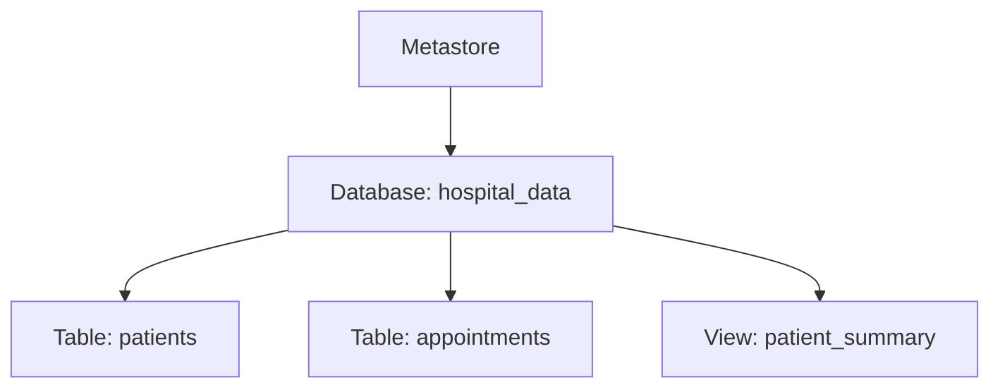

```sql
CREATE DATABASE hospital_data;
USE hospital_data;

CREATE TABLE patients (
    patient_id STRING,
    name STRING,
    city STRING
);
```

Everything created afterward (without an explicit `database.table` prefix) lands inside `hospital_data` until you `USE` a different one.

## 2. Tables

A table is a named, structured dataset the metastore knows how to locate. Databricks distinguishes tables mainly by **who owns the underlying files** — covered in depth next.

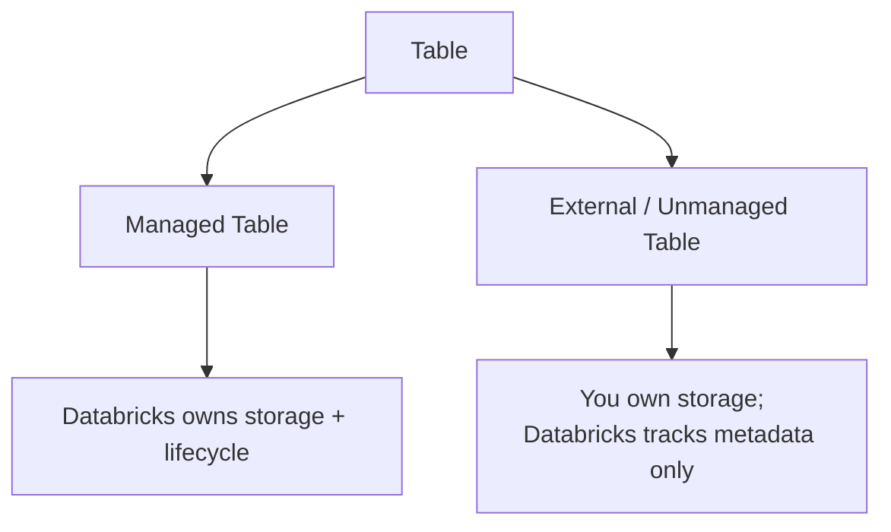

## 3. Managed Tables and External Tables

### Managed Tables

No `LOCATION` given — Databricks picks the storage path itself, inside its managed storage area, and owns the full lifecycle.

```sql
CREATE TABLE patients (
    patient_id STRING,
    name STRING,
    city STRING
);
```

`DROP TABLE patients` deletes both the metadata *and* the underlying data files. Databricks is the sole owner.

### External Tables

You specify exactly where the data lives with `LOCATION`. Databricks only tracks the metadata pointer.

```sql
CREATE TABLE patients (
    patient_id STRING,
    name STRING,
    city STRING
)
LOCATION 's3://my-bucket/delta/patients';
```

`DROP TABLE patients` here removes only the metastore entry — the files at that location remain untouched.

### Custom Locations Across Cloud Providers

The `LOCATION` syntax is identical everywhere — only the URI scheme and the underlying storage credential setup differ.

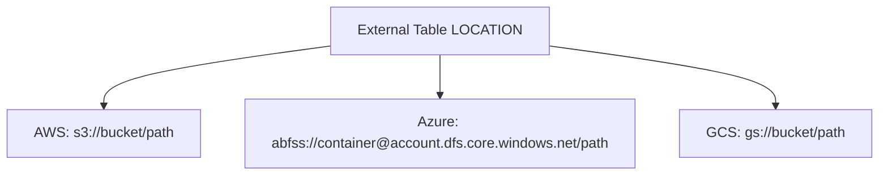

**AWS S3**

```sql
CREATE TABLE patients (
    patient_id STRING,
    name STRING,
    city STRING
)
LOCATION 's3://my-bucket/delta/patients';
```

Requires an instance profile or a Unity Catalog storage credential/external location granting Databricks IAM access to that S3 bucket.

**Azure Data Lake Storage (ADLS Gen2)**

```sql
CREATE TABLE patients (
    patient_id STRING,
    name STRING,
    city STRING
)
LOCATION 'abfss://mycontainer@mystorageaccount.dfs.core.windows.net/delta/patients';
```

`abfss://` is the ADLS Gen2 driver — access is typically granted via a service principal or Unity Catalog external location tied to that storage account.

**Google Cloud Storage**

```sql
CREATE TABLE patients (
    patient_id STRING,
    name STRING,
    city STRING
)
LOCATION 'gs://my-gcs-bucket/delta/patients';
```

Access requires a GCP service account key or Unity Catalog storage credential configured with permissions on that bucket.

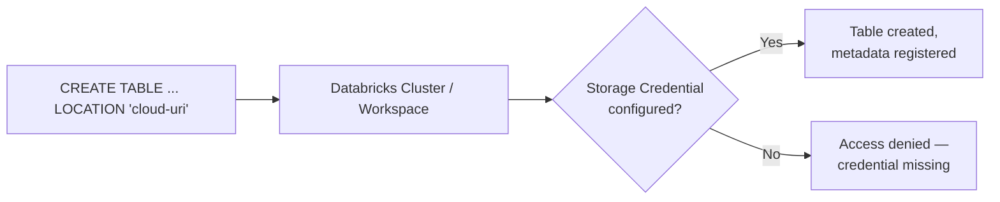

In all three cases, the storage credential (instance profile, service principal, or service account) has to be set up *before* the `CREATE TABLE` statement will succeed — the SQL syntax alone doesn't grant access.

## 4. The Impact of the LOCATION Keyword

`LOCATION` is the single decision point that determines managed vs. external, with concrete downstream consequences.

| Behavior | Managed (no `LOCATION`) | External (`LOCATION` given) |
|---|---|---|
| File path control | Databricks | You |
| `DROP TABLE` deletes data | Yes | No — metadata only |
| Multiple tables sharing one file path | Not possible | Possible |
| Data survives outside Databricks | Tied to metastore | Independent, portable |
| Risk profile | Safer defaults, less flexible | More flexible, easier to orphan data if forgotten |

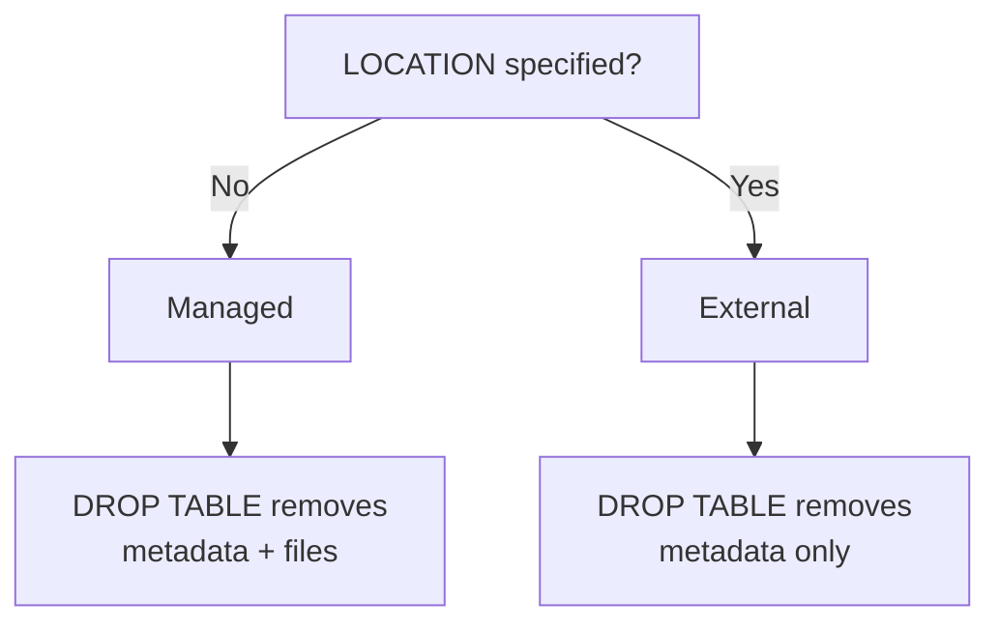

The practical impact: use managed tables when Databricks should fully own a table's lifecycle; use external tables (with a `LOCATION`) when the same files need to be shared across tools, teams, or workspaces, or when data must persist independently of any one table registration.

## 5. CTAS — Create Table As Select

CTAS creates a new table directly from a query result — schema and data both come from the `SELECT`, not from a hand-written column list.

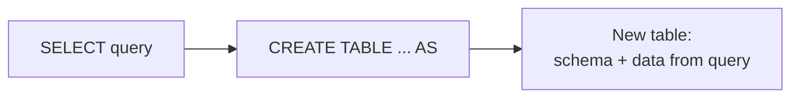

### Basic Creation

```sql
CREATE TABLE patients_copy AS
SELECT * FROM patients;
```

### Filtering

```sql
CREATE TABLE patients_mumbai AS
SELECT * FROM patients
WHERE city = 'Mumbai';
```

Only rows matching the filter end up in the new table — CTAS runs the full query first, then materializes the result as a table.

### Renaming Columns

```sql
CREATE TABLE patients_renamed AS
SELECT
    patient_id AS id,
    name AS patient_name,
    city AS residence_city
FROM patients;
```

Column aliases in the `SELECT` become the new table's actual column names.

### Additional Options

**Comments** — document the table's purpose directly in metadata:

```sql
CREATE TABLE patients_mumbai
COMMENT 'Patients residing in Mumbai, refreshed nightly'
AS SELECT * FROM patients WHERE city = 'Mumbai';
```

**Partition By** — physically split the new table by a column:

```sql
CREATE TABLE patients_by_city
PARTITIONED BY (city)
AS SELECT * FROM patients;
```

**Location** — make the CTAS result an external table instead of managed:

```sql
CREATE TABLE patients_mumbai
LOCATION 's3://my-bucket/delta/patients_mumbai'
AS SELECT * FROM patients WHERE city = 'Mumbai';
```

### Combining Everything

```sql
CREATE TABLE patients_mumbai_summary
COMMENT 'Summary of Mumbai patients for the reporting team'
PARTITIONED BY (city)
LOCATION 's3://my-bucket/delta/patients_mumbai_summary'
AS
SELECT
    patient_id AS id,
    name AS patient_name,
    city
FROM patients
WHERE city = 'Mumbai';
```

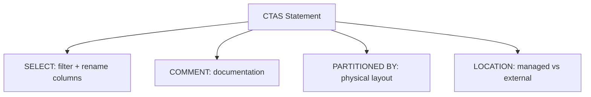

## 6. Table Constraints

Delta Lake supports declaring constraints that enforce data quality rules on writes — a write violating a constraint is rejected outright.

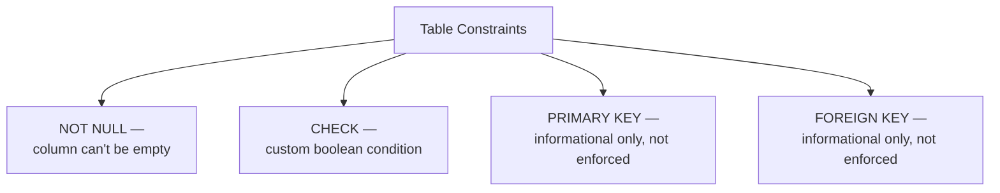

### NOT NULL

```sql
CREATE TABLE patients (
    patient_id STRING NOT NULL,
    name STRING NOT NULL,
    city STRING
);
```

### CHECK Constraints

```sql
ALTER TABLE patients ADD CONSTRAINT valid_city
CHECK (city IS NOT NULL AND city != '');
```

Attempting to insert a row that violates this raises an error and the write fails — enforced at write time, not just documentation.

### PRIMARY KEY / FOREIGN KEY

```sql
ALTER TABLE patients ADD CONSTRAINT patients_pk PRIMARY KEY (patient_id);
```

Important distinction: unlike `NOT NULL` and `CHECK`, Delta Lake's `PRIMARY KEY` and `FOREIGN KEY` constraints are **informational only** — they document intended relationships for query optimizers and tools, but Delta does *not* enforce uniqueness or referential integrity at write time. Duplicate `patient_id` values can still be inserted unless you separately enforce that with a `CHECK` or application logic.

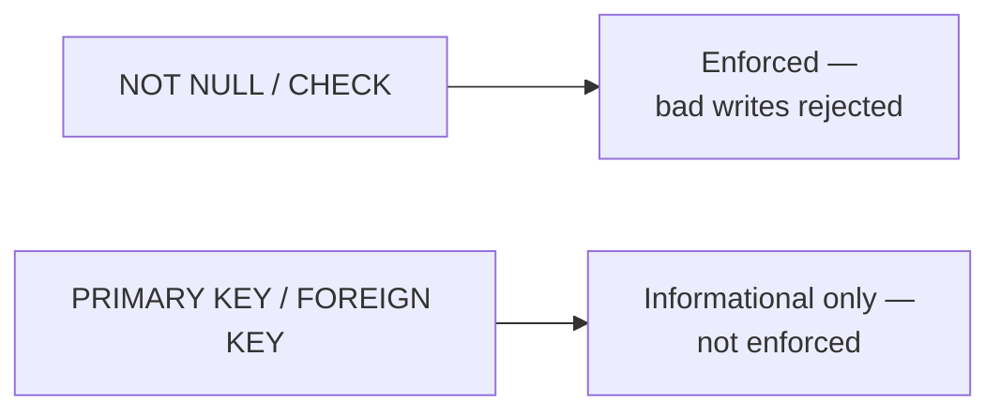

## 7. Cloning Delta Lake Tables

Cloning creates a copy of a table's metadata (and optionally data) without re-running the original ingestion pipeline.

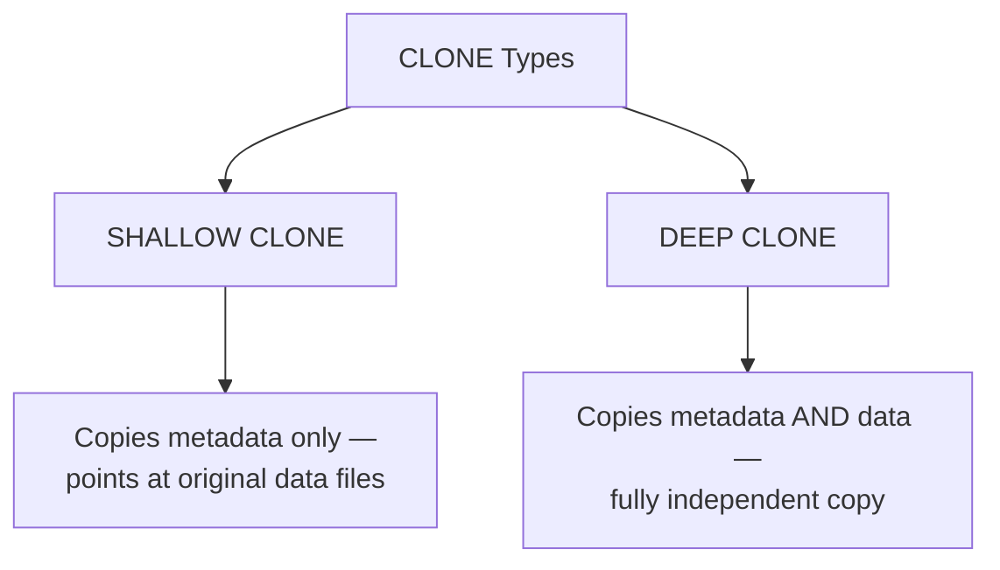

### Shallow Clone

```sql
CREATE TABLE patients_shallow_clone
SHALLOW CLONE patients;
```

Fast and cheap — no data is physically copied, the clone just references the source table's existing files. Good for quick testing, but the clone breaks if the source's underlying files are vacuumed away, and the clone doesn't protect you from changes to the source.

### Deep Clone

```sql
CREATE TABLE patients_deep_clone
DEEP CLONE patients;
```

Copies both metadata and the actual data files — a fully independent table, safe from changes (including deletion) to the source. Slower and uses real additional storage, proportional to the source table's size.

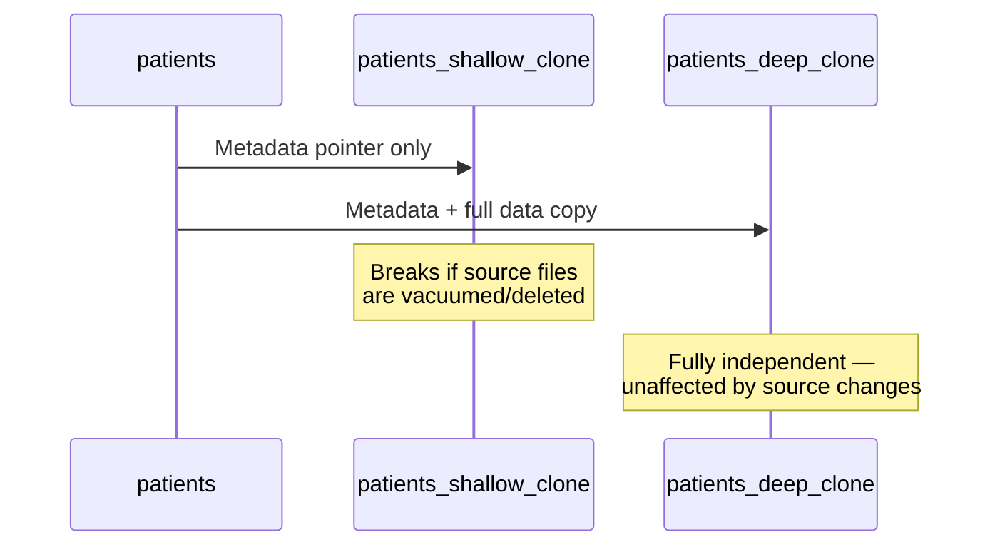

Clones also support `VERSION AS OF`/`TIMESTAMP AS OF`, so you can clone a table as it looked at a specific past point — useful for creating a stable snapshot for testing or auditing.

```sql
CREATE TABLE patients_snapshot
DEEP CLONE patients VERSION AS OF 5;
```

## 8. Views — Types and Spark Session Scope

A view is a saved query — it doesn't store data itself, it re-runs its defining `SELECT` every time it's queried.

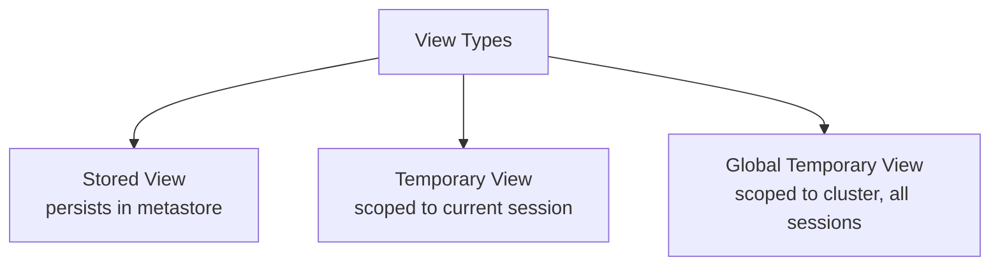

### Stored (Permanent) Views

```sql
CREATE VIEW patient_summary AS
SELECT patient_id, name, city FROM patients;
```

Registered in the metastore, persists across sessions and cluster restarts, visible to anyone with permission on the database — just like a table, except it has no data of its own.

### Temporary Views

```sql
CREATE TEMP VIEW patients_mumbai_temp AS
SELECT * FROM patients WHERE city = 'Mumbai';
```

Exists only for the **current Spark session** — once that session/notebook detaches or the cluster restarts, the view disappears. Not visible from a different notebook attached to the same cluster, even at the same time.

### Global Temporary Views

```sql
CREATE GLOBAL TEMP VIEW patients_mumbai_global AS
SELECT * FROM patients WHERE city = 'Mumbai';

-- accessed via the special "global_temp" database
SELECT * FROM global_temp.patients_mumbai_global;
```

Scoped to the **entire Spark cluster application**, not a single session — visible from any notebook attached to that same cluster, but still gone once the cluster restarts. This sits between a stored view (persistent, metastore-registered) and a regular temp view (single-session only).

### Comparing the Three

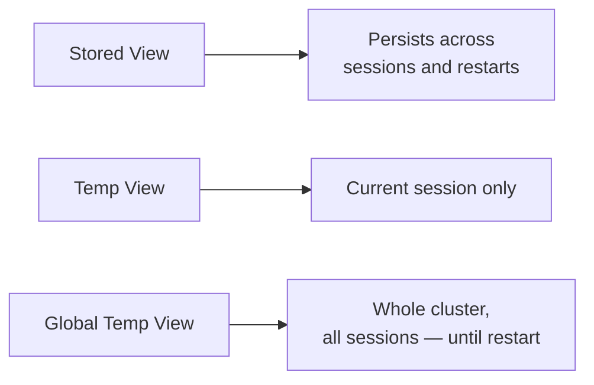

| Type | Visible to | Survives cluster restart | Registered in metastore |
|---|---|---|---|
| Stored View | Anyone with DB access | Yes | Yes |
| Temp View | Current session only | No | No |
| Global Temp View | Any session on the same cluster | No | No (lives in `global_temp` database) |

**Why the Spark session matters here:** a temp view is literally tied to the `SparkSession` object that created it — it's stored in that session's in-memory catalog, not the persistent metastore. A global temp view instead lives in a special system database (`global_temp`) tied to the *SparkContext* shared by all sessions on that cluster, which is why it outlives any single session but not the cluster itself.

## Full Recap

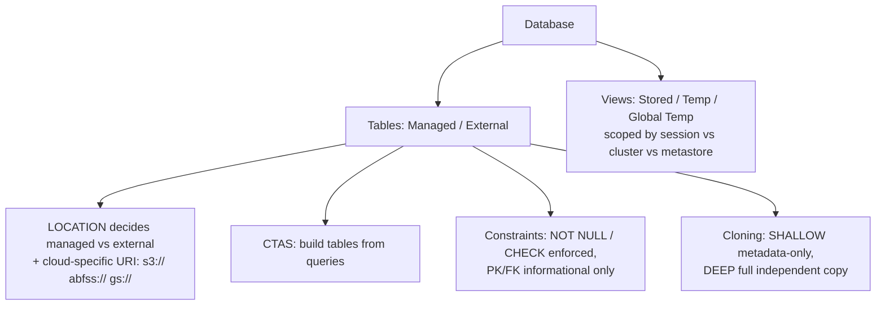
