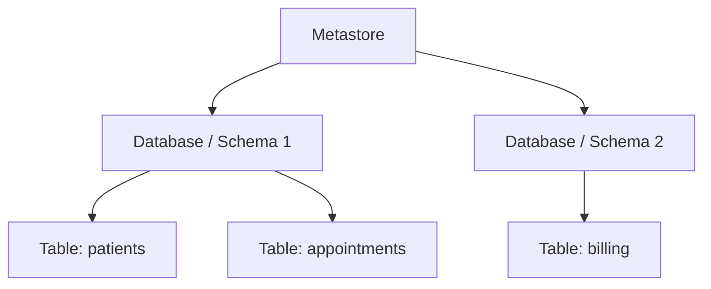
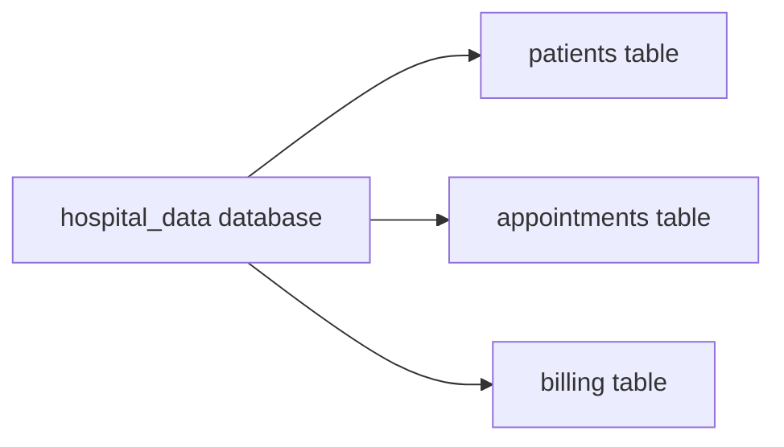
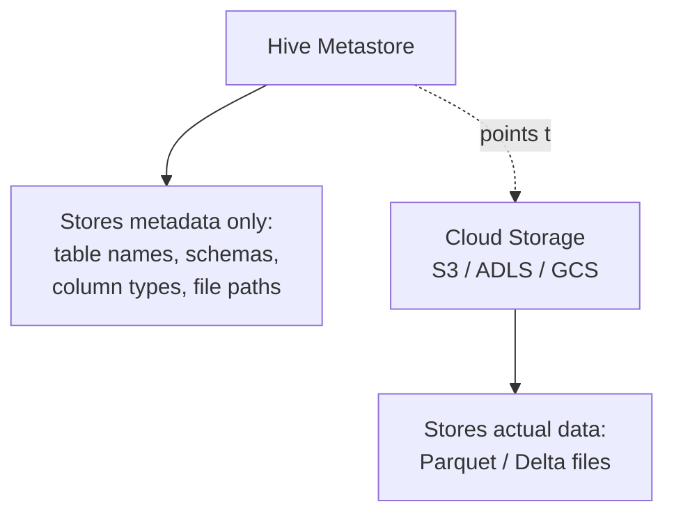
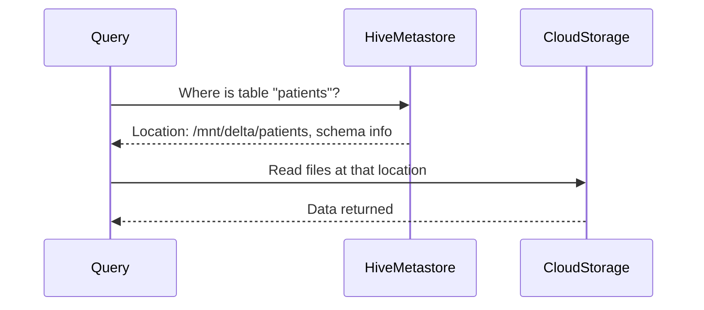
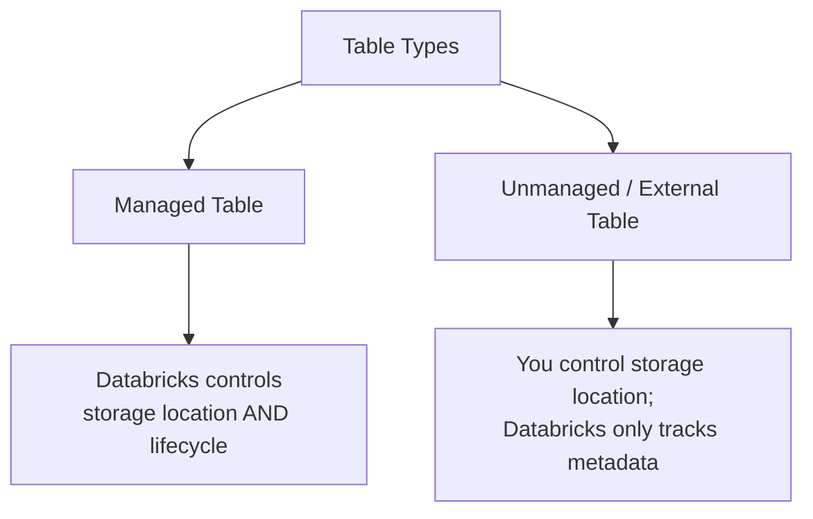
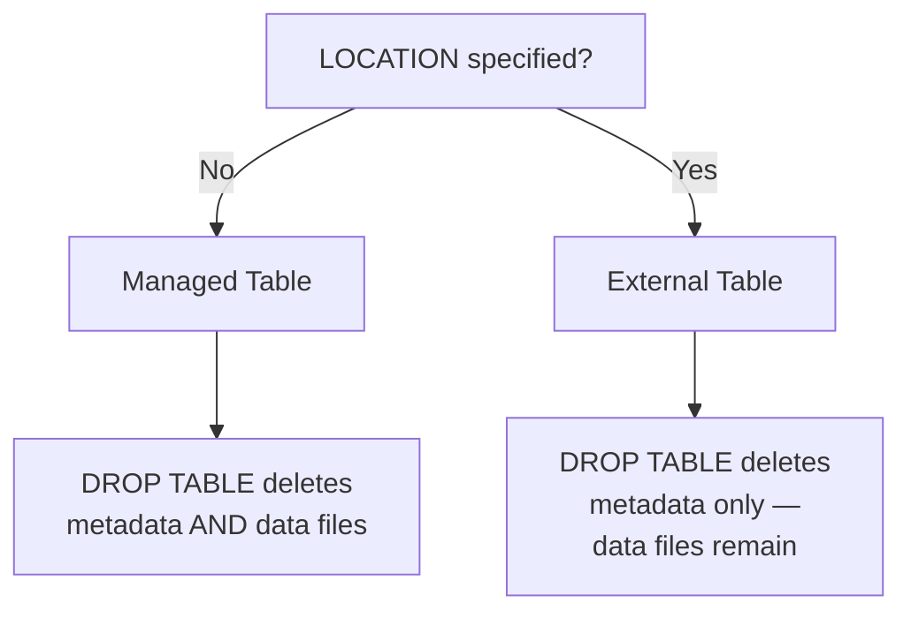

# Databricks Database Entities: Database, Hive Metastore, Tables, and the LOCATION Keyword

## The Entity Hierarchy

Databricks organizes data access through a hierarchy: a **metastore** tracks **databases** (also called schemas), which contain **tables**.



## 1. Database (Schema)

A **database** — Databricks also calls this a **schema**, and the terms are interchangeable — is a logical container for tables, views, and functions. It exists purely for organization and access control; it doesn't hold data itself, it holds references to tables.

```sql
%sql
CREATE DATABASE hospital_data;

USE hospital_data;

CREATE TABLE patients (
    patient_id STRING,
    name STRING,
    city STRING
)
USING DELTA;
```



Databases let you group related tables together (e.g. everything for one department or one project) and apply access permissions at the database level rather than per-table.

## 2. Hive Metastore

The **Hive Metastore** is the original metadata catalog for Databricks (and for Spark/Hadoop ecosystems generally) — it stores the *metadata* about databases and tables (names, schemas, column types, file locations) separately from the actual data files.



When you run `SELECT * FROM patients`, Spark first checks the Hive Metastore to find out *where* the `patients` table's files actually live, then reads those files from cloud storage.



Every Databricks workspace has a built-in Hive Metastore by default, though it can also connect to an external one (shared across multiple workspaces) or, in newer setups, be replaced entirely by **Unity Catalog**, which adds finer-grained governance across the whole account rather than being scoped per-workspace.

## 3. Tables

A table is a named, structured collection of data that the metastore knows how to locate. Databricks has two fundamental kinds, and the difference comes down entirely to who controls the underlying files.



### Managed Tables

```sql
%sql
CREATE TABLE patients (
    patient_id STRING,
    name STRING
)
USING DELTA
```

No `LOCATION` specified — Databricks picks a default storage path (inside the metastore's managed storage area) and takes full ownership: dropping the table deletes both the metadata *and* the underlying data files.

### External (Unmanaged) Tables

```sql
%sql
CREATE TABLE patients (
    patient_id STRING,
    name STRING
)
USING DELTA
LOCATION '/mnt/delta/patients'
```

Here you specify exactly where the files live. Databricks only tracks the metadata pointer — dropping this table removes the entry from the metastore, but the actual Delta files at `/mnt/delta/patients` remain untouched.

## 4. The Impact of the LOCATION Keyword

`LOCATION` is the single decision that determines managed vs. external, and it has real consequences beyond just "where files are stored."



### What Changes Based on LOCATION

| Behavior | Managed (no `LOCATION`) | External (`LOCATION` specified) |
|---|---|---|
| Who controls file path | Databricks | You |
| `DROP TABLE` deletes data files | Yes | No — only the metastore entry |
| Can multiple tables point to the same files | No | Yes — useful for sharing raw data across teams/workspaces |
| Portability | Tied to that metastore | Files exist independently — easy to re-register elsewhere |
| Risk of orphaned files | Low | Higher — if you forget the location, files can be forgotten too |
| Typical use case | Tables Databricks fully owns the lifecycle of | Data lake files also accessed by other tools/teams |

### A Concrete Example of Why This Matters

```sql
%sql
-- Managed table
CREATE TABLE patients_managed (id STRING, name STRING) USING DELTA;
DROP TABLE patients_managed;
-- Result: metadata gone, underlying Parquet/Delta files also gone

-- External table
CREATE TABLE patients_external (id STRING, name STRING)
USING DELTA LOCATION '/mnt/delta/patients';
DROP TABLE patients_external;
-- Result: metadata gone, but /mnt/delta/patients files still exist on disk
```

This matters most in two situations:

- **Accidental drops** — dropping a managed table is destructive and often irreversible outside of Delta's own time-travel window; dropping an external table is comparatively safe, since the data survives
- **Shared raw data** — if the same underlying files need to be queried by multiple workspaces or registered under different table names, `LOCATION` lets you do that without duplicating data; a managed table can't be shared this way, since Databricks assumes sole ownership of its files

## Summary

- **Database (schema)** — a logical grouping of tables for organization and permissions; holds no data itself
- **Hive Metastore** — the metadata catalog mapping table names/schemas to actual file locations in cloud storage
- **Tables** — managed (Databricks owns the files, `DROP` deletes everything) or external/unmanaged (you own the files via `LOCATION`, `DROP` only removes the metadata)
- **`LOCATION`** — the single keyword deciding managed vs. external, with real consequences for what `DROP TABLE` does and whether the same files can be shared across multiple table registrations
