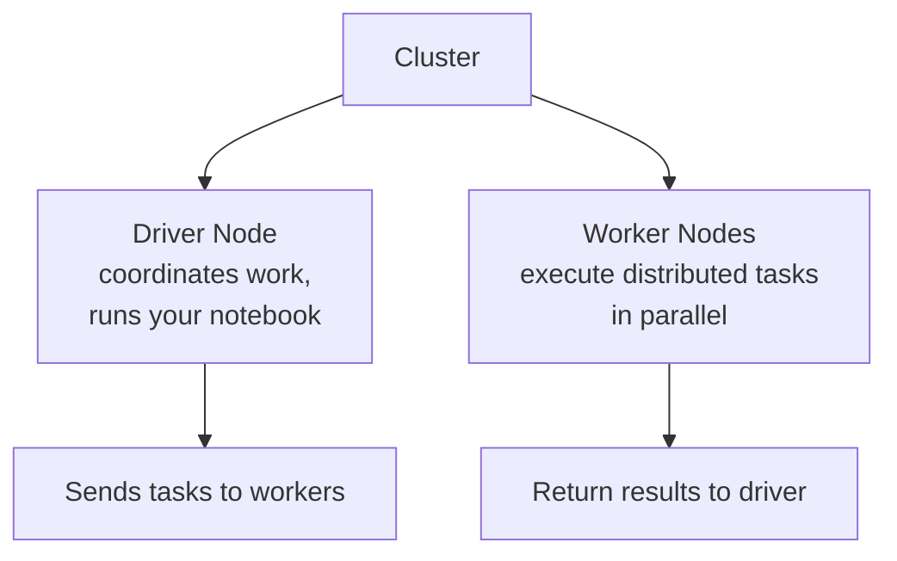
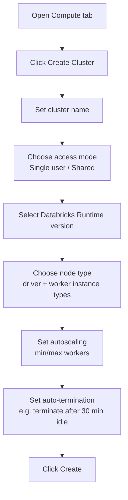
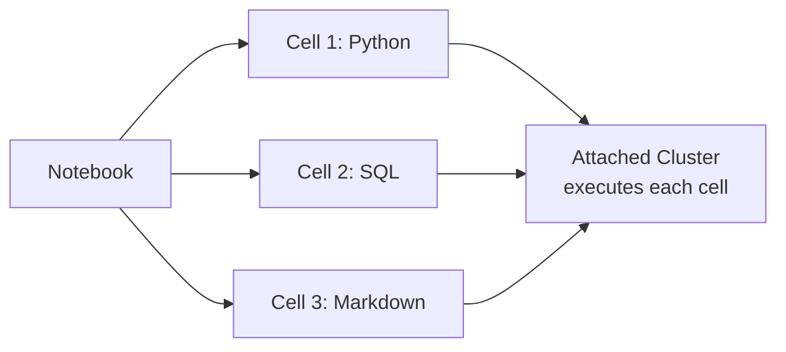
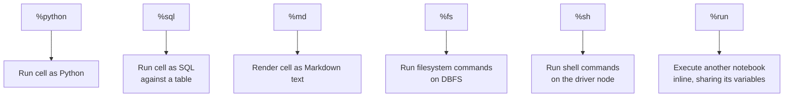
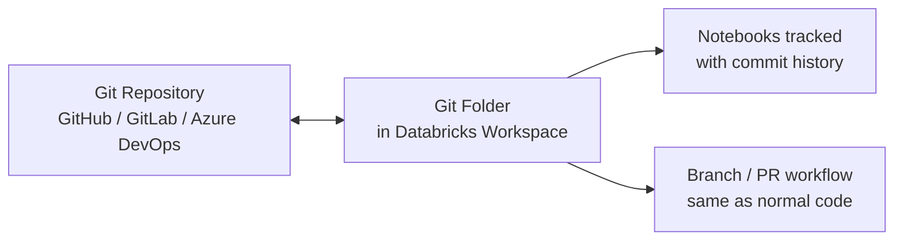
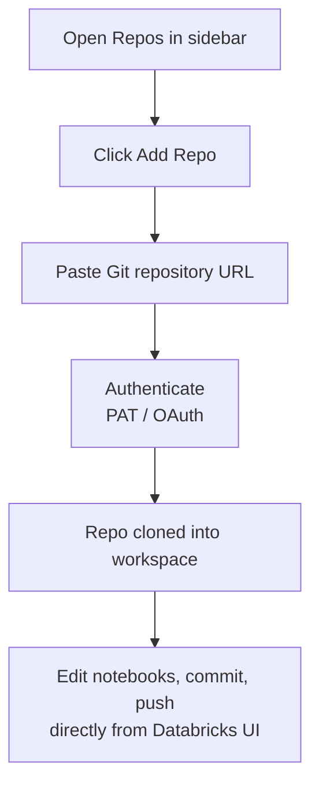

# Databricks Essentials: Clusters, Notebooks, Magic Commands, and Git Folders

## 1. Clusters and Cluster Creation

### What a Cluster Is

A cluster is a set of managed cloud machines (driver + worker nodes) running Apache Spark, spun up on demand to execute your code. You don't manage the underlying servers — Databricks provisions, configures, and tears them down for you.



### Types of Clusters

| Type | Purpose |
|---|---|
| **All-Purpose Cluster** | Interactive use — notebooks, ad-hoc exploration, shared by multiple users |
| **Job Cluster** | Spun up automatically for a scheduled job, then terminated when the job finishes — cheaper for automated pipelines |
| **SQL Warehouse** | Optimized specifically for SQL queries and BI tool connections, not general-purpose compute |

### Step-by-Step: Creating a Cluster



1. **Open the Compute tab** in the workspace sidebar and click **Create Cluster**.
2. **Name the cluster** — something identifiable if multiple people share the workspace.
3. **Choose access mode** — Single User (only you can attach) or Shared (multiple users, with stricter isolation).
4. **Pick a Databricks Runtime version** — this bundles a specific Spark version plus pre-installed libraries (standard, ML runtime, or GPU-enabled, depending on the workload).
5. **Select node type** — the VM size for driver and worker nodes; bigger nodes for memory-heavy jobs, more (smaller) nodes for highly parallel ones.
6. **Configure autoscaling** — set a min and max number of workers; Databricks scales up under load and back down when idle, so you're not paying for idle capacity.
7. **Set auto-termination** — e.g., "terminate after 30 minutes of inactivity" — this is the single most effective cost-control setting for an interactive cluster.
8. **Create** — the cluster takes a few minutes to spin up before you can attach a notebook to it.

### Why Auto-Termination Matters

A cluster left running idle bills the same as one doing real work. Setting a short auto-termination window (e.g., 15–30 minutes) is standard practice specifically to avoid paying for compute nobody is using.

## 2. Notebooks

A notebook is the primary interactive workspace in Databricks — a sequence of executable cells, similar in spirit to Jupyter, but natively multi-language and directly attached to a cluster.



Key properties:

- **Multi-language by cell** — a single notebook can mix Python, SQL, Scala, and R across different cells (using magic commands, covered next)
- **Attached to a cluster** — a notebook doesn't run anything until it's attached to a live cluster; that cluster provides the actual compute
- **State persists between cells** — variables defined in one cell are available in later cells, same as Jupyter
- **Collaborative** — multiple users can view/edit the same notebook, with comments and version history built in

## 3. Magic Commands

Magic commands let you override a notebook cell's default language for that one cell, or invoke special notebook behaviors, using a `%` prefix.



| Magic command | What it does |
|---|---|
| `%sql` | Runs the cell as a SQL query against a table, even in a Python-default notebook |
| `%python` | Forces a cell to run as Python |
| `%md` | Renders the cell as formatted Markdown, not code |
| `%fs` | Runs filesystem commands against DBFS (Databricks File System) |
| `%sh` | Runs a shell command directly on the driver node |
| `%run` | Executes another notebook in place, inheriting its variables/functions |

### Example

```python
# Cell 1 (Python)
df = spark.read.table("patients")
df.createOrReplaceTempView("patients_view")
```

```sql
%sql
-- Cell 2 (SQL, in an otherwise Python notebook)
SELECT city, AVG(bmi) as avg_bmi
FROM patients_view
GROUP BY city
ORDER BY avg_bmi DESC
```

This is one of the most common patterns in Databricks notebooks: load and transform data with PySpark, then drop into `%sql` for quick, readable aggregate queries — without leaving the notebook or switching tools.

## 4. Git Folders

A **Git folder** (formerly called "Repos") links a folder in your Databricks workspace directly to a Git repository, so notebooks can be version-controlled the same way regular code is.



### What It Enables

- **Version control for notebooks** — commit, push, pull, and view diffs on notebooks the same as `.py` files
- **Branching workflows** — create a feature branch, make changes in a notebook, open a pull request, same as any software project
- **CI/CD integration** — Git folders let notebook-based pipelines participate in the same review and deployment process as the rest of an engineering org's code
- **Avoiding notebook sprawl** — without Git integration, teams often end up with untracked, duplicated notebook copies ("analysis_v2_final_FINAL"); Git folders bring standard source control discipline to that workflow

### Basic Setup Flow



Once connected, notebooks inside that folder behave like tracked files — changes show up as diffs, and you can switch branches directly from the Databricks UI without leaving the platform.

## Summary

| Concept | Role |
|---|---|
| **Cluster** | The actual compute — created once, attached to notebooks, torn down when idle |
| **Notebook** | Where you write and run code, interactively, against an attached cluster |
| **Magic commands** | Let a single notebook mix languages (`%sql`, `%python`) or run special operations (`%fs`, `%sh`, `%run`) |
| **Git folder** | Connects workspace notebooks to a real Git repo, enabling proper version control and CI/CD |
