# Databricks Lakeflow and Its Components

## What Is Lakeflow?

Lakeflow is Databricks' unified data engineering framework — it combines ingestion, transformation, and orchestration, which previously required stitching together separate tools, into one governed system built on serverless compute and Unity Catalog.

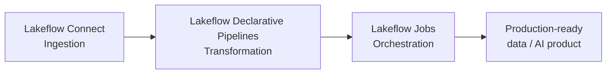

| Component | Job | Analogy |
|---|---|---|
| **Lakeflow Connect** | Bring data in from external sources | The intake pipe |
| **Lakeflow Declarative Pipelines** | Transform raw data into clean, usable tables | The refinery |
| **Lakeflow Jobs** | Schedule and orchestrate the whole workflow | The conductor |

Each component can be used independently, but they're built to work together — Lakeflow Connect pipelines are actually built on top of Lakeflow Declarative Pipelines under the hood, and both are typically run and monitored via Lakeflow Jobs.

## Quick Overview: The Three Components

### 1. Lakeflow Connect (Ingestion)

Point-and-click, fully managed connectors — 100+ of them — for pulling data in from SaaS apps (Salesforce, Workday, HubSpot), databases (SQL Server, MySQL, PostgreSQL), files (SharePoint, Google Drive), and streaming sources, with governance built in via Unity Catalog. Covered in detail below.

### 2. Lakeflow Declarative Pipelines (Transformation)

The successor to Delta Live Tables (DLT) — you declare *what* the transformed data should look like (in SQL or Python), and the engine figures out *how* to run it: orchestration, incremental processing, and autoscaling are all handled automatically, rather than you hand-writing Spark/Structured Streaming code.

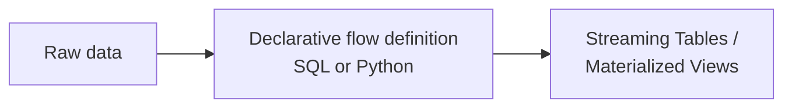

### 3. Lakeflow Jobs (Orchestration)

The workflow engine — DAG-based scheduling with conditional execution, looping, retries, and real-time triggers, plus full observability (lineage, freshness, data-quality monitoring) across every stage from ingestion through transformation.

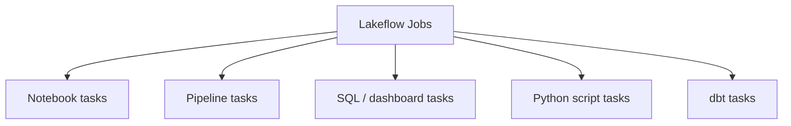

## Lakeflow Connect, In Detail

### What It Actually Does

Lakeflow Connect ingests data from a source system into Databricks, incrementally — reading and writing only what's changed since the last run, rather than re-pulling everything every time.

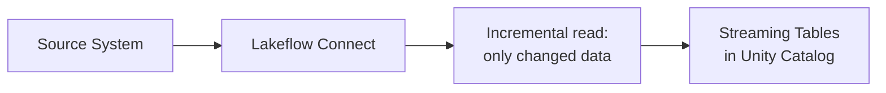

### Connector Types

Lakeflow Connect organizes connectors by the kind of source they pull from:

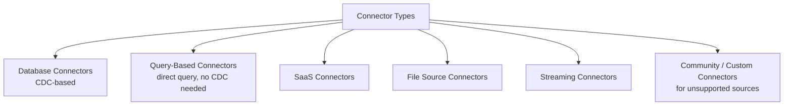

| Type | How it works | Examples |
|---|---|---|
| **Database (CDC)** | Uses change data capture to track row-level changes | MySQL, PostgreSQL, SQL Server |
| **Query-based** | Queries the source directly on a schedule using a cursor column, no CDC setup needed | Salesforce and others |
| **SaaS** | Managed connectors for enterprise apps | Salesforce, Workday, HubSpot, Jira |
| **File source** | Pulls unstructured/structured files from file storage | SharePoint, Google Drive |
| **Streaming** | Continuously reads from a message bus | Kafka, RabbitMQ, event streams |
| **Community / Custom** | For sources with no built-in connector | Open-source or self-built |

### Architecture: What a Connector Is Actually Made Of

The components differ depending on connector type. SaaS and file connectors are simplest; database connectors add an extra piece for continuous change tracking.

**SaaS / File connectors:**

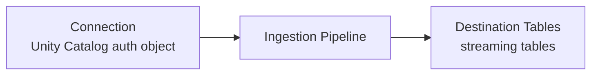

**Database connectors (CDC):**

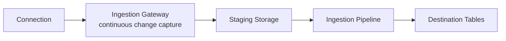

- **Connection** — a Unity Catalog object storing the source's authentication details, so credentials aren't scattered across pipeline configs
- **Ingestion Gateway** — runs continuously (as its own job) specifically for database connectors, capturing ongoing changes from the source
- **Staging Storage** — a holding area for captured changes before they're processed into the destination
- **Ingestion Pipeline** — the Lakeflow Declarative Pipeline that actually writes data into destination tables, running on serverless compute by default
- **Destination Tables** — always **streaming tables**, governed by Unity Catalog

### Orchestration

Every schedule you attach to a pipeline automatically gets its own job, with the ingestion pipeline as one task inside it — you can add more tasks to that job if needed.

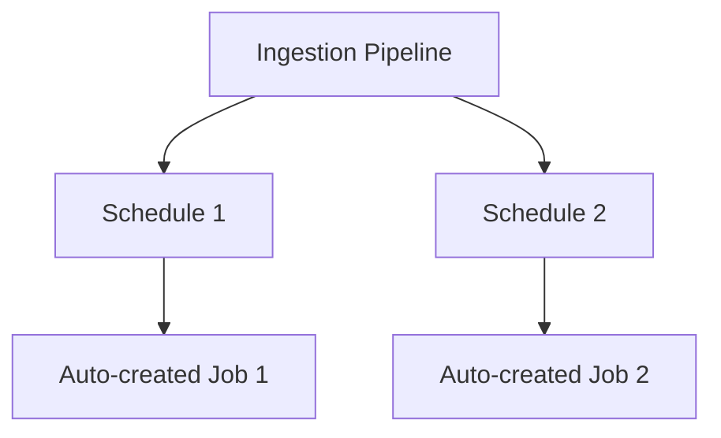

For database connectors specifically, the gateway runs as a **continuous task** in its own separate job — since change capture needs to run constantly, not on a fixed schedule like a batch pull.

### Incremental Ingestion

The first run pulls everything from the source. From then on, each run ingests only what changed — the exact mechanism depends on what the source supports:

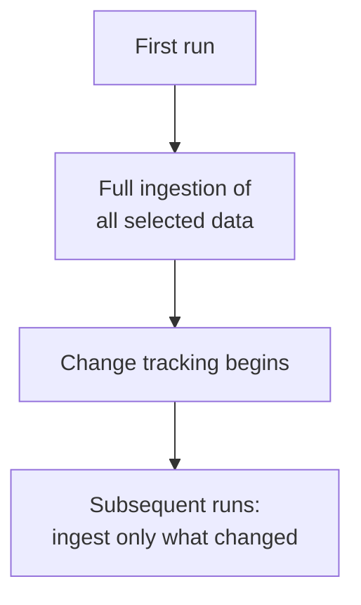

- **SQL Server** — can use both native change tracking and CDC
- **Salesforce** — uses a cursor column selected from a defined list of options
- Some sources or specific tables don't support incremental ingestion yet — Databricks is actively expanding coverage

### Networking

How a connector reaches its source depends on where that source lives:

| Source location | Connection method |
|---|---|
| SaaS application | Direct API calls; compatible with serverless egress controls |
| Cloud database | Private Link, or deploy the gateway inside a peered VNet/VPC |
| On-premises database | AWS Direct Connect / Azure ExpressRoute |

### Deployment and Programmatic Setup

Ingestion pipelines can be deployed via **Databricks Asset Bundles**, enabling source control, code review, and CI/CD across dev/staging/production workspaces — rather than clicking through the UI each time.

For connectors using API-only authentication (all database connectors, most SaaS connectors), connections can be created programmatically:

```python
# Via the Connections API from a notebook
# (illustrative — see Databricks docs for exact parameters)
w.connections.create(
    name="salesforce_conn",
    connection_type="SALESFORCE",
    options={...}
)
```

Or via the CLI:

```bash
databricks connections create --json '{...}'
```

**Exception:** connectors relying on browser-based OAuth (Confluence, Google Ads, HubSpot, Jira, Slack, Zendesk Support, and a few others) require interactive sign-in and can't be set up this way.

### Failure Recovery

As a fully managed service, Lakeflow Connect tries to self-heal:

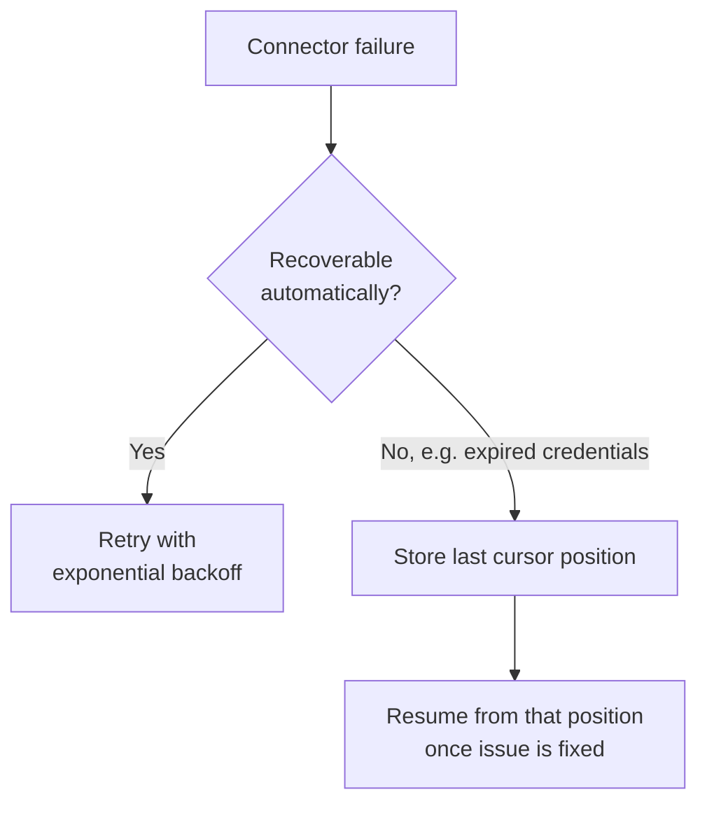

This cursor-position storage is what prevents data loss when an error needs human intervention — the pipeline doesn't have to restart from scratch once you fix the underlying issue.

### Monitoring

Lakeflow Connect exposes event logs, cluster logs, pipeline health metrics, and data quality metrics. Cost tracking is available via the built-in `system.billing.usage` table, and database connectors specifically expose gateway progress through dedicated event logs — useful since the gateway runs continuously and independently of the batch pipeline schedule.

### When the Built-In Connectors Aren't Enough

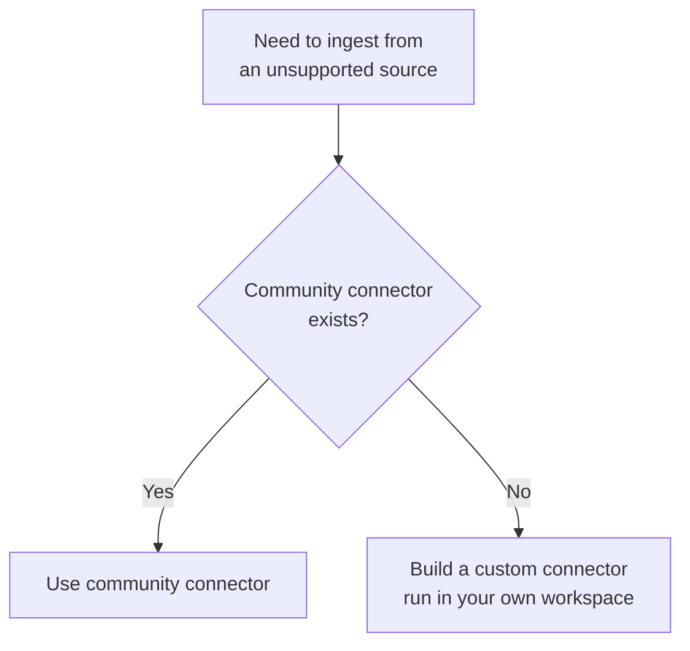

Community connectors are open-source, community-built and maintained. If neither a managed nor community connector fits, you can build and run your own custom connector inside your workspace.

### One Important Caveat

Because managed connectors depend on the source application/database's own APIs and stability, Databricks has limited control if the external service changes in a breaking way — in that case Databricks may need to discontinue or stop maintaining a connector, with advance notice where possible.

## Putting the Three Together

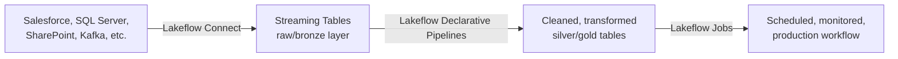

Lakeflow Connect gets data in reliably and incrementally; Lakeflow Declarative Pipelines transforms it with far less hand-written orchestration code than raw Spark; Lakeflow Jobs ties the whole thing — ingestion and transformation together — into a single scheduled, observable workflow.

## Summary

- **Lakeflow** unifies ingestion, transformation, and orchestration under one governed, serverless system
- **Lakeflow Connect** — 100+ managed connectors across database, query-based, SaaS, file, and streaming types; database connectors add a continuous ingestion gateway and staging storage that SaaS/file connectors don't need; incremental ingestion, automatic retry/recovery, and Unity Catalog governance are built in throughout
- **Lakeflow Declarative Pipelines** — the DLT successor; declare transformations, let the engine handle orchestration and scaling
- **Lakeflow Jobs** — the orchestrator tying ingestion and transformation pipelines into scheduled, monitored production workflows
