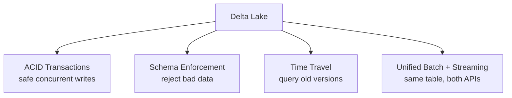
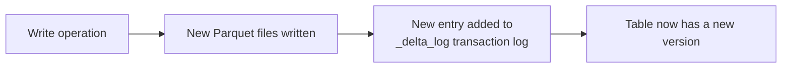
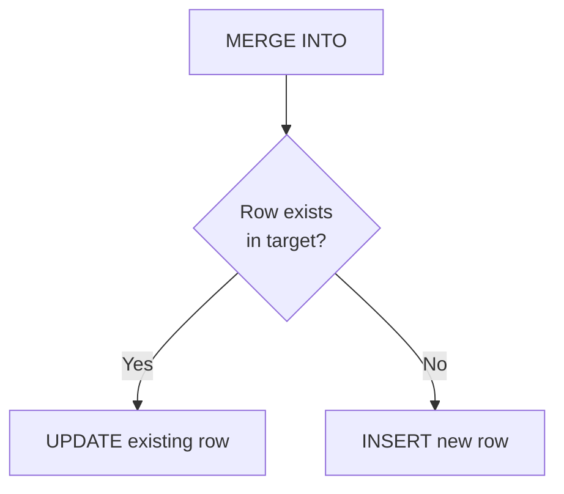
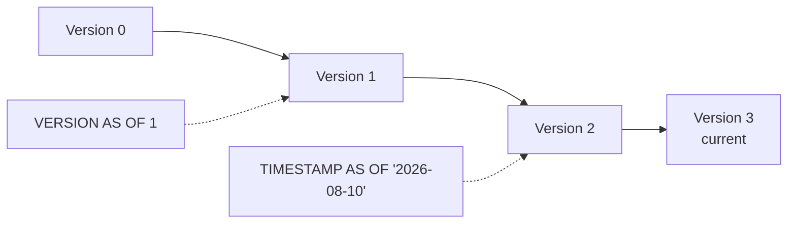
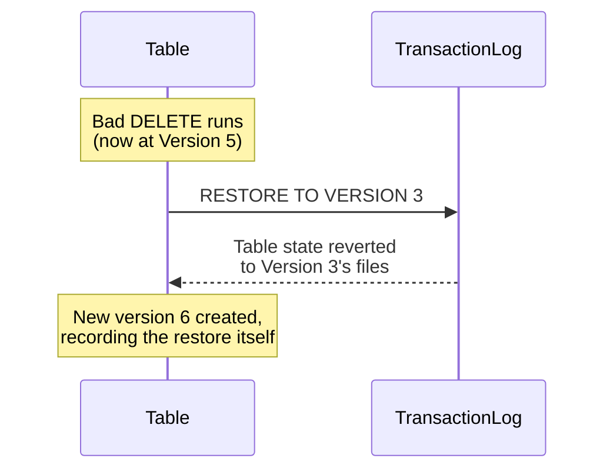
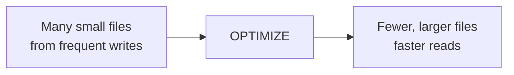
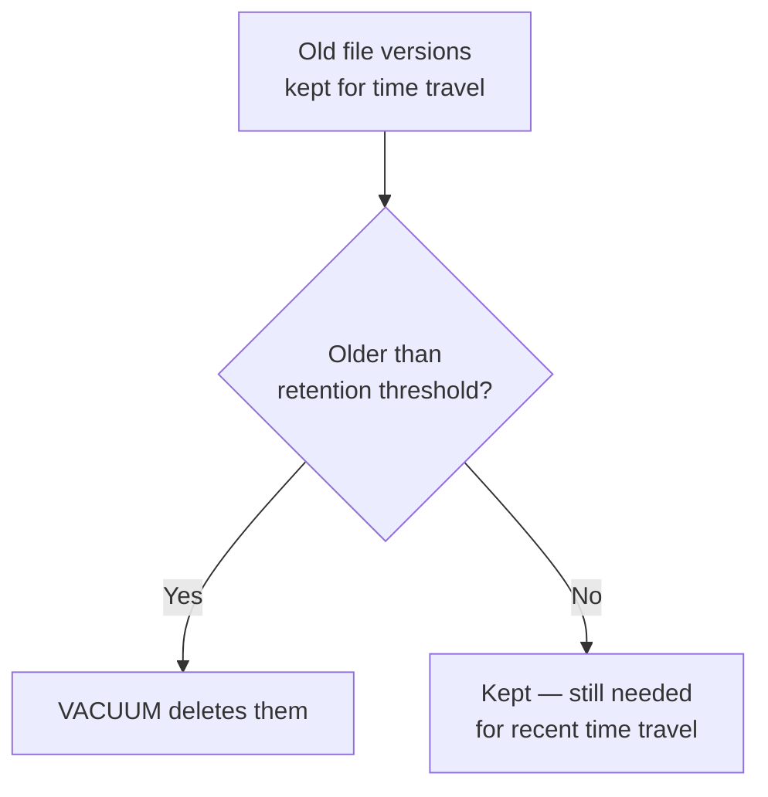

# Delta Lake, In Depth

## What Is Delta Lake?

Delta Lake is an open-source storage layer that sits on top of plain files (Parquet, typically) in cloud storage, adding the reliability features a data warehouse has but a raw data lake doesn't: ACID transactions, schema enforcement, and full version history.



Without Delta Lake, a "table" in a data lake is just a folder of files — nothing stops two jobs from writing to it simultaneously and corrupting it, nothing enforces that new data matches the expected schema, and there's no way to see what the table looked like yesterday.

## How It Works Under the Hood

Every Delta table is a folder containing:

- The actual data files (Parquet)
- A **transaction log** (`_delta_log/`) — a sequence of JSON files recording every change ever made to the table



This transaction log is the entire mechanism behind ACID guarantees, time travel, and versioning — it's an ordered record of every add/remove of every file, and "querying version N" just means reading the files that were present at that point in the log.

## Creating a Delta Table

### From a DataFrame (PySpark)

```python
df = spark.read.csv("/mnt/data/patients_raw.csv", header=True, inferSchema=True)

df.write.format("delta").mode("overwrite").save("/mnt/delta/patients")
```

- `.format("delta")` — write as a Delta table, not plain Parquet/CSV
- `.mode("overwrite")` — replace existing data (other options: `append`, `ignore`, `error`)

### As a SQL-Managed Table

```sql
%sql
CREATE TABLE patients
USING DELTA
LOCATION '/mnt/delta/patients'
```

This registers the Delta files as a named table you can query with SQL, without needing to reload it through PySpark each time.

### Creating One from Scratch with a Defined Schema

```sql
%sql
CREATE TABLE patients (
    patient_id STRING,
    name STRING,
    city STRING,
    age INT,
    bmi DOUBLE,
    verdict STRING
)
USING DELTA
LOCATION '/mnt/delta/patients'
```

## Basic Usage

### Reading

```python
df = spark.read.format("delta").load("/mnt/delta/patients")
df.show()
```

```sql
%sql
SELECT * FROM patients WHERE city = 'Mumbai'
```

### Writing / Appending New Data

```python
new_patients_df.write.format("delta").mode("append").save("/mnt/delta/patients")
```

### Updating and Deleting

Unlike plain Parquet, Delta tables support row-level `UPDATE` and `DELETE` directly:

```sql
%sql
UPDATE patients SET verdict = 'Normal' WHERE patient_id = 'P004';

DELETE FROM patients WHERE patient_id = 'P003';
```

### Upserts with MERGE

```sql
%sql
MERGE INTO patients AS target
USING patients_updates AS source
ON target.patient_id = source.patient_id
WHEN MATCHED THEN UPDATE SET *
WHEN NOT MATCHED THEN INSERT *
```

`MERGE` is the standard pattern for "insert if new, update if existing" — a very common need when syncing a table with a changing source system.



## Time Travel and History Commands

Because every change is recorded in the transaction log, Delta Lake lets you query, and even restore, past versions of a table.

### `DESCRIBE HISTORY`

Shows the full changelog of a table — every operation, when it happened, and who/what did it.

```sql
%sql
DESCRIBE HISTORY patients
```

Returns a table with columns like `version`, `timestamp`, `operation` (e.g. `WRITE`, `MERGE`, `DELETE`), and `operationParameters`. This is the first thing to check when you need to understand what happened to a table over time — every write is traceable.

### Querying by `VERSION`

Every write increments a version number, starting at 0. You can query the table exactly as it looked at any past version.

```sql
%sql
SELECT * FROM patients VERSION AS OF 3
```

```python
df = spark.read.format("delta").option("versionAsOf", 3).load("/mnt/delta/patients")
```

### Querying by `TIMESTAMP`

Same idea, but by wall-clock time instead of version number — useful when you know roughly *when* something happened but not the exact version.

```sql
%sql
SELECT * FROM patients TIMESTAMP AS OF '2026-08-15'
```

```python
df = spark.read.format("delta").option("timestampAsOf", "2026-08-15").load("/mnt/delta/patients")
```



### `RESTORE`

Reverts the table back to a previous version or timestamp — not just querying it, but actually making that old state the current state again.

```sql
%sql
RESTORE TABLE patients TO VERSION AS OF 2;
-- or
RESTORE TABLE patients TO TIMESTAMP AS OF '2026-08-10';
```

This is the direct fix for "someone ran a bad `DELETE`/`UPDATE` and we need to undo it" — because the old data files referenced by that version are (usually) still there, restoring is fast and doesn't require re-ingesting anything from the original source.



Note that `RESTORE` itself creates a *new* version — it doesn't erase history, it adds an entry saying "we went back to version 3."

## Maintenance Commands

### `OPTIMIZE`

Over time, many small writes create many small files, which hurts read performance (more files to open and scan). `OPTIMIZE` compacts small files into larger ones.

```sql
%sql
OPTIMIZE patients
```

You can also optimize with **Z-Ordering**, which co-locates related data in the same files based on a column you query often — this speeds up filtered queries significantly.

```sql
%sql
OPTIMIZE patients ZORDER BY (city)
```



### `VACUUM`

Deletes old data files that are no longer referenced by the current table version and are older than a retention threshold (default 7 days) — this is how you actually reclaim storage space, since old versions' files stick around to support time travel until vacuumed.

```sql
%sql
VACUUM patients;                    -- uses default 7-day retention
VACUUM patients RETAIN 168 HOURS;   -- explicit 168 hours = 7 days
```



**Important tradeoff:** running `VACUUM` with a short retention window (or the unsafe `RETAIN 0 HOURS` override) permanently deletes files that time travel and `RESTORE` depend on — you lose the ability to go back to any version older than what you kept. Vacuuming and time travel are in direct tension: more aggressive vacuuming saves storage cost but shrinks how far back you can restore.

## Command Summary

| Command | Purpose |
|---|---|
| `DESCRIBE HISTORY` | Show the full changelog of operations on a table |
| `... VERSION AS OF n` | Query the table as it looked at version `n` |
| `... TIMESTAMP AS OF 'date'` | Query the table as it looked at a specific time |
| `RESTORE TABLE ... TO VERSION/TIMESTAMP` | Revert the table's current state to a past version |
| `OPTIMIZE` | Compact small files into larger ones (optionally `ZORDER BY` a column) for faster reads |
| `VACUUM` | Permanently delete old, unreferenced files past the retention window to free storage |

## Summary

Delta Lake turns a folder of raw files into something that behaves like a real database table: transactional writes, enforced schema, and — because every change is logged — full time travel via `DESCRIBE HISTORY`, `VERSION AS OF`, `TIMESTAMP AS OF`, and `RESTORE`. `OPTIMIZE` and `VACUUM` are the maintenance side of that same log: compacting for read performance and cleaning up old files for storage cost, with vacuuming being the one operation that trades away time-travel depth for space savings.
