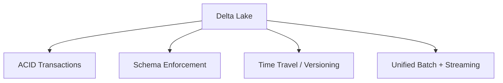
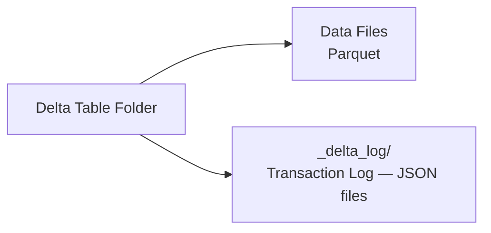
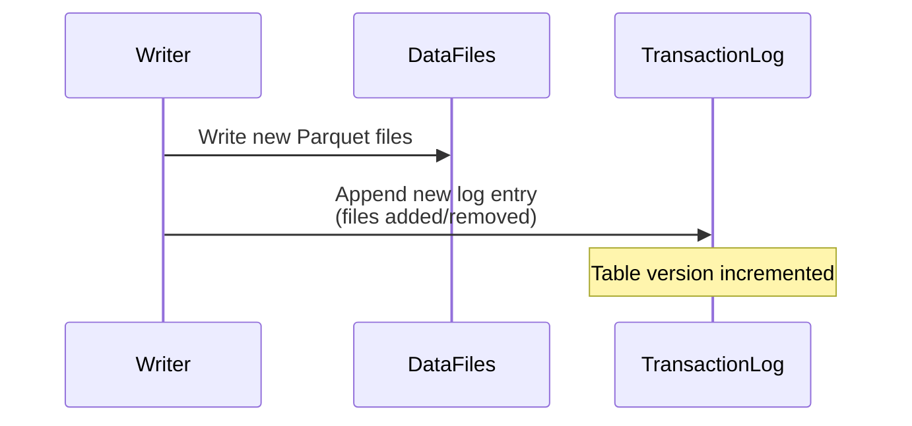
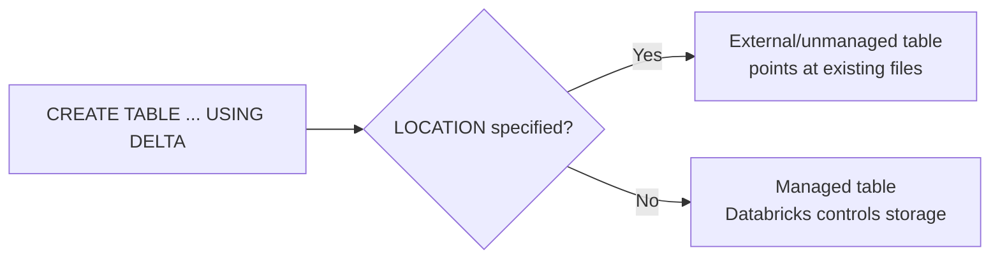
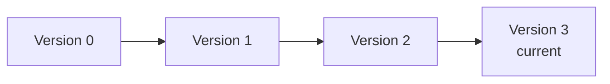
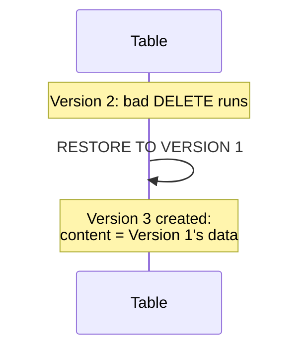
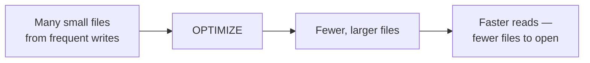
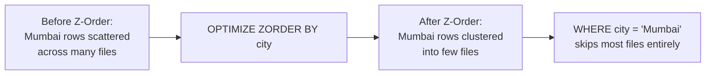
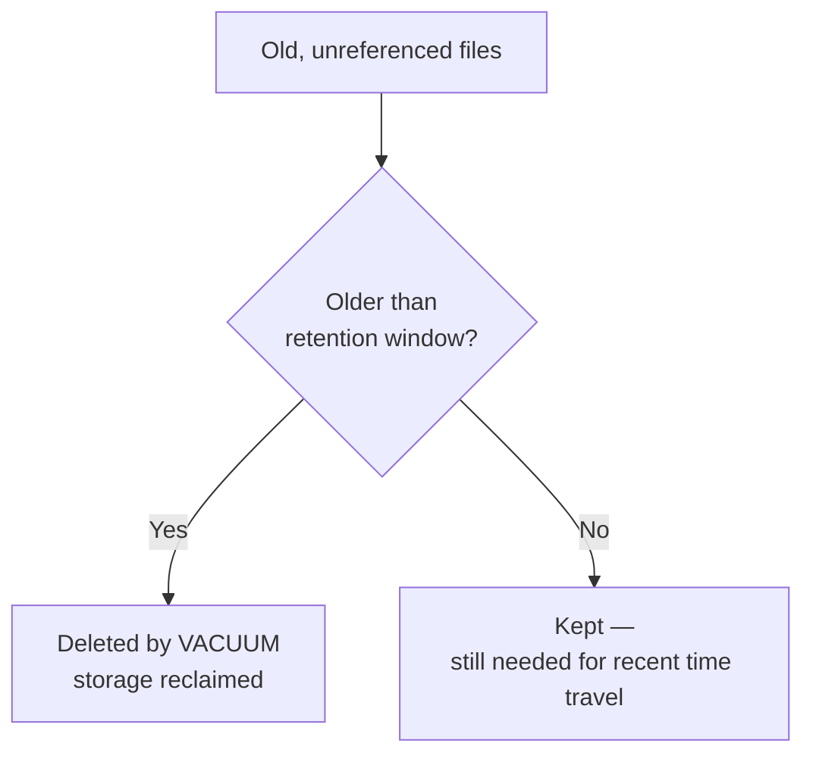

# Delta Lake: Depth, SQL Tables, Time Travel, Compaction, Indexing, Vacuum

## 1. Delta Lake, In Depth

Delta Lake is an open-source storage layer that sits on top of Parquet files in cloud storage, adding the reliability guarantees a normal data lake lacks: ACID transactions, schema enforcement, and versioned history.



### How It Works

A Delta table is really two things on disk:



Every write — insert, update, delete, merge — adds a new entry to `_delta_log`, recording which files were added and which were logically removed. This log is what makes everything else in this article possible: ACID safety, schema checks, and time travel all come from the fact that the table's full history is recorded, not just its current state.



### Why This Matters Over Plain Parquet

| | Plain Parquet in a lake | Delta Lake |
|---|---|---|
| Concurrent writes | Can corrupt data | Safe (ACID) |
| Schema changes | Silently accepted, can break downstream jobs | Enforced/validated |
| Row-level update/delete | Not supported directly | Supported (`UPDATE`, `DELETE`, `MERGE`) |
| Query old state | Not possible | Time travel via version/timestamp |

## 2. Creating a Delta Table Using SQL

```sql
%sql
CREATE TABLE patients (
    patient_id STRING,
    name STRING,
    city STRING,
    age INT,
    height DOUBLE,
    weight DOUBLE,
    bmi DOUBLE,
    verdict STRING
)
USING DELTA
LOCATION '/mnt/delta/patients'
```

- `USING DELTA` — tells Databricks to create this as a Delta table, not plain Parquet/CSV
- `LOCATION` — where the underlying files live in cloud storage; omit this and Databricks manages the location itself (a **managed table**) instead of you pointing at existing files (an **unmanaged/external table**)

### Inserting Data

```sql
%sql
INSERT INTO patients VALUES
('P006', 'Karan Shah', 'Delhi', 45, 1.72, 80.0, 27.04, 'Overweight');
```

### Creating from an Existing Query

```sql
%sql
CREATE TABLE patients_mumbai
USING DELTA
AS SELECT * FROM patients WHERE city = 'Mumbai'
```



## 3. Time Travel

Because every write is logged, you can query — or restore — the table exactly as it existed at any past point.



### Viewing the History

```sql
%sql
DESCRIBE HISTORY patients
```

Shows every operation, its version number, timestamp, and type (`WRITE`, `UPDATE`, `MERGE`, `DELETE`, `RESTORE`).

### Querying a Past Version

```sql
%sql
SELECT * FROM patients VERSION AS OF 1;
SELECT * FROM patients TIMESTAMP AS OF '2026-08-15';
```

```python
df = spark.read.format("delta").option("versionAsOf", 1).load("/mnt/delta/patients")
```

### Restoring to a Past State

```sql
%sql
RESTORE TABLE patients TO VERSION AS OF 1;
```

`RESTORE` doesn't erase history — it adds a *new* version whose content matches the old one, so the log always shows what actually happened, including the restore itself.



## 4. Compaction

Frequent small writes (streaming ingestion, small batch jobs) leave a table fragmented into many small files. Reading a table means opening every file that matches your query — many small files means more overhead per query.



### Running Compaction

```sql
%sql
OPTIMIZE patients
```

This rewrites the table's small files into a smaller number of appropriately-sized larger files, without changing any actual data — it's purely a storage-layout optimization.

### When to Run It

Compaction is typically scheduled periodically (e.g. nightly) on tables that receive frequent small writes, rather than run manually after every insert — running it too often adds unnecessary compute cost for marginal benefit.

## 5. Indexing

Delta Lake doesn't use traditional B-tree indexes like a relational database. Instead, it speeds up queries through **data layout** and **file-level statistics**, so the engine can skip reading files that can't possibly contain relevant rows.

```mermaid
graph TD
    A[Delta "Indexing" Approaches] --> B[File Statistics<br/>min/max per column, automatic]
    A --> C[Z-Ordering<br/>co-locate related data]
    A --> D[Bloom Filter Indexes<br/>fast existence checks]
```

### File Statistics + Data Skipping (Automatic)

Delta Lake automatically tracks min/max values for columns in each file. When you filter (`WHERE age > 60`), the engine checks each file's stats first and skips any file whose range can't possibly match — no configuration needed, this happens by default.

### Z-Ordering (Manual, Most Common)

Z-Ordering physically co-locates rows with similar values in a chosen column into the same files, which makes data-skipping far more effective for queries that filter on that column.

```sql
%sql
OPTIMIZE patients ZORDER BY (city)
```



Pick columns you frequently filter on — Z-Ordering by a column nobody queries by doesn't help.

### Bloom Filter Indexes (For High-Cardinality Lookups)

For point lookups on columns with many distinct values (like an ID), a Bloom filter index lets Delta quickly check "could this file contain this value?" without scanning it.

```sql
%sql
CREATE BLOOMFILTER INDEX ON TABLE patients
FOR COLUMNS(patient_id OPTIONS (fpp=0.1, numItems=100000))
```

- `fpp` — false positive probability (lower = more accurate, larger index)
- `numItems` — expected number of distinct values, used to size the filter correctly

## 6. Vacuuming a Delta Table

`VACUUM` permanently deletes data files that are no longer referenced by the table's current version and are older than a retention window — this is how storage is actually reclaimed, since old file versions stick around (to support time travel) until vacuumed.

```sql
%sql
VACUUM patients;                    -- default: 7-day retention
VACUUM patients RETAIN 168 HOURS;   -- explicit 7 days
```



### Dry Run First

```sql
%sql
VACUUM patients DRY RUN
```

Lists which files *would* be deleted, without actually deleting anything — worth running before a real vacuum on an important table.

### The Core Tradeoff

Vacuuming trades away time-travel depth for storage savings. Once a file is vacuumed, any version of the table that depended on it can no longer be queried or restored — `VERSION AS OF` or `RESTORE` to a point beyond the retention window will fail. Shortening the retention window below the default (or the unsafe `RETAIN 0 HOURS` override) saves storage cost but shrinks how far back you can ever go.

## Summary

| Topic | Key Command | What It Gives You |
|---|---|---|
| Delta Lake core | — | ACID + schema enforcement + versioning, via the transaction log |
| SQL table creation | `CREATE TABLE ... USING DELTA` | A managed or external Delta table |
| Time travel | `VERSION AS OF`, `TIMESTAMP AS OF`, `RESTORE` | Query or revert to a past state |
| Compaction | `OPTIMIZE` | Fewer, larger files → faster reads |
| Indexing | `OPTIMIZE ... ZORDER BY`, `CREATE BLOOMFILTER INDEX` | Faster filtered/point-lookup queries via data skipping |
| Vacuuming | `VACUUM ... RETAIN n HOURS` | Reclaimed storage, at the cost of time-travel depth |
