# Incremental Data Ingestion, Auto Loader In Depth, and Multi-Hop Architecture

## 1. Incremental Data Ingestion and Its Types

### The Core Problem

Re-processing an entire dataset every time new data arrives wastes compute and time — especially as a dataset grows into millions of files. **Incremental ingestion** solves this by tracking what's already been processed and only handling what's new.

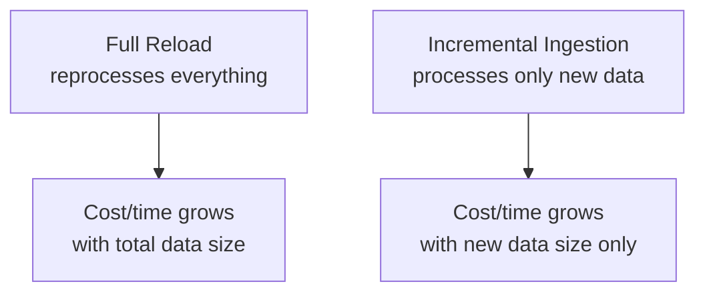

On Databricks, two main tools handle this for files landing in cloud object storage: **`COPY INTO`** and **Auto Loader**.

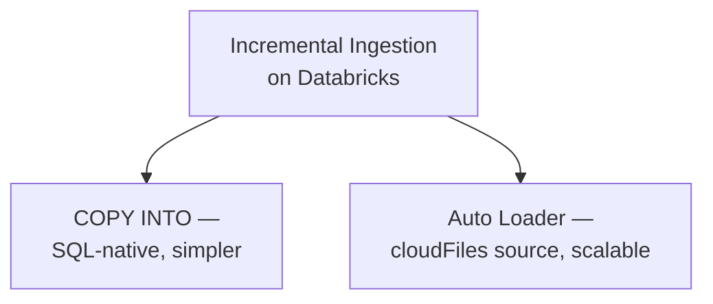

### `COPY INTO`

A SQL command that loads new files from a location into a Delta table, automatically skipping files it has already loaded.

```sql
COPY INTO orders_table
FROM '/Volumes/demoworkspace_new/default/my_volume/ecommerce/'
FILEFORMAT = JSON
FORMAT_OPTIONS ('multiline' = 'true')
COPY_OPTIONS ('mergeSchema' = 'true');
```

- Tracks already-loaded files internally, so re-running the same command is safe — it only picks up new files
- Simple, SQL-only, good for **periodic batch loads** where the number of files per run is modest
- Not designed for very high file volumes (millions of files) or truly continuous streaming — file discovery gets slower as the source directory grows large

### Auto Loader

A structured streaming source (`cloudFiles`) purpose-built for incrementally and efficiently processing new files at scale — including scenarios with millions of existing files or a constant trickle of new ones.

```python
df = (spark.readStream
    .format("cloudFiles")
    .option("cloudFiles.format", "json")
    .schema(orders_schema)
    .load("/Volumes/demoworkspace_new/default/my_volume/ecommerce/"))
```

- Built on Structured Streaming, so it inherits checkpointing, fault tolerance, and exactly-once processing guarantees
- Scales to very high file counts far better than `COPY INTO`
- Supports two distinct strategies for detecting new files, covered in depth below

### Choosing Between Them

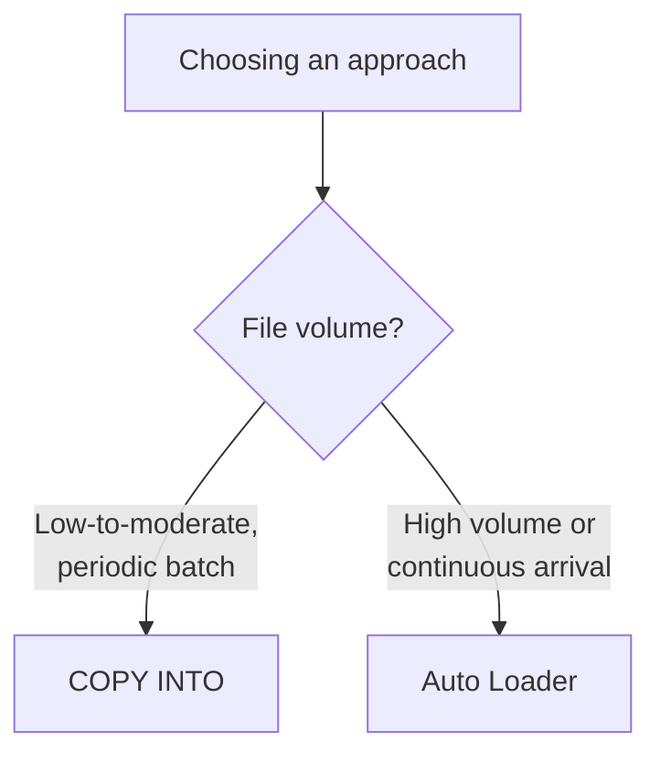

| | `COPY INTO` | Auto Loader |
|---|---|---|
| Interface | SQL only | PySpark (streaming) |
| Scale | Thousands of files | Millions of files |
| Continuous streaming | No — run on a schedule | Yes — can run continuously |
| Schema evolution | Basic (`mergeSchema`) | Rich (`cloudFiles.schemaEvolutionMode`) |
| File discovery | Full directory listing each run | Two configurable modes (below) |

## 2. Auto Loader, In Depth

### How It Fits the Structured Streaming Model

Auto Loader is a *source* — everything about triggers, output modes, and checkpointing from Structured Streaming applies to it directly, since it's just `readStream.format("cloudFiles")` under the hood.

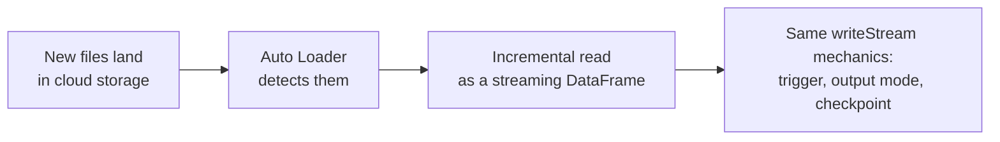

### Key Options

```python
df = (spark.readStream
    .format("cloudFiles")
    .option("cloudFiles.format", "json")
    .option("cloudFiles.schemaLocation", "/mnt/checkpoints/orders_schema")
    .option("cloudFiles.inferColumnTypes", "true")
    .option("cloudFiles.schemaEvolutionMode", "addNewColumns")
    .load("/Volumes/demoworkspace_new/default/my_volume/ecommerce/"))
```

| Option | Purpose |
|---|---|
| `cloudFiles.format` | Source file format (`json`, `csv`, `parquet`, etc.) |
| `cloudFiles.schemaLocation` | Where Auto Loader persists the inferred/evolved schema across restarts |
| `cloudFiles.inferColumnTypes` | Whether to infer actual types (e.g. `int`, `double`) rather than treating everything as string |
| `cloudFiles.schemaEvolutionMode` | How to react when new columns appear in later files (`addNewColumns`, `rescue`, `failOnNewColumns`, `none`) |
| `cloudFiles.maxFilesPerTrigger` | Caps how many files are processed per micro-batch |

### Discovery Mode 1: Directory Listing (Default)

Auto Loader periodically lists the contents of the source directory and compares it against its own record of already-processed files, identifying what's new.

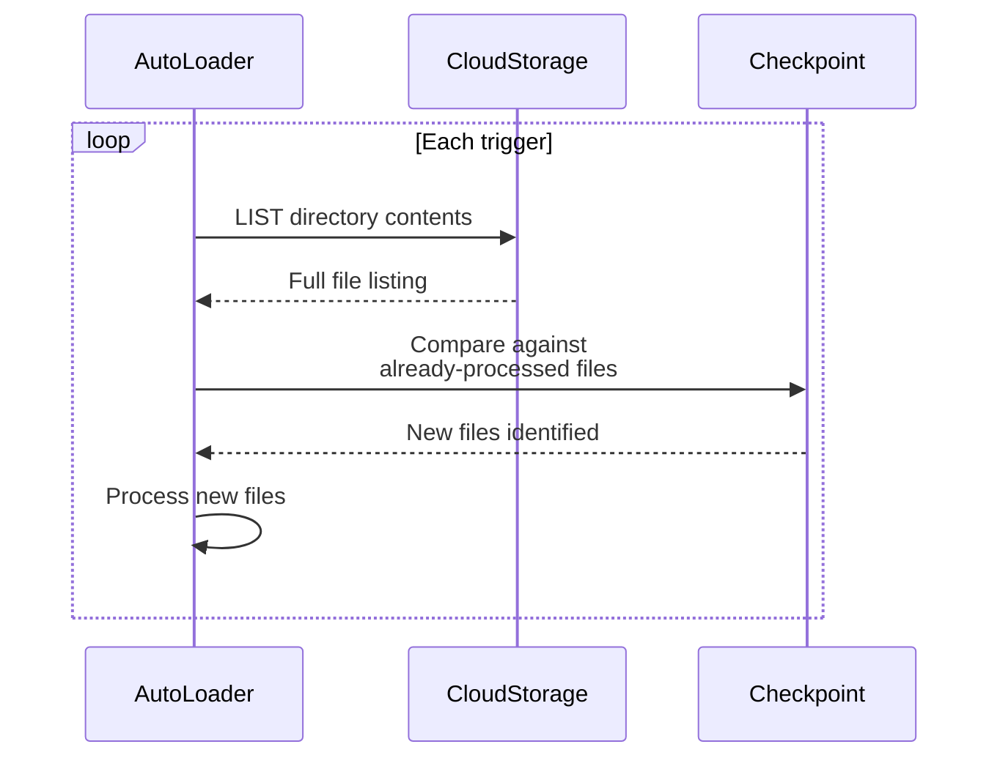

```python
df = (spark.readStream
    .format("cloudFiles")
    .option("cloudFiles.format", "json")
    .option("cloudFiles.useIncrementalListing", "auto")  # directory listing, optimized
    .load("/Volumes/demoworkspace_new/default/my_volume/ecommerce/"))
```

- **How it works:** lists the directory (often using lexicographically-ordered incremental listing for efficiency, where supported), diffs against known files, processes what's new
- **Good for:** moderate file volumes, and setups where you don't want to configure extra cloud infrastructure (queues, event subscriptions)
- **Weak point:** listing cost grows as the number of files in the directory grows — with very large numbers of files (deep, wide, or long-lived directories), each listing operation gets slower, even though the *new* files are few

### Discovery Mode 2: File Notification (Event-Driven)

Instead of listing the directory, Auto Loader subscribes to the cloud provider's native file-creation events (via a queue), and only reacts to files it's explicitly told about.

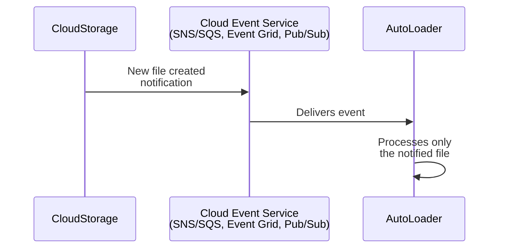

```python
df = (spark.readStream
    .format("cloudFiles")
    .option("cloudFiles.format", "json")
    .option("cloudFiles.useNotifications", "true")
    .load("/Volumes/demoworkspace_new/default/my_volume/ecommerce/"))
```

- **How it works:** Auto Loader sets up (or uses) cloud-native infrastructure — AWS S3 event notifications via SNS/SQS, Azure Event Grid + Queue Storage, or GCP Pub/Sub — so new file events are pushed to it directly, rather than it having to ask "what's new?" via listing
- **Good for:** very large or continuously growing directories, where directory listing would become a bottleneck; near-real-time ingestion needs
- **Setup cost:** requires cloud permissions to create/manage the notification infrastructure (queues, topics, subscriptions) — more moving parts than directory listing, but Auto Loader manages the setup automatically when given the right permissions

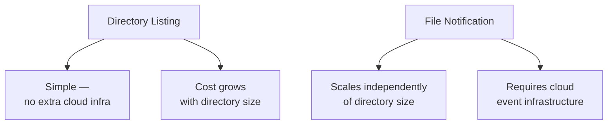

### Choosing Between the Two Modes

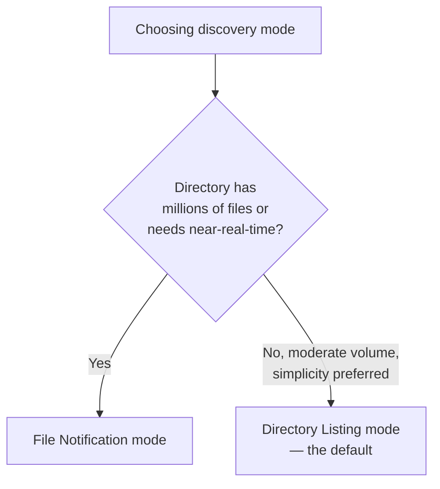

| | Directory Listing | File Notification |
|---|---|---|
| Default? | Yes | No, opt-in |
| Extra cloud setup | None | Queue/topic/subscription infra |
| Scales with directory size | Degrades at very high file counts | Stays efficient regardless of directory size |
| Latency | Depends on listing frequency | Near-real-time, event-driven |
| Best for | Simpler pipelines, moderate volume | High-volume, low-latency ingestion |

## 3. Multi-Hop (Medallion) Architecture

### The Core Idea

Multi-hop architecture organizes data into progressively refined layers — commonly called **bronze**, **silver**, and **gold** — with each layer built from the one before it, rather than trying to go from raw data straight to business-ready output in one step.

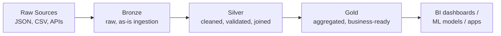

### Bronze: Raw Ingestion

Data lands here exactly as it arrived from the source — minimal to no transformation, often just Auto Loader or `COPY INTO` writing files straight into a Delta table.

```python
bronze_df = (spark.readStream
    .format("cloudFiles")
    .option("cloudFiles.format", "json")
    .schema(orders_schema)
    .load("/Volumes/demoworkspace_new/default/my_volume/ecommerce/"))

bronze_df.writeStream.format("delta").outputMode("append") \
    .option("checkpointLocation", "/mnt/checkpoints/bronze_orders") \
    .table("bronze_orders")
```

**Why keep raw data at all?** If a downstream transformation turns out to be wrong, bronze lets you reprocess from the original data without going back to the source system — it's your permanent, replayable record of exactly what arrived.

### Silver: Cleaned and Conformed

Bronze data gets validated, deduplicated, type-corrected, and joined with other tables — still fairly granular (row-level), but now trustworthy and query-ready.

```python
from pyspark.sql.functions import to_timestamp

silver_orders_df = (spark.readStream.table("bronze_orders")
    .withColumn("timestamp", to_timestamp("timestamp"))
    .dropDuplicates(["order_id"])
    .filter("total > 0"))

silver_orders_df.writeStream.format("delta").outputMode("append") \
    .option("checkpointLocation", "/mnt/checkpoints/silver_orders") \
    .table("silver_orders")
```

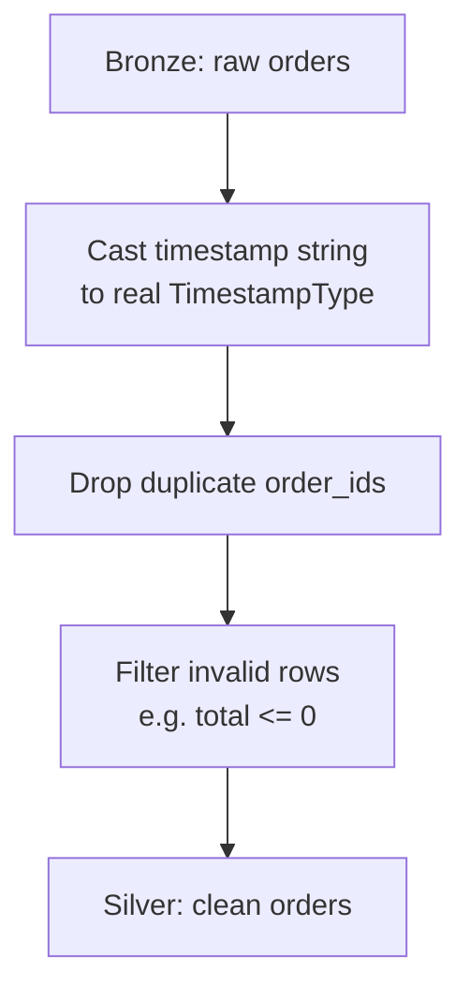

### Gold: Business-Ready Aggregates

Silver data gets aggregated into the shapes actual consumers need — dashboards, reports, ML feature tables.

```python
from pyspark.sql.functions import window, sum as _sum

gold_hourly_revenue_df = (spark.readStream.table("silver_orders")
    .withWatermark("timestamp", "10 minutes")
    .groupBy(window("timestamp", "1 hour"))
    .agg(_sum("total").alias("revenue")))

gold_hourly_revenue_df.writeStream.format("delta").outputMode("update") \
    .option("checkpointLocation", "/mnt/checkpoints/gold_hourly_revenue") \
    .table("gold_hourly_revenue")
```

### Why This Structure, Specifically

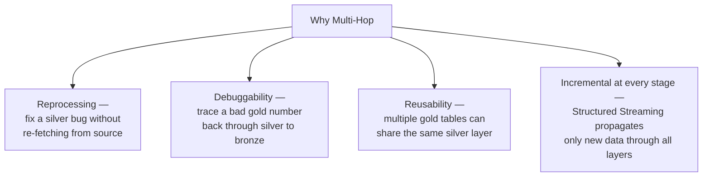

- **Reprocessing without re-fetching** — if a silver transformation had a bug (say, the wrong filter), you fix and rerun it against bronze, without needing to re-ingest from the original source system, which may not even keep history that long
- **Debuggability** — a wrong number in a gold table can be traced backward, layer by layer, to find exactly where it went wrong
- **Reusability** — several different gold tables (hourly revenue, top books, customer segments) can all read from the same silver layer, instead of each one re-deriving cleaning logic from bronze independently
- **End-to-end incrementality** — because each layer is itself a Structured Streaming job reading the previous layer as a stream, new data flows through bronze → silver → gold automatically, without manual re-triggering at each stage

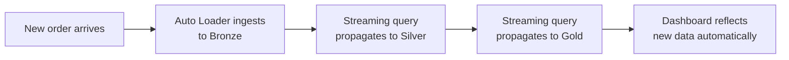

## Summary

| Topic | Key Idea |
|---|---|
| Incremental ingestion | Process only new data, not the whole dataset, on each run |
| `COPY INTO` | SQL-native, simple, good for moderate batch volumes |
| Auto Loader | `cloudFiles` streaming source, scales to millions of files, built on Structured Streaming |
| Directory listing mode | Default; lists and diffs the directory each trigger; simple but slows at very high file counts |
| File notification mode | Event-driven via cloud queues/topics; scales independently of directory size, more setup |
| Multi-hop architecture | Bronze (raw) → Silver (cleaned) → Gold (aggregated), each layer streaming from the one before, enabling reprocessing, debugging, and reuse without re-touching the original source |
