# Lakeflow Connect, In Detail: Connector Types Explained

## What Lakeflow Connect Is

Lakeflow Connect is Databricks' managed ingestion layer — 100+ connectors that bring data into Unity Catalog-governed streaming tables, using incremental reads/writes so pipelines stay fast and cost-efficient rather than re-pulling entire datasets on every run.

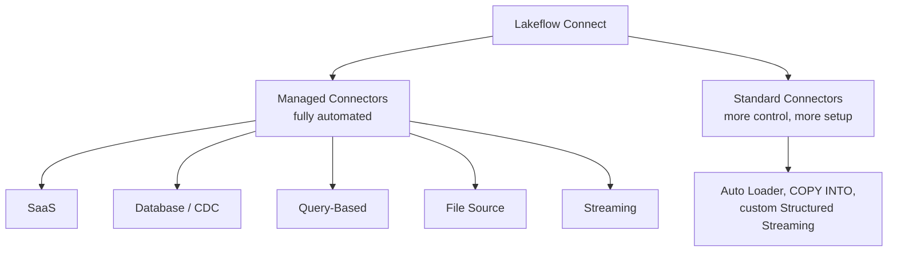

The core tradeoff across the platform: **managed connectors** automate almost everything (schema handling, scheduling, retries) but support a defined list of sources; **standard connectors** (Auto Loader, COPY INTO, custom streaming) give you more control and broader source support, at the cost of more manual setup.

## Connector Type 1: SaaS Connectors

Managed, point-and-click connectors for enterprise applications — Salesforce, HubSpot, Jira, Workday, Confluence, and more.

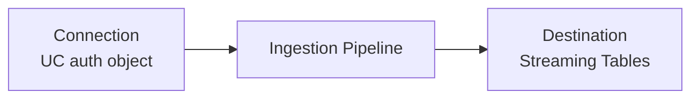

**Components:**

| Component | Role |
|---|---|
| Connection | Unity Catalog object storing the app's authentication details (API keys, OAuth tokens) |
| Ingestion Pipeline | Runs on serverless compute, pulls data via the app's API, writes to streaming tables |
| Destination Tables | Streaming tables governed by Unity Catalog |

**How you'd set one up (Salesforce example):** select or create a Unity Catalog connection storing the app's auth details, then configure the ingestion pipeline with a destination catalog/schema — no custom API integration code required.

Some SaaS connectors use browser-based OAuth (Confluence, Google Ads, HubSpot, Jira, Meta Ads, Slack, TikTok Ads, Zendesk) and require interactive sign-in — these can't be set up purely programmatically.

> **Setup steps (Salesforce example):**
> 1. Confirm prerequisites: Unity Catalog enabled, serverless compute enabled on the workspace, and `CREATE CONNECTION` privilege on the metastore if creating a new connection
> 2. In the workspace sidebar, click **Data Ingestion** → **Add data** → select the connector (e.g. **Salesforce**) under Databricks connectors
> 3. On the Connection page, either select an existing connection or create a new one — this triggers an OAuth 2.0 login flow against the source app (only authenticate via the link Databricks itself provides)
> 4. Salesforce specifically requires the connected Databricks app be authorized by an admin if API Access Control is enabled — use a dedicated ingestion user, not a personal login
> 5. Once authenticated, click **Create connection**, then continue the wizard to select objects/tables to ingest
> 6. Configure the destination catalog/schema and a sync schedule, then create the pipeline — Lakeflow Connect auto-creates a job for that schedule

## Connector Type 2: Database Connectors (CDC)

Managed connectors for relational databases, using **change data capture** to track every row-level change (insert/update/delete) rather than re-scanning tables.

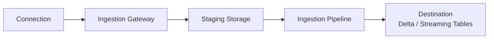

**Supported connectors:**

| Database | Mechanism |
|---|---|
| MySQL | CDC, for efficient incremental loads |
| PostgreSQL | CDC |
| Microsoft SQL Server | CDC or full snapshot |
| Oracle | CDC via LogMiner |

**Components:**

- **Connection** — Unity Catalog object with the database's authentication details
- **Ingestion Gateway** — a pipeline that runs *continuously*, extracting snapshots, change logs, and metadata directly from the source database; runs on classic compute inside your workspace's VPC/VNet so it can reach the database over the network
- **Staging Storage** — holds captured changes before they're applied downstream
- **Ingestion Pipeline** — applies the staged changes incrementally to Delta tables
- **Destination Tables** — the resulting Delta tables in Unity Catalog

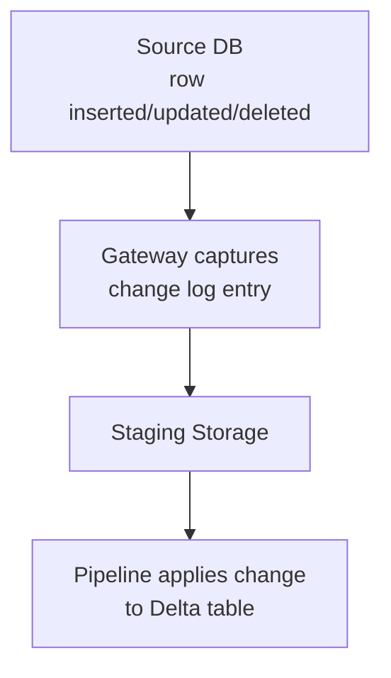

**Networking:** the gateway needs a real network path to the database — VPN, AWS Direct Connect, Azure ExpressRoute, VPC/VNet peering, or a public endpoint all work, and cross-cloud connectivity is supported (e.g. gateway in Azure reaching a database in AWS).

**Orchestration quirk:** because the gateway needs to run continuously (change capture doesn't happen on a fixed schedule), it runs as its own **continuous task** in a separate job from the ingestion pipeline itself.

> **Setup steps (SQL Server example):**
> 1. Ensure network connectivity between your Databricks workspace and the database — set up VPN, Direct Connect/ExpressRoute, or VPC/VNet peering beforehand, since the gateway must reach the source directly
> 2. On the source database, enable CDC (or confirm it's already enabled) and create a dedicated database user with the required read/replication permissions for Databricks to use
> 3. In the workspace, go to **Data Ingestion** → **Add data** → select the database connector (e.g. **SQL Server**)
> 4. Create a Unity Catalog **connection** with the database's host, port, and credentials
> 5. Configure the **ingestion gateway** — choose where it runs (inside your VPC/VNet if using peering) and which staging location to use
> 6. Select the tables/schemas to ingest, and choose CDC or full-snapshot mode per table if the connector supports both
> 7. Set the destination catalog/schema and create the pipeline — the gateway starts running continuously as its own job, separate from the scheduled ingestion pipeline job

## Connector Type 3: Query-Based Connectors

For databases where CDC isn't available or isn't enabled — these query the source **directly**, on a schedule, using a **cursor column** instead of change logs.

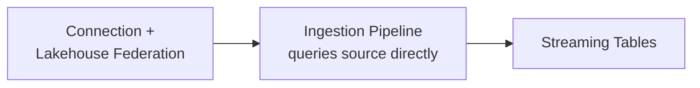

### How the Cursor Column Works

The cursor is a monotonically increasing column (timestamp or integer, like `updated_at` or an auto-incrementing ID) that tracks progress between runs.

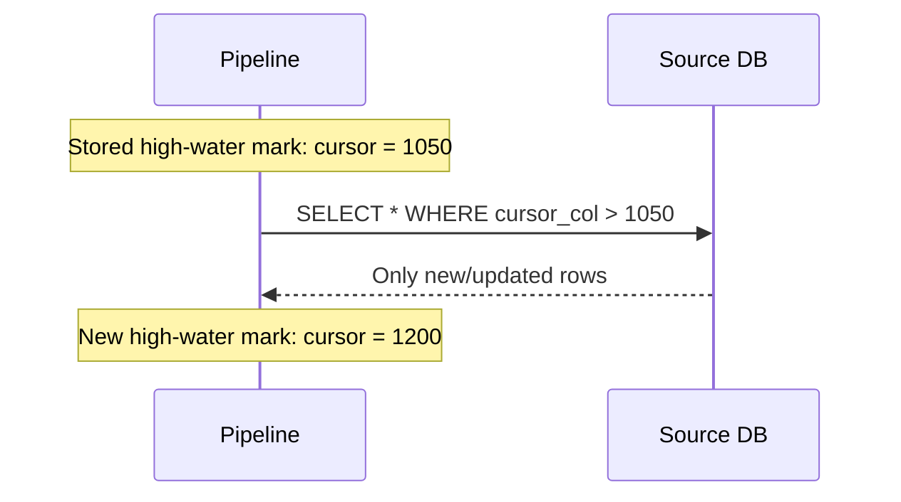

- Only a **single** cursor column is allowed — no composite/multi-column cursors (a pipeline with more than one fails with `INVALID_CURSOR_COLUMNS`)
- Cursor values must never decrease — rows at or below the stored high-water mark are never re-ingested
- No gateway or staging volume needed — it queries the source directly via a Unity Catalog connection and **Lakehouse Federation**

### History Tracking Modes (SCD)

Query-based connectors support different modes for how destination tables handle historical changes:

| Mode | Behavior |
|---|---|
| `SCD_TYPE_1` | Overwrites existing rows with the latest version — no history preserved |
| `SCD_TYPE_2` | Preserves full history by adding new versioned rows for every change |
| `APPEND_ONLY` | Every ingested row is appended, nothing merged or overwritten |

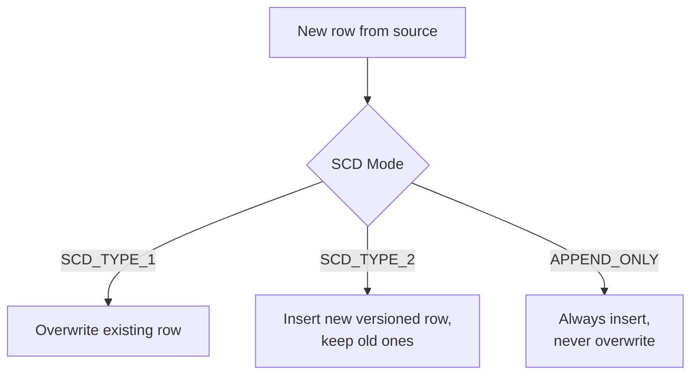

Query-based connectors also support a `deletion_condition` parameter to detect soft deletes (e.g. a row flagged `is_deleted = true` rather than physically removed).

> **Setup steps:**
> 1. Identify a column on the source table that increases monotonically and never decreases (e.g. `updated_at`, `id`) — this becomes your cursor column
> 2. Ensure network connectivity from serverless compute to the source database (query-based connectors use Lakehouse Federation, so check federation networking requirements specifically)
> 3. Create a Unity Catalog **connection** (or foreign catalog, for Lakehouse Federation-based ingestion) storing the database's credentials
> 4. Define the **ingestion pipeline**, specifying the source table, the cursor column, and the desired history-tracking mode (`SCD_TYPE_1`, `SCD_TYPE_2`, or `APPEND_ONLY`)
> 5. Optionally set a `deletion_condition` if the source uses soft deletes you want reflected downstream
> 6. Set the destination catalog/schema and a schedule, then create the pipeline — no gateway or staging volume needs to be provisioned

## Connector Type 4: File Source Connectors

For structured and unstructured files sitting in enterprise file storage — Google Drive, SharePoint — as opposed to cloud object storage (which typically uses Auto Loader, a standard connector).

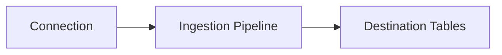

Same basic shape as SaaS connectors: connection, pipeline, destination tables. These are particularly useful for feeding unstructured content (PDFs, documents) into AI/RAG applications via Unity Catalog governance.

> **Setup steps (SharePoint example):**
> 1. Register an app / service credential on the source platform (e.g. an Azure AD app registration for SharePoint) with read access to the target site/drive
> 2. In the workspace, go to **Data Ingestion** → **Add data** → select the file source connector (e.g. **SharePoint**)
> 3. Create a Unity Catalog **connection** using that credential
> 4. Select the site, folder, or drive to ingest from, and choose which file types to include
> 5. Set the destination catalog/schema and a sync schedule, then create the pipeline

## Connector Type 5: Streaming Connectors

For continuously ingesting from message buses and event streams — Kafka, RabbitMQ, and similar.

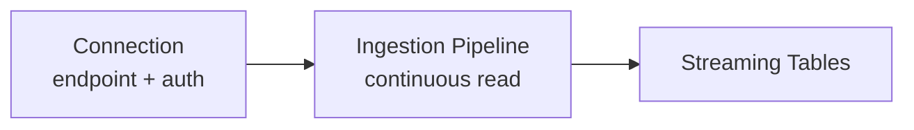

The pipeline runs continuously on serverless compute, reading messages as they arrive rather than on a batch schedule — the connection stores the source endpoint and credentials so the pipeline can authenticate without needing credentials embedded in its own configuration.

> **Setup steps (Kafka example):**
> 1. Confirm network reachability from Databricks serverless compute to the Kafka bootstrap servers (VPC peering, Private Link, or public endpoint with proper security group/firewall rules)
> 2. Gather the broker endpoint(s) and authentication details (SASL credentials, mTLS certs, or similar)
> 3. In the workspace, go to **Data Ingestion** → **Add data** → select the streaming connector (e.g. **Kafka**)
> 4. Create a Unity Catalog **connection** storing the endpoint and credentials
> 5. Configure the ingestion pipeline: topic(s) to subscribe to, starting offset behavior, and the destination streaming table
> 6. Create the pipeline — it runs continuously rather than on a fixed schedule, since it's reading a live stream

## Connector Type 6: Community and Custom Connectors

For sources with no managed connector support:

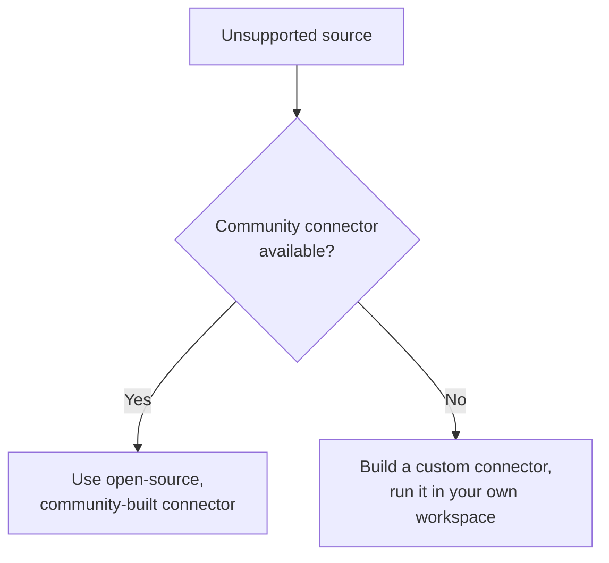

Community connectors are open-source and community-maintained rather than built by Databricks. Custom connectors are fully self-built when nothing else fits — you take on the maintenance burden yourself.

## Choosing the Right Connector Type — A Decision Guide

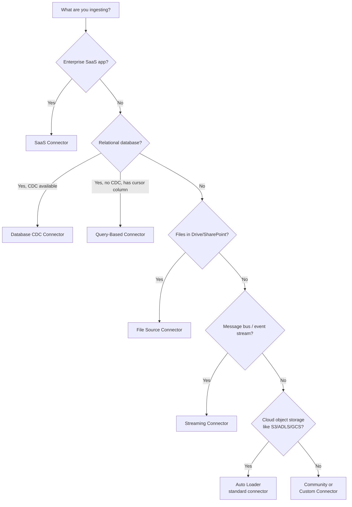

Real examples of this decision in practice:

| Scenario | Right connector |
|---|---|
| Supported Salesforce source, no custom API code needed | Managed SaaS connector |
| SQL Server with native change logs available | Managed database CDC connector |
| Database can't enable CDC, but has an `updated_at` column | Query-based connector with that column as cursor |
| Millions of JSON files landing in ADLS | Auto Loader (standard connector) |
| A few thousand files, SQL-only, scheduled load | `COPY INTO` (standard connector) |
| Kafka events needing custom transformations/offset control | Standard streaming connector via Structured Streaming |

## Why the Component Differences Matter

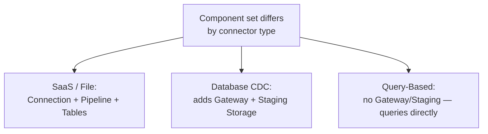

The database connector's extra components (gateway, staging) exist specifically because CDC requires *continuously* watching a database's change log — that's fundamentally different work from a scheduled API pull or a scheduled `SELECT` query, which is why query-based and SaaS connectors don't need them.

## Summary

- **SaaS connectors** — API-based, point-and-click, for apps like Salesforce/Workday/HubSpot
- **Database (CDC) connectors** — track every row change via change logs; need a continuous gateway + staging storage; support MySQL, PostgreSQL, SQL Server, Oracle
- **Query-based connectors** — no CDC needed, use a single monotonically increasing cursor column instead; support SCD_TYPE_1/SCD_TYPE_2/APPEND_ONLY history modes
- **File source connectors** — for enterprise file storage (SharePoint, Google Drive), distinct from cloud object storage ingestion (which uses Auto Loader)
- **Streaming connectors** — continuous ingestion from message buses like Kafka/RabbitMQ
- **Community/custom connectors** — fallback for anything with no managed option, at the cost of self-maintenance
