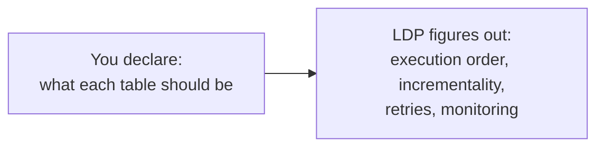
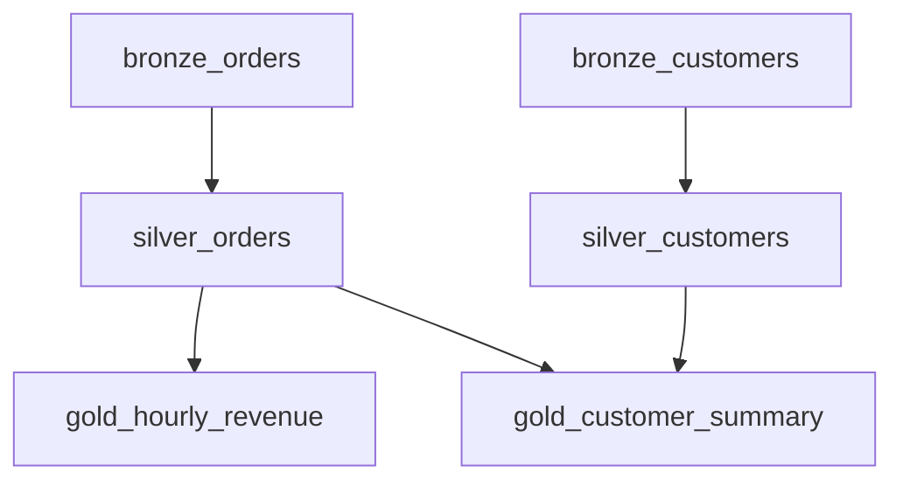
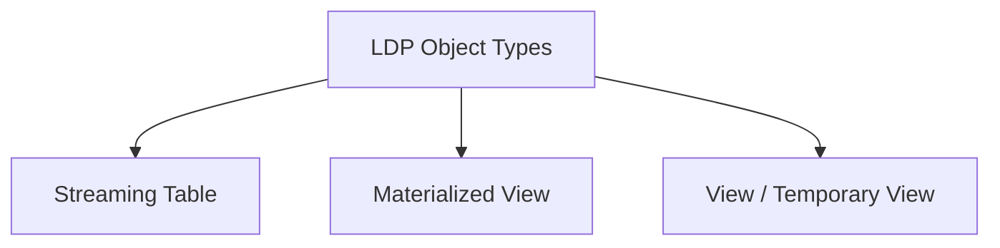
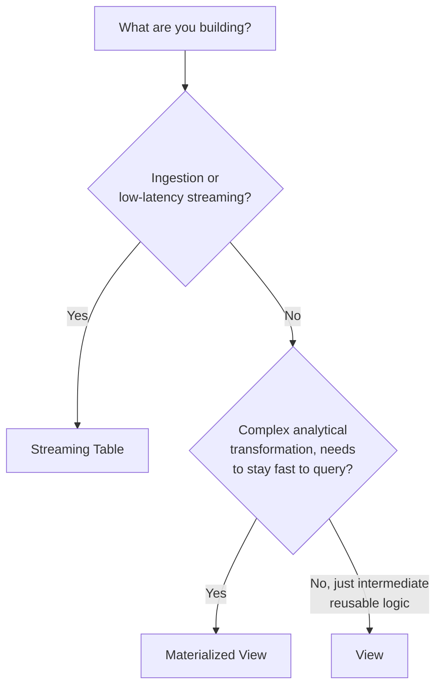
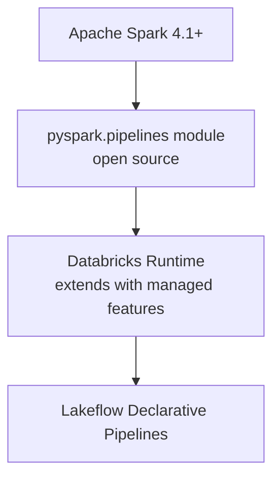
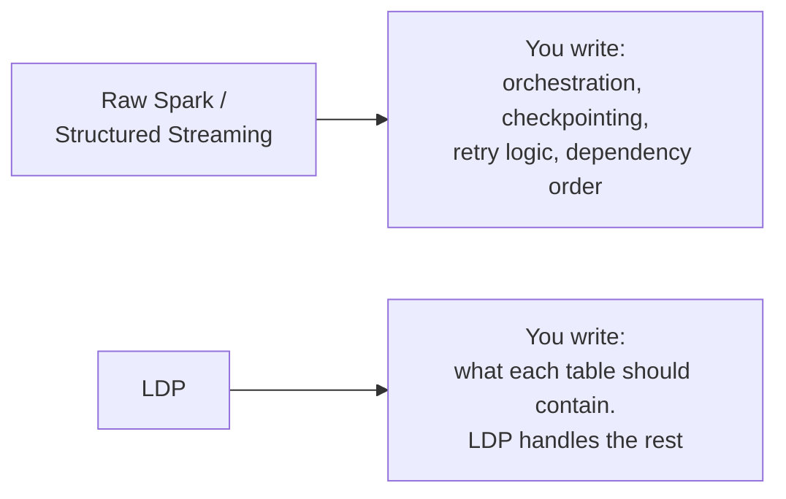
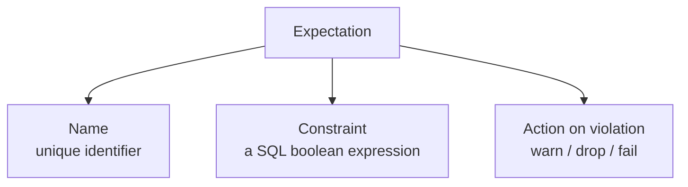
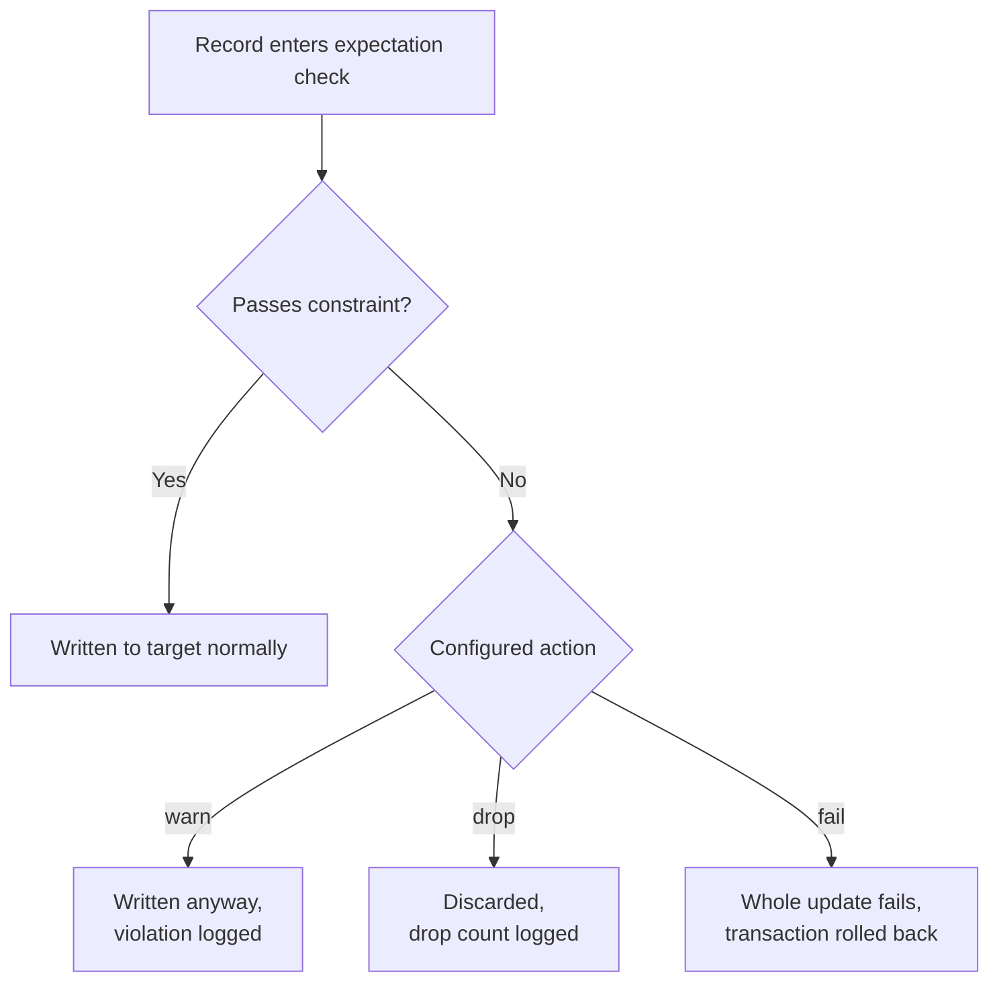
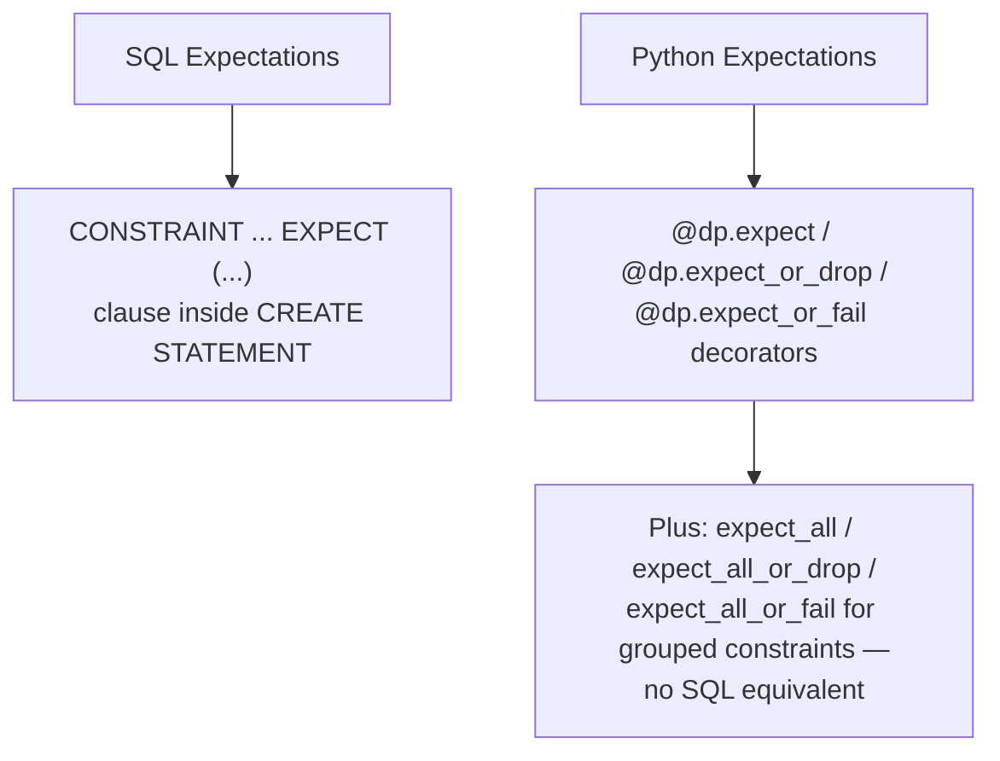

# Lakeflow Declarative Pipelines: Object Types, Spark vs. LDP, and Expectations

## What Lakeflow Declarative Pipelines Is

Lakeflow Declarative Pipelines (LDP) — also called Lakeflow Spark Declarative Pipelines (SDP), and the successor to Delta Live Tables (DLT) — lets you declare *what* your tables should contain, in SQL or Python, and the engine handles *how*: orchestration, incremental processing, dependency ordering, and retries.



A key architectural detail: LDP evaluates every dataset definition across all source files in a pipeline and builds a full **dependency graph** before running anything — the order your code appears in doesn't determine execution order, the graph's dependencies do.



## Object Types in LDP

LDP pipelines are built from three dataset types, each suited to a different job.



### Streaming Table

Processes each input row exactly once, incrementally — the right choice for ingestion and low-latency streaming transformations, especially append-only, high-volume, or event-driven data from cloud storage or message buses.

**SQL:**

```sql
CREATE OR REFRESH STREAMING TABLE bronze_orders
AS SELECT * FROM STREAM(read_files('/Volumes/.../ecommerce/orders_raw/', format => 'json'));
```

**Python:**

```python
from pyspark import pipelines as dp

@dp.table
def bronze_orders():
    return (spark.readStream
        .format("cloudFiles")
        .option("cloudFiles.format", "json")
        .load("/Volumes/.../ecommerce/orders_raw/"))
```

The `STREAM(...)` keyword in SQL is what tells LDP to read that source incrementally — leaving it out reads the source as a complete snapshot instead, the same distinction as `readStream` vs. `read` in plain PySpark.

### Materialized View

Best for complex transformations and analytical queries — its results are pre-computed and kept up to date via **incremental refresh**, so queries against it stay fast without needing to reprocess everything from scratch on every run.

**SQL:**

```sql
CREATE OR REFRESH MATERIALIZED VIEW gold_hourly_revenue
AS SELECT window(timestamp, '1 hour') AS hour, SUM(total) AS revenue
FROM silver_orders
GROUP BY window(timestamp, '1 hour');
```

**Python:**

```python
from pyspark.sql.functions import window, sum as _sum

@dp.materialized_view
def gold_hourly_revenue():
    return (spark.read.table("silver_orders")
        .groupBy(window("timestamp", "1 hour"))
        .agg(_sum("total").alias("revenue")))
```

### View (Temporary View)

A view is only computed when queried — it holds no data of its own and isn't persisted as a table. Useful for intermediate logic reused by multiple downstream datasets within the same pipeline, without materializing it as its own table.

**SQL:**

```sql
CREATE TEMPORARY VIEW valid_orders
AS SELECT * FROM STREAM(bronze_orders) WHERE total > 0;
```

**Python:**

```python
@dp.temporary_view
def valid_orders():
    return spark.readStream.table("bronze_orders").filter("total > 0")
```

### Choosing Between Them



| | Streaming Table | Materialized View | View |
|---|---|---|---|
| Data persisted? | Yes | Yes | No — computed on query |
| Processing style | Incremental, once per row | Incremental refresh | Recomputed each time it's queried |
| Best for | Ingestion, high-volume streaming | Analytical aggregations | Intermediate/reusable logic |
| Supports expectations? | Yes | Yes | Yes |

## Spark vs. LDP

### The Relationship, Not a Replacement

LDP isn't a separate engine competing with Spark — it's a declarative layer built directly on top of Spark and Structured Streaming. Apache Spark itself has included declarative pipelines since Spark 4.1, via the open-source `pyspark.pipelines` module; Databricks Runtime extends that open-source foundation with additional managed capabilities for production use. Code written against the open-source module runs unmodified on Databricks.



### The Practical Difference



| | Raw Spark / Structured Streaming | LDP |
|---|---|---|
| Orchestration between tables | You write and manage it (e.g. separate jobs, manual triggering order) | Automatic — inferred from the dependency graph |
| Incremental processing | You manage manually (checkpoints, watermarks, `readStream`) | Built in via streaming tables and incremental refresh |
| Retry/error handling | You implement it | Built in |
| Data quality checks | You write manual `filter`/`assert` logic | Declarative `EXPECT` clauses (expectations) |
| Monitoring/lineage | You build it yourself (logging, custom metrics) | Built-in pipeline UI, event logs, lineage |
| Best for | Full custom control, one-off scripts, non-pipeline workloads | Multi-stage ETL, bronze/silver/gold pipelines |

### A Concrete Comparison

**Raw Structured Streaming** (what you'd write by hand — same pattern from the earlier multi-hop notebook):

```python
bronze_df = (spark.readStream.format("cloudFiles")
    .option("cloudFiles.format", "json")
    .schema(orders_schema)
    .load("/Volumes/.../orders_raw/"))

(bronze_df.writeStream
    .format("delta")
    .outputMode("append")
    .option("checkpointLocation", "/mnt/checkpoints/bronze_orders")
    .trigger(availableNow=True)
    .table("bronze_orders"))
```

**Equivalent in LDP** — no explicit checkpoint, trigger, or `writeStream` call; LDP manages all of that itself:

```python
@dp.table
def bronze_orders():
    return (spark.readStream.format("cloudFiles")
        .option("cloudFiles.format", "json")
        .schema(orders_schema)
        .load("/Volumes/.../orders_raw/"))
```

You wrote roughly the same *transformation* logic either way — LDP just removes everything around it (checkpoint location, trigger config, table-write call) that isn't specific to what the data should actually be.

## Expectations in LDP

### What Expectations Are

Expectations are optional data-quality clauses attached to a streaming table, materialized view, or view — they validate every record against a boolean SQL condition as it flows through the pipeline. Only these three object types support expectations.



### The Three Actions

| Action | SQL syntax | Python syntax | What happens to a bad record |
|---|---|---|---|
| **Warn** (default) | `EXPECT (...)` | `@dp.expect(...)` | Kept in the target table; violation is only logged in metrics |
| **Drop** | `EXPECT (...) ON VIOLATION DROP ROW` | `@dp.expect_or_drop(...)` | Removed before writing to the target; drop count is logged |
| **Fail** | `EXPECT (...) ON VIOLATION FAIL UPDATE` | `@dp.expect_or_fail(...)` | The entire pipeline update fails and rolls back atomically |



### Warn (Retain Invalid Records) — Both Syntaxes

**Python:**

```python
@dp.table
@dp.expect("valid_timestamp", "timestamp > '2012-01-01'")
def bronze_orders():
    return spark.readStream.table("raw_orders")
```

**SQL:**

```sql
CREATE OR REFRESH STREAMING TABLE bronze_orders (
  CONSTRAINT valid_timestamp EXPECT (timestamp > '2012-01-01')
)
AS SELECT * FROM STREAM(raw_orders);
```

### Drop Invalid Records — Both Syntaxes

**Python:**

```python
@dp.table
@dp.expect_or_drop("valid_total", "total > 0")
def silver_orders():
    return spark.readStream.table("bronze_orders")
```

**SQL:**

```sql
CREATE OR REFRESH STREAMING TABLE silver_orders (
  CONSTRAINT valid_total EXPECT (total > 0) ON VIOLATION DROP ROW
)
AS SELECT * FROM STREAM(bronze_orders);
```

### Fail on Invalid Records — Both Syntaxes

**Python:**

```python
@dp.table
@dp.expect_or_fail("valid_customer_id", "customer_id IS NOT NULL")
def silver_orders():
    return spark.readStream.table("bronze_orders")
```

**SQL:**

```sql
CREATE OR REFRESH STREAMING TABLE silver_orders (
  CONSTRAINT valid_customer_id EXPECT (customer_id IS NOT NULL) ON VIOLATION FAIL UPDATE
)
AS SELECT * FROM STREAM(bronze_orders);
```

**Important behavior difference:** in a *triggered* pipeline, one flow failing doesn't fail other parallel flows; in a *continuous* pipeline, an expectation failure stops that flow and everything downstream of it, and the pipeline reports why.

### Multiple Expectations on One Dataset

**SQL** — separate constraints with commas:

```sql
CREATE OR REFRESH STREAMING TABLE silver_orders (
  CONSTRAINT valid_total EXPECT (total > 0) ON VIOLATION DROP ROW,
  CONSTRAINT valid_customer_id EXPECT (customer_id IS NOT NULL) ON VIOLATION DROP ROW
)
AS SELECT * FROM STREAM(bronze_orders);
```

**Python** — stack decorators, or group them with a dictionary:

```python
@dp.table
@dp.expect_or_drop("valid_total", "total > 0")
@dp.expect_or_drop("valid_customer_id", "customer_id IS NOT NULL")
def silver_orders():
    return spark.readStream.table("bronze_orders")
```

Python specifically also supports **grouping** expectations with a shared action, using `expect_all`, `expect_all_or_drop`, and `expect_all_or_fail` — something SQL doesn't offer:

```python
valid_orders = {
    "valid_total": "total > 0",
    "valid_customer_id": "customer_id IS NOT NULL"
}

@dp.table
@dp.expect_all_or_drop(valid_orders)
def silver_orders():
    return spark.readStream.table("bronze_orders")
```

### What Constraints Can't Contain

Regardless of language, an expectation's constraint must be plain SQL boolean logic — it cannot contain custom Python functions, external service calls, or subqueries referencing other tables. This keeps the check something the engine can evaluate per-row, efficiently, without side effects.

### Why SQL and Python Differ Here



SQL expectations live inline as a clause in the `CREATE OR REFRESH` statement itself, matching SQL's declarative, statement-based style. Python expectations are decorators stacked on the function defining the dataset, which is what enables the grouped/dictionary-based `expect_all*` pattern — a metaprogramming convenience SQL's fixed clause syntax doesn't support.

## Summary

- **Object types:** Streaming Tables (incremental, ingestion-focused), Materialized Views (incrementally-refreshed analytical queries), Views (recomputed on query, not persisted) — only these three support expectations
- **Spark vs. LDP:** LDP is built on Spark/Structured Streaming (open-sourced in Spark 4.1's `pyspark.pipelines`), not a replacement for it — it removes the need to hand-write orchestration, checkpointing, retries, and dependency ordering that raw Spark jobs require
- **Expectations:** three actions — `warn`/`EXPECT` (default, keeps bad rows), `drop`/`expect_or_drop`/`ON VIOLATION DROP ROW`, `fail`/`expect_or_fail`/`ON VIOLATION FAIL UPDATE` — with Python additionally supporting grouped expectations (`expect_all`, `expect_all_or_drop`, `expect_all_or_fail`) that SQL has no equivalent for
