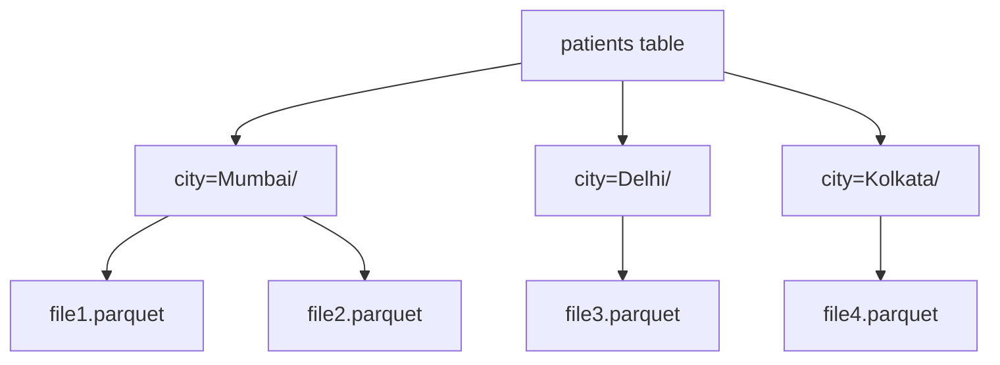
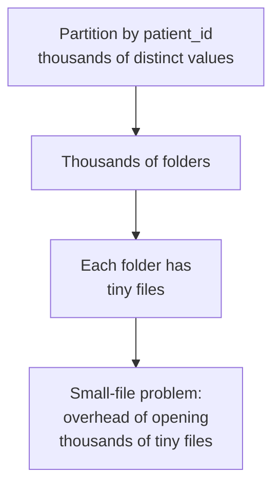
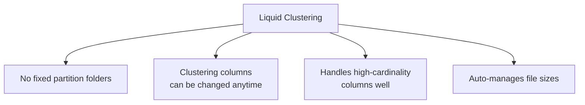
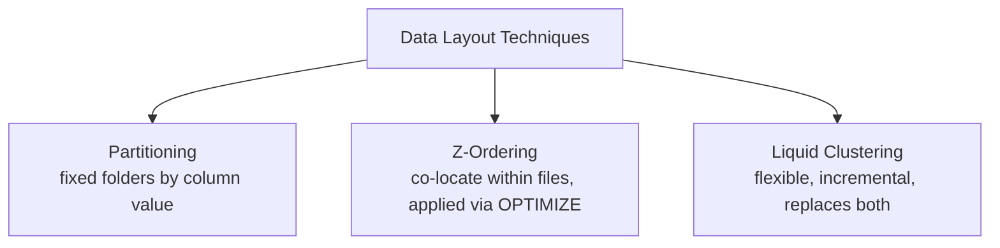
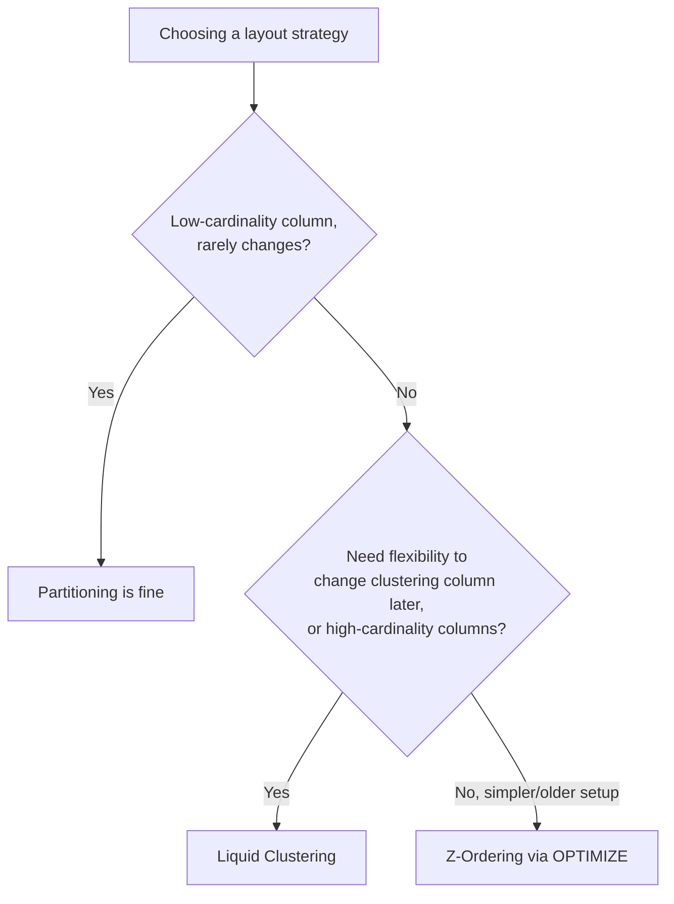

# Partitioning, Liquid Clustering, and How They Compare to Z-Ordering

## 1. Partitioning

Partitioning physically splits a table's data into separate folders based on the value of one or more columns. It's the oldest and most common data-layout technique in big data systems, not specific to Delta Lake.



### Creating a Partitioned Table

```sql
%sql
CREATE TABLE patients (
    patient_id STRING,
    name STRING,
    city STRING,
    age INT,
    bmi DOUBLE,
    verdict STRING
)
USING DELTA
PARTITIONED BY (city)
LOCATION '/mnt/delta/patients'
```

Every distinct value of `city` gets its own physical subfolder. A query filtering on `city` can skip entire folders without even opening a file:

```sql
%sql
SELECT * FROM patients WHERE city = 'Mumbai'
-- only reads files inside city=Mumbai/, ignores every other folder entirely
```


### The Partitioning Trap: Cardinality

Partitioning works well for **low-cardinality** columns (a handful to a few hundred distinct values, like `city` or `year`). It breaks down badly for **high-cardinality** columns:



Partitioning by a high-cardinality column, or by multiple partition columns stacked together, tends to produce a huge number of tiny partitions — which hurts performance instead of helping it. This is the central weakness that led to Z-Ordering and, later, liquid clustering.

## 2. Liquid Clustering

Liquid clustering is a newer Delta Lake feature that replaces both partitioning and Z-Ordering with a single, more flexible mechanism: it clusters data by chosen columns without physically fixing the layout into rigid folders, and it can be changed later without rewriting the whole table.



### Creating a Table with Liquid Clustering

```sql
%sql
CREATE TABLE patients (
    patient_id STRING,
    name STRING,
    city STRING,
    age INT,
    bmi DOUBLE,
    verdict STRING
)
USING DELTA
CLUSTER BY (city, age)
LOCATION '/mnt/delta/patients'
```

### Changing Clustering Columns Later

```sql
%sql
ALTER TABLE patients CLUSTER BY (patient_id)
```

This is the key practical advantage: with partitioning, changing the partition column means rewriting the entire table from scratch. With liquid clustering, you just declare new clustering columns, and future `OPTIMIZE` runs incrementally reorganize the data toward that new layout.

### Keeping It Optimized

```sql
%sql
OPTIMIZE patients
```

Liquid clustering still relies on `OPTIMIZE` to actually do the clustering work — it doesn't happen automatically on every write, but each `OPTIMIZE` run incrementally improves the layout rather than requiring a full rewrite.


## 3. Partitioning vs. Z-Ordering vs. Liquid Clustering



| | Partitioning | Z-Ordering | Liquid Clustering |
|---|---|---|---|
| **Mechanism** | Physical folders per distinct value | Sorts/co-locates rows across files during `OPTIMIZE` | Clusters data flexibly, no fixed folders, updated via `OPTIMIZE` |
| **Best for** | Low-cardinality columns (city, year, status) | Medium/high-cardinality filter columns | Any cardinality, especially when the filter column changes over time |
| **Changing the layout later** | Requires rewriting the entire table | Requires re-running `OPTIMIZE ZORDER BY` on new column | Just `ALTER TABLE ... CLUSTER BY`, incrementally applied |
| **Small-file risk** | High, if column is high-cardinality or over-partitioned | Low — doesn't create folders | Low — actively manages file sizes |
| **Combines multiple columns well** | Poorly (multi-column partitioning multiplies folder count) | Reasonably (a few columns) | Well — designed for this |
| **How it's declared** | `PARTITIONED BY (col)` at creation | `OPTIMIZE table ZORDER BY (col)`, run periodically | `CLUSTER BY (col1, col2)` at creation or via `ALTER TABLE` |

### The Practical Decision Path



In practice, Databricks now generally recommends **liquid clustering** for new tables over classic partitioning or Z-Ordering, precisely because it avoids the small-file trap of partitioning while being easier to adjust than Z-Ordering, which needs to be manually re-applied and doesn't handle changing query patterns as gracefully.

## Summary

- **Partitioning** — fixed physical folders per distinct column value; great for a handful of stable, low-cardinality values, bad for high-cardinality columns (small-file explosion)
- **Z-Ordering** — sorts and co-locates related rows across files via `OPTIMIZE ZORDER BY`, without creating folders; better than partitioning for higher-cardinality filter columns, but must be manually re-run and re-specified
- **Liquid Clustering** — the newer, more flexible approach: no fixed folder structure, clustering columns can change anytime via `ALTER TABLE ... CLUSTER BY`, and `OPTIMIZE` incrementally improves layout without a full table rewrite — generally the recommended default for new tables today
