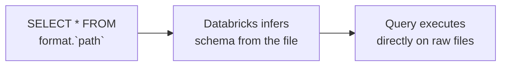
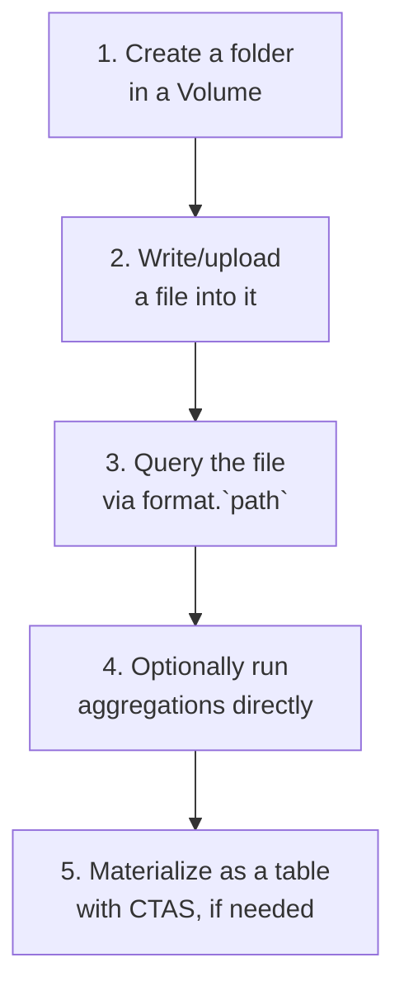
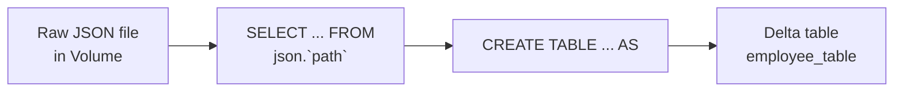
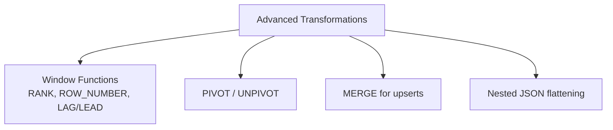
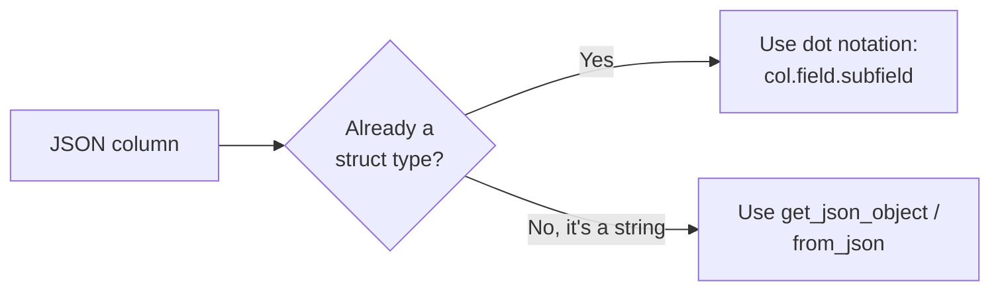
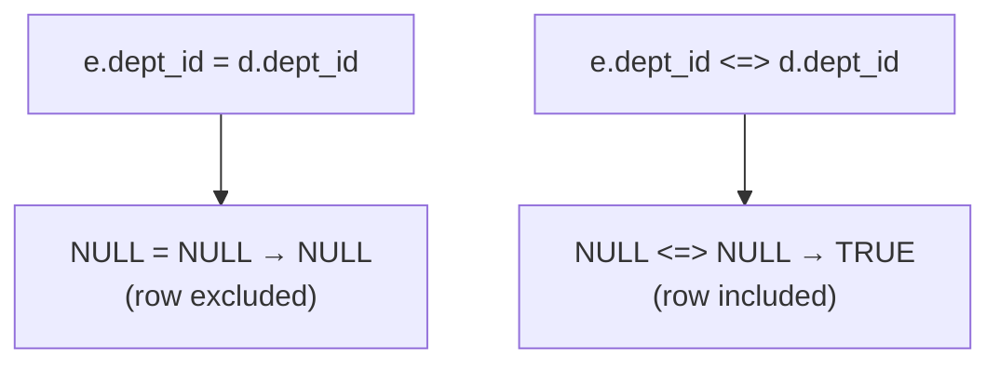
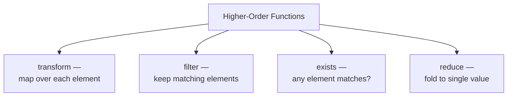
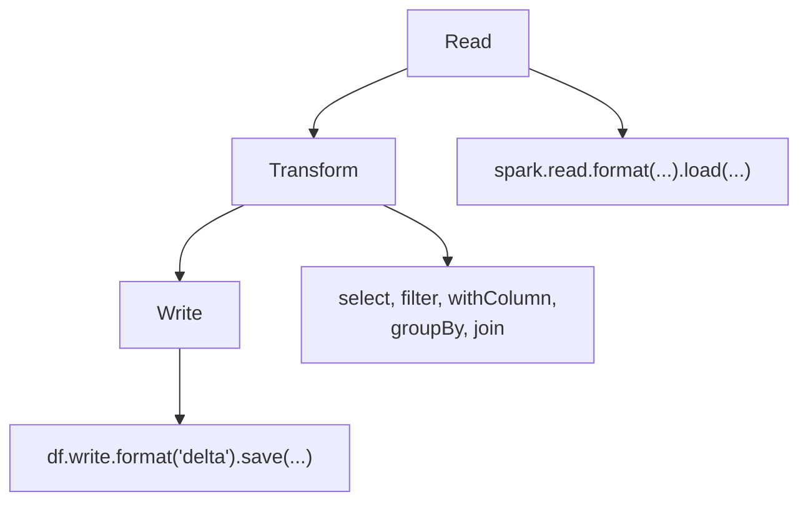
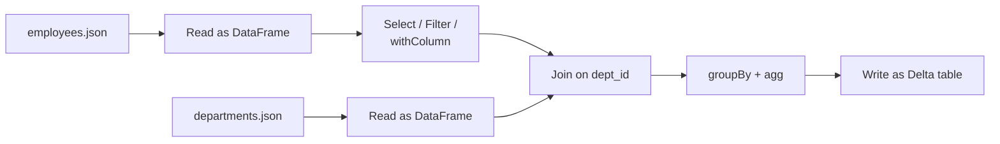

# Querying Files, Writing Tables, and Advanced Transformations in Databricks

## 1. Querying a File

Databricks lets you run SQL directly against files sitting in storage — no table needs to exist first. You reference the file's format as if it were a database name, and the file's path (in backticks) as if it were the table name.



```sql
SELECT * FROM json.`/Volumes/demoworkspace_new/default/my_volume/json/employees.json`;
```

This works because Databricks treats a small set of built-in "pseudo-databases" — `json`, `csv`, `parquet`, `text`, `binaryFile`, and others — as ways of saying "read this path using this format," rather than requiring a `CREATE TABLE` step first.

### Why This Is Useful

- **Exploration** — inspect a raw file's contents and structure before deciding how (or whether) to formalize it as a table
- **One-off queries** — no need to register a table for a file you'll only query once
- **Format flexibility** — you can even query the same file as different formats to see how each one interprets it

### A Subtlety Worth Noting

```sql
SELECT * FROM csv.`/Volumes/demoworkspace_new/default/my_volume/json/employees.json`;
```

Querying a JSON file *as* CSV doesn't error — it just parses the file according to CSV rules, which for JSON content produces garbled, meaningless columns. Databricks trusts the format you specify; it doesn't validate that the file actually matches that format. The extension in the file's name is irrelevant to this — only the format you name before the path matters.

## 2. Steps to Query a File

Based on a real, minimal walkthrough:



### Step 1: Create a Folder in a Volume

```python
%python
dbutils.fs.mkdirs("/Volumes/demoworkspace_new/default/my_volume/json")
```

Volumes are Unity Catalog-governed storage locations for files that aren't (yet) structured tables — the natural place to stage raw JSON, CSV, or other files before or instead of loading them into Delta tables.

### Step 2: Write Files into the Volume

```python
%python
dept_json = (
    '{"dept_id": 101, "dept_name": "Engineering"}\n'
    '{"dept_id": 102, "dept_name": "Analytics"}\n'
    '{"dept_id": 103, "dept_name": "Management"}\n'
    # ... more rows
)
dbutils.fs.put("/Volumes/demoworkspace_new/default/my_volume/json/departments.json", dept_json, overwrite=True)
```

This is **NDJSON** (newline-delimited JSON) — one full JSON object per line, not a single JSON array. This format matters: it's what lets Spark treat each line as one row without having to parse an entire file into memory as one structure first.

### Step 3: Query the File Directly

```sql
SELECT * FROM json.`/Volumes/demoworkspace_new/default/my_volume/json/employees.json`;
```

### Step 4: Run Aggregations Directly on the File

```sql
SELECT COUNT(name) FROM json.`/Volumes/demoworkspace_new/default/my_volume/json/employees.json`;
```

No table registration needed — any SQL you could run against a table works directly against the file reference, including aggregates, filters, and joins.

### Bonus: Inspecting Files as Binary

```sql
SELECT * FROM binaryFile.`/Volumes/demoworkspace_new/default/my_volume/json/*.json`;
```

The `binaryFile` format doesn't parse content at all — it returns file-level metadata (path, modification time, length) and the raw file bytes. The `*.json` wildcard matches every JSON file in that folder at once, useful for inspecting a batch of files' metadata without reading their contents.

### Step 5: Materialize as a Real Table (CTAS)

```sql
CREATE TABLE IF NOT EXISTS employee_table
AS SELECT * FROM json.`/Volumes/demoworkspace_new/default/my_volume/json/employees.json`;

SELECT * FROM employee_table;
```

This is the bridge from "querying a raw file" to "having a real, governed, versioned Delta table" — same CTAS pattern covered in the database entities article, just sourced from a file reference instead of another table.



## 3. Writing into a Table and Advanced Transformations

### Writing Data In

```sql
-- Append new rows
INSERT INTO employee_table VALUES (11, 'Karan', 'Engineer', 101);

-- Overwrite the whole table
INSERT OVERWRITE employee_table
SELECT * FROM json.`/Volumes/.../json/employees_updated.json`;
```

```python
# From PySpark
df.write.format("delta").mode("append").saveAsTable("employee_table")
```

### Advanced Transformations

Beyond basic `SELECT`/`WHERE`, common advanced SQL transformation patterns on Databricks:

```sql
-- Window functions: rank employees within each department
SELECT
    name, dept_id,
    RANK() OVER (PARTITION BY dept_id ORDER BY id) AS dept_rank
FROM employee_table;

-- Pivoting: department counts as columns
SELECT * FROM (
    SELECT dept_id, role FROM employee_table
) PIVOT (
    COUNT(role) FOR dept_id IN (101, 102, 103)
);
```



## 4. JSON Query Syntax and Null-Safe Join

### Querying Nested JSON

When a JSON column contains nested objects or arrays, dot notation and `:` access the nested fields directly in SQL.

```sql
-- Given a column `details` containing {"address": {"city": "Mumbai"}}
SELECT details:address:city FROM employee_table;

-- Accessing array elements
SELECT details:skills[0] FROM employee_table;
```

```python
# In PySpark, dot notation on a parsed struct column
df.select("details.address.city")
```

For working with true JSON *strings* stored in a column (not yet parsed into a struct), functions like `get_json_object` and `from_json` extract values using a JSONPath-style expression:

```sql
SELECT get_json_object(raw_json_col, '$.address.city') FROM employee_table;
```



### Null-Safe Join

A regular `=` join in SQL silently drops rows where the join key is `NULL` on either side — `NULL = NULL` evaluates to `NULL`, not `TRUE`, so those rows never match.

```sql
-- Regular join: rows with NULL dept_id in either table are dropped
SELECT e.name, d.dept_name
FROM employee_table e
JOIN departments_table d ON e.dept_id = d.dept_id;
```

The **null-safe equality operator**, `<=>`, treats `NULL = NULL` as `TRUE`, so rows with matching `NULL` keys are joined instead of silently disappearing.

```sql
-- Null-safe join: NULL dept_id values on both sides now match each other
SELECT e.name, d.dept_name
FROM employee_table e
JOIN departments_table d ON e.dept_id <=> d.dept_id;
```



Use `<=>` specifically when `NULL` in your join key is a meaningful value you want matched (e.g. "no department assigned" on both sides should count as a match) rather than treated as unknown/unmatchable.

## 5. Higher-Order Functions and SQL UDFs

### Higher-Order Functions

Higher-order functions operate directly on array/map columns without exploding them into separate rows first — you pass a lambda-style expression as an argument.

```sql
-- transform: apply an expression to every element of an array
SELECT transform(scores, x -> x * 1.1) AS boosted_scores FROM student_table;

-- filter: keep only array elements matching a condition
SELECT filter(scores, x -> x > 50) AS passing_scores FROM student_table;

-- exists: check if any element matches a condition
SELECT exists(scores, x -> x < 35) AS has_failing_score FROM student_table;

-- reduce: aggregate an array down to a single value
SELECT reduce(scores, 0, (acc, x) -> acc + x) AS total_score FROM student_table;
```



These avoid the performance cost of `explode()`-ing an array into rows, transforming, then re-aggregating back — the whole operation happens in place on the array column.

### SQL UDFs (User-Defined Functions)

A SQL UDF packages a reusable expression as a named function, callable like any built-in.

```sql
CREATE OR REPLACE FUNCTION bmi_category(bmi DOUBLE)
RETURNS STRING
RETURN CASE
    WHEN bmi < 18.5 THEN 'Underweight'
    WHEN bmi < 25 THEN 'Normal'
    WHEN bmi < 30 THEN 'Overweight'
    ELSE 'Obese'
END;

SELECT name, bmi, bmi_category(bmi) AS verdict FROM patients;
```


SQL UDFs are registered in the metastore (governed by Unity Catalog like tables/views), so once created, any user with permission can reuse the same logic — avoiding copy-pasted `CASE` expressions scattered across many queries.

## 6. Data Transformations Using PySpark

### The Typical Flow



### Step-by-Step Example

**Step 1 — Read the source data:**

```python
employees_df = spark.read.json("/Volumes/demoworkspace_new/default/my_volume/json/employees.json")
departments_df = spark.read.json("/Volumes/demoworkspace_new/default/my_volume/json/departments.json")
```

**Step 2 — Select and rename columns:**

```python
employees_df = employees_df.select("id", "name", "role", "dept_id")
```

**Step 3 — Filter rows:**

```python
engineers_df = employees_df.filter(employees_df.role == "Engineer")
```

**Step 4 — Add or transform columns:**

```python
from pyspark.sql.functions import upper

employees_df = employees_df.withColumn("role_upper", upper(employees_df.role))
```

**Step 5 — Join with another DataFrame:**

```python
joined_df = employees_df.join(departments_df, on="dept_id", how="inner")
```

**Step 6 — Aggregate:**

```python
from pyspark.sql.functions import count

dept_counts_df = joined_df.groupBy("dept_name").agg(count("id").alias("employee_count"))
```

**Step 7 — Write the result:**

```python
dept_counts_df.write.format("delta").mode("overwrite").saveAsTable("dept_employee_counts")
```



### Why PySpark Instead of SQL Here

PySpark DataFrames and SQL both compile down to the same underlying execution engine — the choice is mostly about ergonomics. PySpark tends to be preferred when transformations are conditional, parameterized, or need to integrate with broader Python code (loops, functions, testing); SQL tends to be preferred for standalone, readable queries. Databricks notebooks let you mix both freely across cells using magic commands, so this is rarely an either/or decision in practice.

## Summary

| Topic | Key Idea |
|---|---|
| Querying a file | `SELECT * FROM format.\`path\`` — no table needed first |
| Steps to query a file | Create Volume folder → write file → query directly → optionally CTAS into a table |
| Writing + advanced transformations | `INSERT`/`INSERT OVERWRITE`; window functions, `PIVOT`, `MERGE` |
| JSON syntax + null-safe join | `col:field` / `get_json_object` for JSON; `<=>` to match `NULL` keys instead of dropping them |
| Higher-order functions + SQL UDFs | `transform`/`filter`/`exists`/`reduce` on arrays in place; `CREATE FUNCTION` for reusable logic |
| PySpark transformations | Read → select/filter/withColumn → join → aggregate → write, chained as DataFrame operations |
