# Structured Streaming, In Depth

## 1. Structured Streaming, In Depth

### The Core Idea

Structured Streaming is Spark's engine for processing data continuously, as it arrives, rather than in fixed batch runs. Its central abstraction is deliberately simple: **treat a stream as an unbounded table that keeps growing**, and let you write the same DataFrame/SQL operations you'd use on a static table.

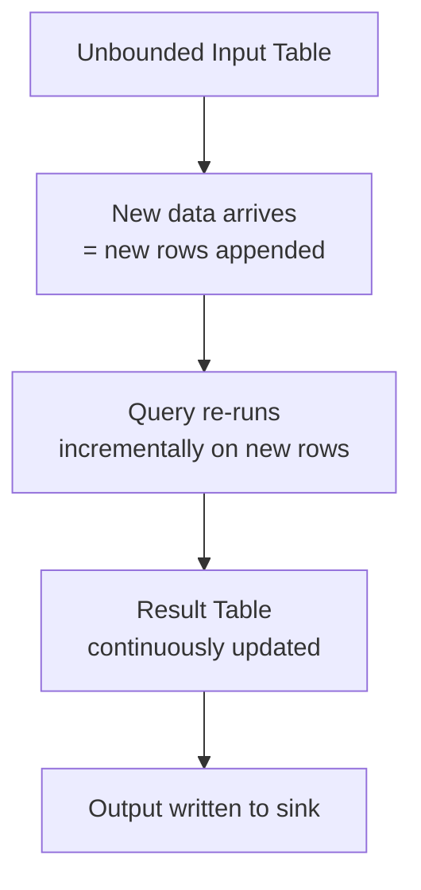

This is the defining design choice of Structured Streaming: you write a query as if it runs once against a complete table, and the engine figures out how to run it incrementally against new data each micro-batch — you don't manually manage state transitions yourself for most operations.

### The Execution Model

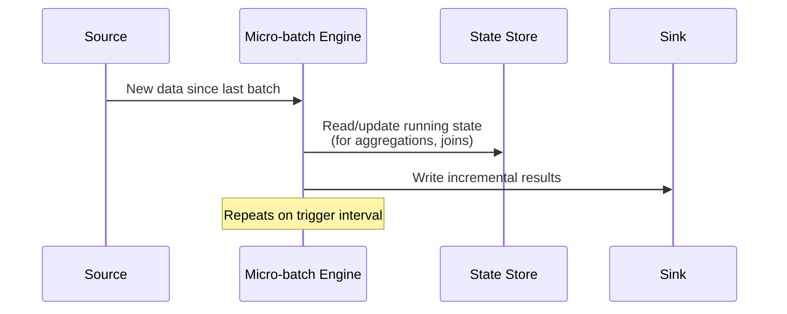

Under the hood (by default), Structured Streaming runs as a series of **micro-batches**: on each trigger, it processes whatever new data has arrived since the last batch, updates any running state (like aggregation totals), and writes results to the sink. A separate execution mode, **Continuous Processing**, processes records with lower latency but supports a much narrower set of operations — micro-batch is the default and by far the more commonly used mode.

### Why This Model, Specifically

- **Fault tolerance built in** — because the engine tracks exactly which input has been processed (via checkpointing, covered below), a failed job can restart and resume exactly where it left off, without reprocessing or dropping data
- **One API for batch and streaming** — the same DataFrame transformations (`select`, `filter`, `groupBy`, `join`) work whether the source is static or streaming, so you're not learning two separate programming models
- **Exactly-once semantics for supported sinks** — combined with idempotent sinks (like Delta Lake), this model can guarantee each input record affects the output exactly once, even after failures and retries

## 2. Streaming Read and Streaming Write

### Streaming Read

Unlike a batch read, a streaming source generally can't infer its schema on the fly — Spark needs to know the schema upfront, since it has to keep processing new files consistently over time without re-inspecting the data on every batch. So `orders_schema` has to be defined explicitly before it's passed in, matching the actual structure of `orders.json` (including the nested `books` array):

```python
from pyspark.sql.types import StructType, StructField, StringType, IntegerType, DoubleType, ArrayType

orders_schema = StructType([
    StructField("order_id", IntegerType()),
    StructField("timestamp", StringType()),   # cast to TimestampType later if needed
    StructField("customer_id", IntegerType()),
    StructField("quantity", IntegerType()),
    StructField("total", DoubleType()),
    StructField("books", ArrayType(
        StructType([
            StructField("book_id", IntegerType()),
            StructField("qty", IntegerType())
        ])
    ))
])

streaming_df = (spark.readStream
    .format("json")  # or "cloudFiles" for Auto Loader, "kafka", etc.
    .schema(orders_schema)
    .option("maxFilesPerTrigger", 1)
    .load("/Volumes/demoworkspace_new/default/my_volume/ecommerce/orders.json"))
```

The key difference from a batch read is `readStream` instead of `read` — everything else (format, options) follows the same pattern you already know from batch DataFrames.

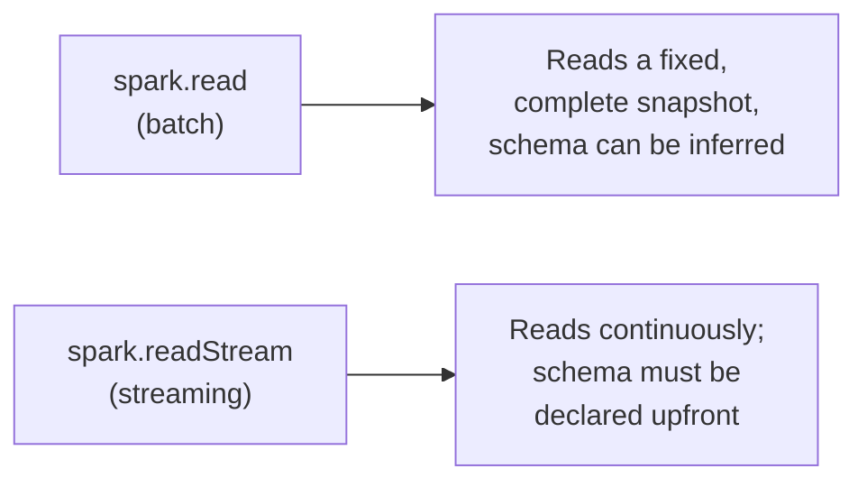

Common streaming sources: Delta tables, cloud object storage via Auto Loader (`cloudFiles`), Kafka, and other message queues. Delta and Kafka sources carry their own schema, so `orders_schema` is specifically needed here because the source is raw JSON files.

### Streaming Write

```python
query = (streaming_df.writeStream
    .format("delta")
    .outputMode("append")
    .option("checkpointLocation", "/mnt/checkpoints/orders_stream")
    .trigger(processingTime="1 minute")
    .table("orders_live"))
```

`writeStream` replaces `write`, and a streaming write returns a `StreamingQuery` object representing the ongoing job — rather than executing once and finishing, it keeps running until explicitly stopped.

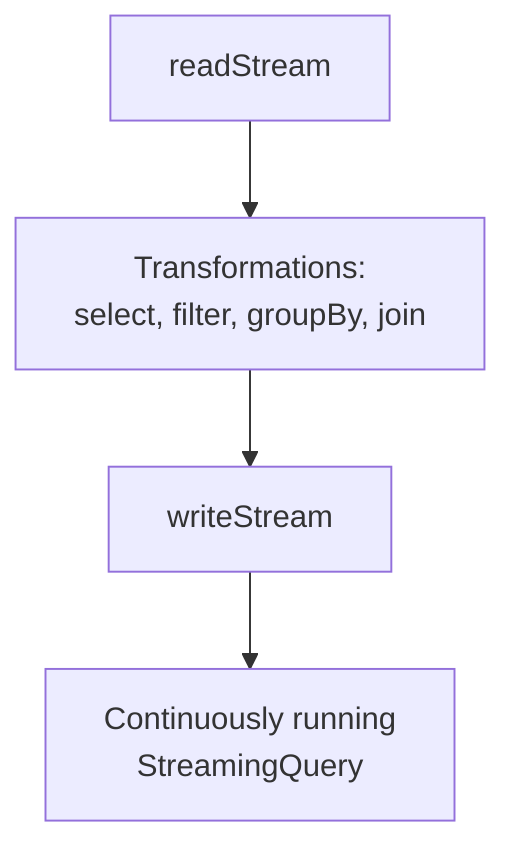

### Controlling the Running Query

```python
query.awaitTermination()   # blocks until the stream stops or errors
query.stop()                # stops it manually
query.status                # current state: is it actively processing?
query.lastProgress           # metrics from the most recent micro-batch
```

## 3. Methods of Streaming Write

### Trigger Interval

Controls *when* each micro-batch runs.

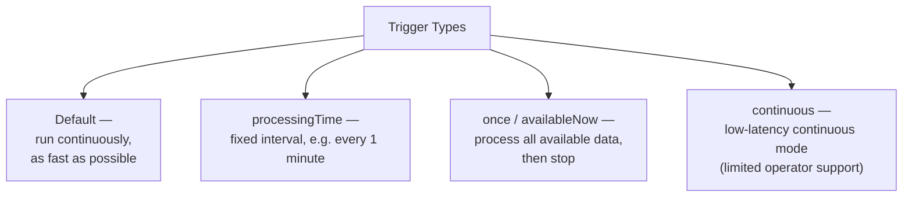

```python
.trigger(processingTime="1 minute")   # micro-batch every 1 minute
.trigger(once=True)                    # process everything available, then stop
.trigger(availableNow=True)            # like once, but can span multiple micro-batches
.trigger(continuous="1 second")        # experimental low-latency mode
```

`availableNow` is commonly used to run a "streaming" pipeline in scheduled batch mode — e.g. triggered hourly by a job, processing whatever accumulated since the last run, then stopping, rather than a truly always-on stream.

### Output Mode

Controls *what* gets written to the sink on each trigger.

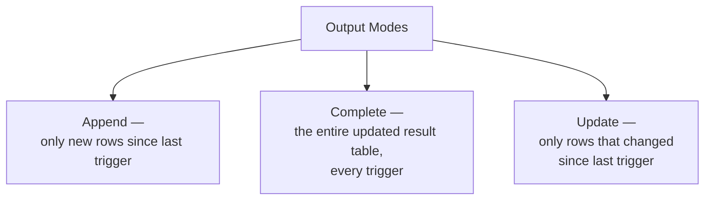

| Mode | Writes | Typical use case |
|---|---|---|
| `append` | Only newly added rows | Simple ingestion, no aggregation, or aggregations with watermarking |
| `complete` | The full result table every time | Aggregations you need the complete current state of (e.g. a running total) |
| `update` | Only rows that changed | Aggregations where you only care about what's new/changed, not the full table |

```python
.outputMode("append")    # or "complete", or "update"
```

Not every mode works with every query — `complete` mode, for instance, requires the query to be an aggregation (there's no "complete state" concept for a plain row-by-row transformation).

### Checkpointing

The checkpoint location is where Structured Streaming persists its progress — which offsets/files have been processed, and the current state of any running aggregations.

```python
.option("checkpointLocation", "/mnt/checkpoints/orders_stream")
```

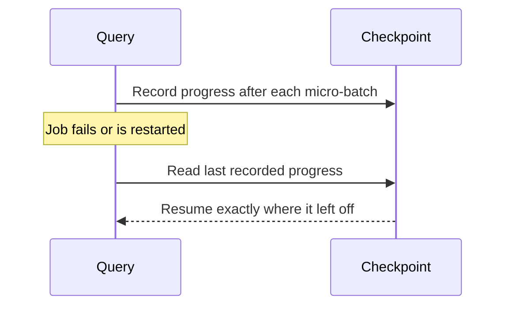

- Each streaming query needs its **own dedicated checkpoint location** — sharing one between two queries corrupts both
- Deleting a checkpoint and restarting the stream causes it to reprocess from scratch, since the progress record is gone
- Checkpointing is what makes fault tolerance possible: without it, a restarted job wouldn't know what it had already processed

### Guarantees

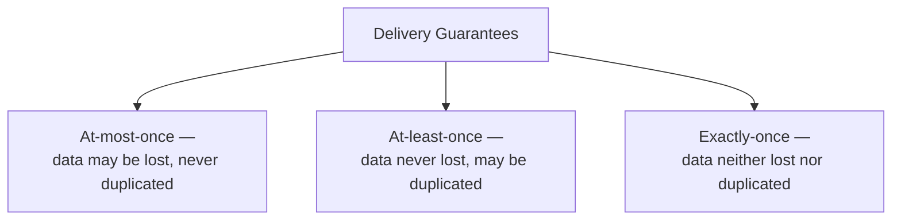

Structured Streaming can achieve **exactly-once** end-to-end semantics, but this requires *both* halves to cooperate:

- **Source replayability** — the source must let Spark re-read the same data range if a batch needs to be reprocessed after a failure (Delta tables and Kafka both support this; some sources don't)
- **Sink idempotency** — the sink must handle a rewritten/retried batch without producing duplicates (Delta Lake sinks support this natively via transactional writes tied to batch IDs)

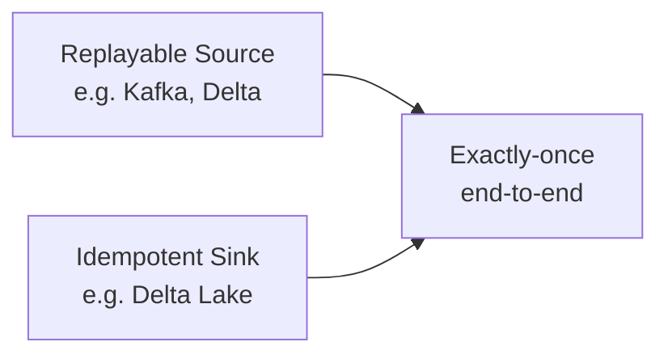

If either side doesn't support this (e.g. a sink that always appends blindly, with no dedup key), you only get at-least-once — safe against data loss, but capable of writing duplicate rows on retry.

## 4. Unsupported Operations in Structured Streaming

Because a streaming DataFrame represents an *unbounded*, ever-growing table, some operations that make perfect sense on a finite, static DataFrame simply can't be computed the same way on a stream — they'd require seeing the "end" of data that never ends.

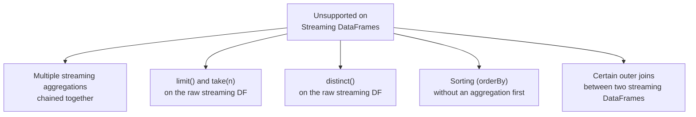

### Why Each One Fails

| Operation | Why it's unsupported |
|---|---|
| **Chained streaming aggregations** (aggregate the output of another streaming aggregation) | Each aggregation needs to track running state; chaining them requires state-on-state tracking Spark doesn't support directly |
| **`limit(n)` / `take(n)`** on a raw streaming DataFrame | "The first N rows" is undefined on a table that never stops growing |
| **`distinct()`** on a raw streaming DataFrame | Requires comparing every new row against *all* previously seen rows, forever — unbounded memory growth |
| **`orderBy`/`sort` without a prior aggregation** | Sorting requires seeing the complete dataset first; a stream never completes |
| **Full outer joins between two streaming DataFrames** (without watermarking) | Spark can't know when it's "safe" to emit an unmatched row, since a match could theoretically still arrive later |

### The Common Workaround: Watermarking

Several of these restrictions can be lifted, or made practical, using a **watermark** — a declared tolerance for how late data is allowed to arrive, which lets Spark safely bound how much state it needs to keep.

```python
orders_stream_df = orders_stream_df.withWatermark("timestamp", "10 minutes")
```

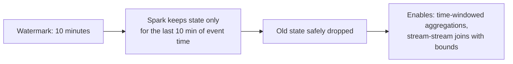

This is why time-windowed aggregations and bounded stream-stream joins *are* supported, while their unbounded equivalents aren't — the watermark gives Spark a concrete point past which it's safe to finalize results and discard old state, resolving the "when do we know we're done waiting" problem that makes the unsupported operations impossible in the first place.

### What To Do Instead

```mermaid
graph TD
    A[Need a "batch-only" operation?] --> B["writeStream + foreachBatch"]
    B --> C[Each micro-batch delivered<br/>as a regular static DataFrame]
    C --> D[Full batch API available<br/>— distinct, orderBy, complex joins, etc.]
```

```python
def process_batch(batch_df, batch_id):
    # distinct() and orderBy() aren't allowed on a raw streaming DataFrame,
    # but work normally once foreachBatch hands us a static micro-batch
    (batch_df
        .distinct()
        .orderBy("timestamp")
        .write.mode("append")
        .saveAsTable("orders_dedup"))

streaming_df.writeStream.foreachBatch(process_batch).start()
```

`foreachBatch` hands you each micro-batch as an ordinary static DataFrame, where every batch-only operation works normally — it's the standard escape hatch when a streaming query genuinely needs an operation Structured Streaming doesn't support directly on the streaming DataFrame itself.

## A Full Worked Example: Streaming Orders

Using the e-commerce dataset — `customers.json`, `books.json`, and `orders.json` (which has a nested `books` array per order and a `timestamp` field) — here's how the pieces fit together end-to-end.

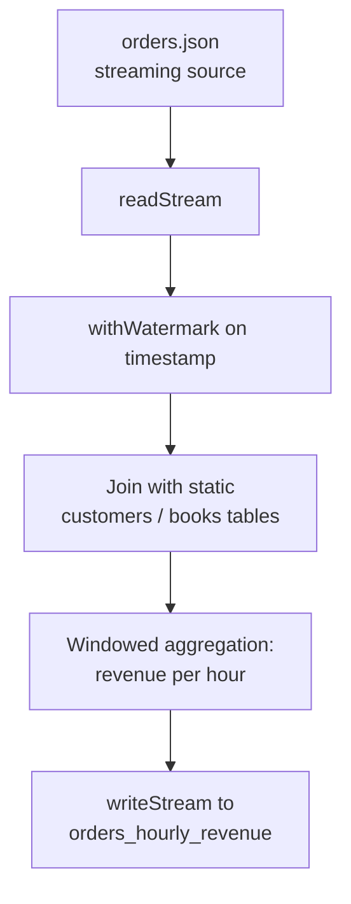

```python
from pyspark.sql.functions import window, sum as _sum, to_timestamp

# Static reference data — read normally, not as a stream
customers_df = spark.read.json("/Volumes/demoworkspace_new/default/my_volume/ecommerce/customers.json")
books_df = spark.read.json("/Volumes/demoworkspace_new/default/my_volume/ecommerce/books.json")

# Streaming source — orders_schema defined above in section 2
orders_stream_df = (spark.readStream
    .format("json")
    .schema(orders_schema)
    .load("/Volumes/demoworkspace_new/default/my_volume/ecommerce/orders.json")
    .withColumn("timestamp", to_timestamp("timestamp"))  # string -> real timestamp for windowing
    .withWatermark("timestamp", "10 minutes"))

# Join the stream against static customer data
enriched_df = orders_stream_df.join(customers_df, on="customer_id", how="inner")

# Windowed aggregation: total revenue per 1-hour window
hourly_revenue_df = (enriched_df
    .groupBy(window("timestamp", "1 hour"))
    .agg(_sum("total").alias("revenue")))

query = (hourly_revenue_df.writeStream
    .format("delta")
    .outputMode("update")
    .option("checkpointLocation", "/mnt/checkpoints/orders_hourly_revenue")
    .trigger(processingTime="1 minute")
    .table("orders_hourly_revenue"))
```

This example uses several pieces from above at once: the `orders_schema` defined in section 2, a cast from the JSON's string `timestamp` to a real `TimestampType` (required before `withWatermark`/`window` can use it), a watermark on that field (which is what makes the windowed aggregation and the stream-static join safe to run continuously), `outputMode("update")` since only changed windows need rewriting, and a dedicated checkpoint location distinct from the earlier `orders_stream` example.

## Summary

| Topic | Key Idea |
|---|---|
| Structured Streaming core | Treats a stream as an unbounded table; same DataFrame API as batch, run incrementally via micro-batches |
| Streaming read/write | `readStream`/`writeStream` replace `read`/`write`; write returns a long-running `StreamingQuery` |
| Trigger interval | Controls *when* micro-batches run: default, `processingTime`, `once`/`availableNow`, `continuous` |
| Output mode | Controls *what's* written: `append`, `complete`, `update` |
| Checkpointing | Persists progress for fault-tolerant restart; one dedicated location per query |
| Guarantees | Exactly-once requires both a replayable source and an idempotent sink |
| Unsupported operations | Anything requiring a "complete" view of unbounded data — chained aggregations, raw `limit`/`distinct`/`orderBy`, unbounded outer joins — unless bounded via watermarking or routed through `foreachBatch` |
