# The Transformer Architecture, In Depth: Encoder and Decoder

## Overview: Why the Transformer Exists

Before Transformers, sequence models (RNNs, LSTMs) processed tokens one at a time, in order — which made them slow to train (no parallelism across the sequence) and prone to losing information over long distances. The Transformer's core bet: replace recurrence entirely with **attention**, so every token can look directly at every other token, in parallel, regardless of distance.

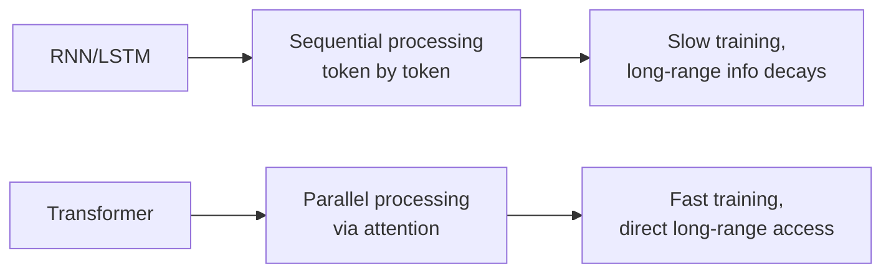

## The Full Architecture at a Glance

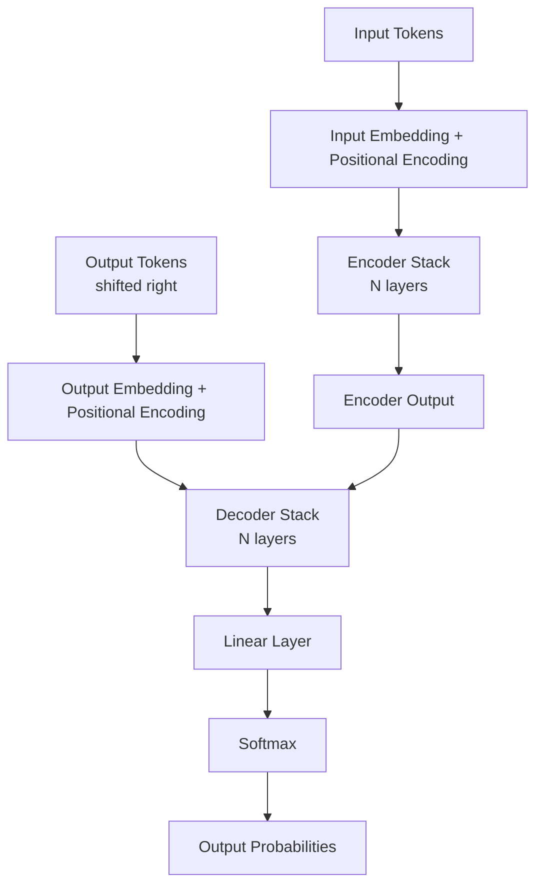

The original Transformer ("Attention Is All You Need") is an **encoder-decoder** architecture, built for sequence-to-sequence tasks like translation. Modern LLMs typically use only one half — GPT-style models use decoder-only, BERT-style models use encoder-only — but both are built from the same underlying blocks, so understanding the full architecture explains both.

## Step 1: Input Embedding and Positional Encoding (Shared by Both Sides)

### Embeddings

Each input token (a word or subword) is converted into a dense vector — a learned representation that captures meaning, not just an arbitrary ID.

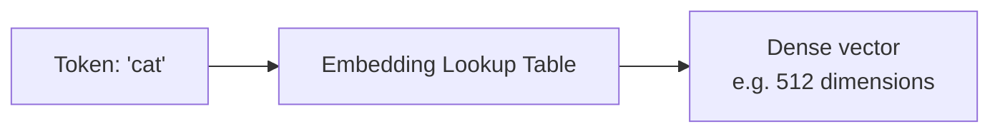

### Positional Encoding

Because attention has no inherent sense of order — it looks at all tokens simultaneously — the model needs a separate signal telling it *where* each token sits in the sequence.

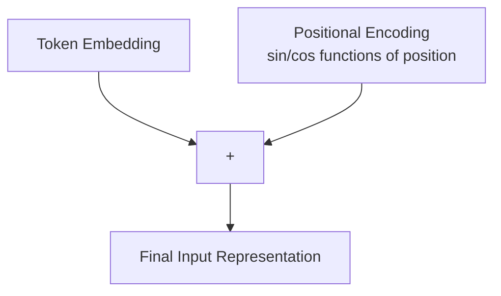

The original paper uses fixed sine and cosine functions at different frequencies for each position:

```
PE(pos, 2i)   = sin(pos / 10000^(2i/d_model))
PE(pos, 2i+1) = cos(pos / 10000^(2i/d_model))
```

This particular choice (sinusoidal, rather than a learned embedding) lets the model generalize to sequence lengths it didn't see during training, and gives it an easy way to learn *relative* positions, since `PE(pos+k)` can be expressed as a linear function of `PE(pos)`.

## Step 2: The Core Mechanism — Scaled Dot-Product Attention

Every attention block in the Transformer — encoder self-attention, decoder self-attention, and encoder-decoder cross-attention — uses the same underlying operation, just with different inputs.

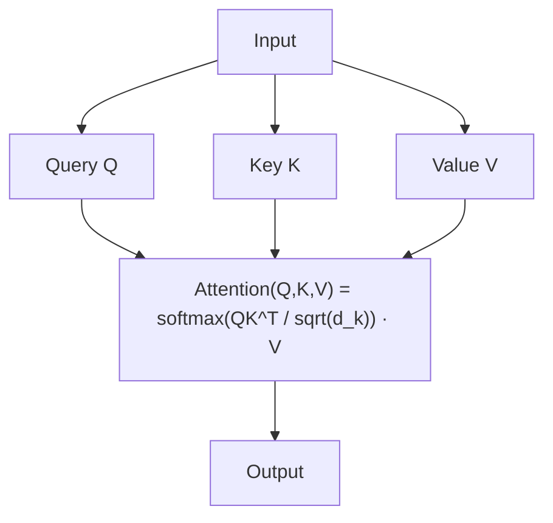

### The Intuition

- **Query (Q)** — "what am I looking for?" — a representation of the current token's information need
- **Key (K)** — "what do I contain?" — a representation each token exposes about itself
- **Value (V)** — "what do I actually contribute?" — the information passed along if attended to

The dot product `Q·K^T` measures how well each query matches each key (similarity), scaled down by `sqrt(d_k)` to keep gradients stable (large dot products push softmax into regions with tiny gradients), then passed through softmax to get attention weights that sum to 1, which are used to compute a weighted sum of the values.

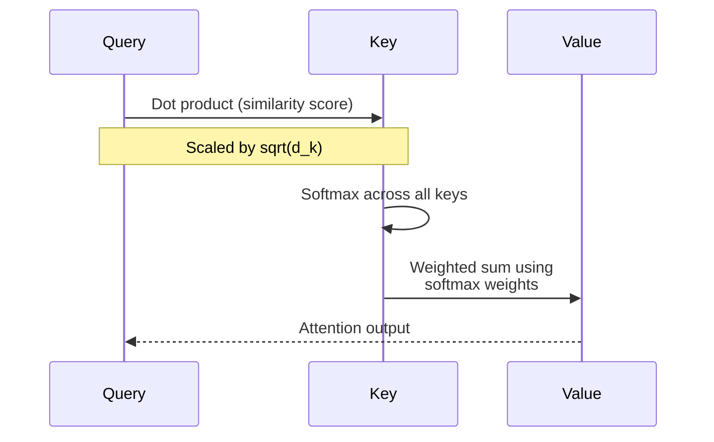

### Multi-Head Attention

Rather than computing attention once, the Transformer splits Q, K, V into multiple smaller "heads," runs attention in parallel across each, and concatenates the results.

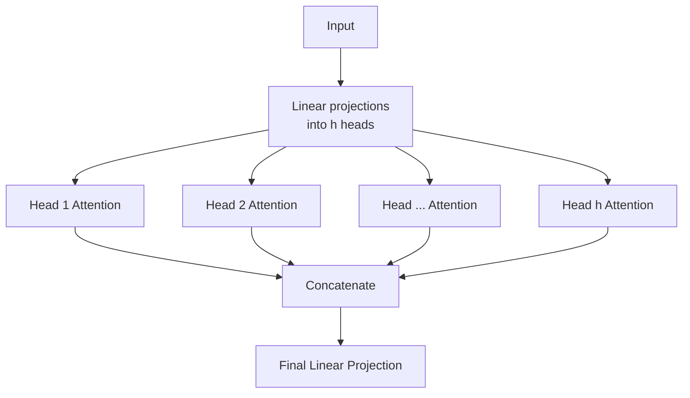

Each head can learn to focus on a different kind of relationship — one head might track syntactic dependencies, another might track coreference, another might track local word order — and multi-head attention lets the model capture all of these simultaneously rather than being forced into a single attention pattern.

## The Encoder Block

### Structure

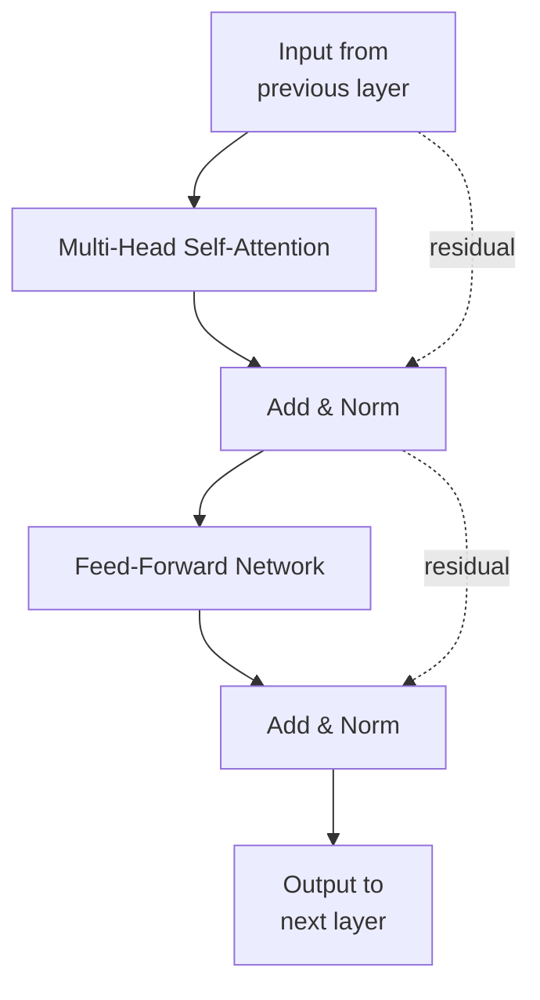

Each encoder layer has exactly two sub-layers: multi-head self-attention, then a position-wise feed-forward network — each wrapped with a residual connection and layer normalization.

### Self-Attention in the Encoder

"Self" means Q, K, and V all come from the *same* sequence — every token in the input attends to every other token in the input, including itself, with **no restrictions** on what it can see (unlike the decoder, covered below).

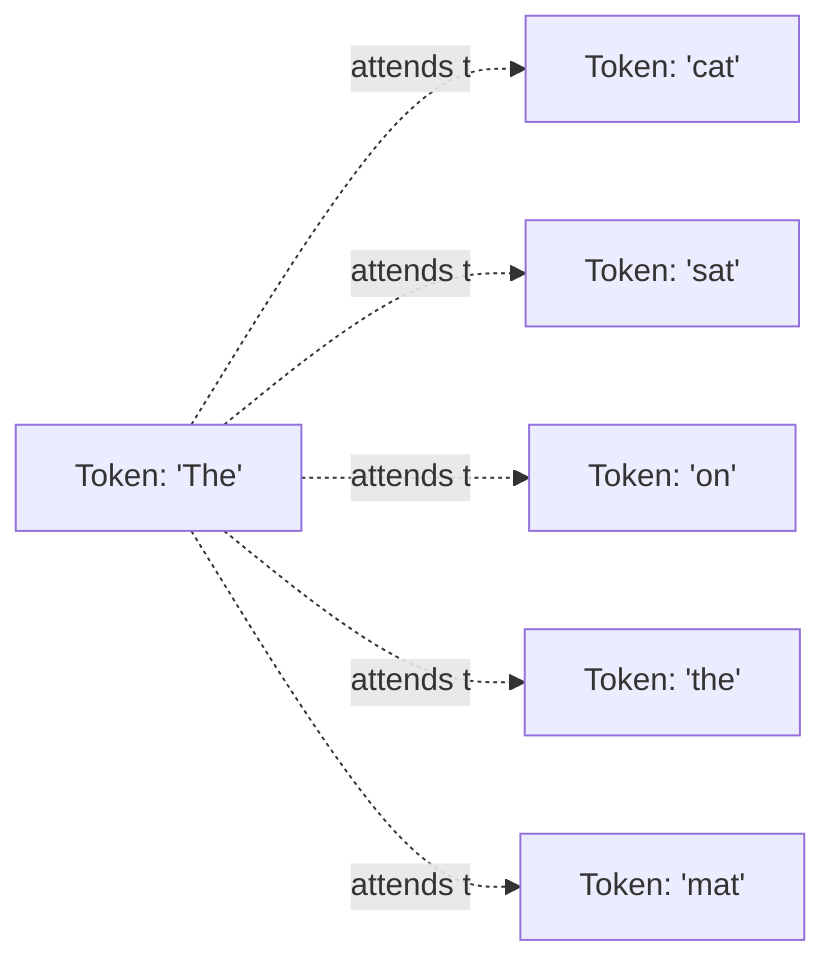

This is why encoders are well-suited to *understanding* tasks — classification, embedding generation — where the whole input is available at once and every part of it can inform every other part.

### Add & Norm (Residual Connection + Layer Normalization)

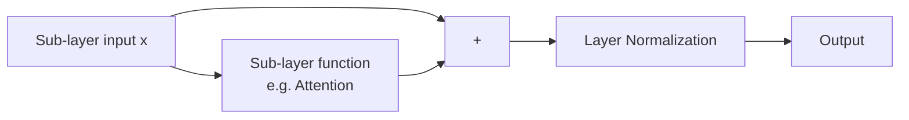

`LayerNorm(x + Sublayer(x))` — the residual connection (`x +`) lets gradients flow directly through the network during backpropagation, which is what makes it practical to stack many layers deep without vanishing gradients; layer normalization stabilizes the scale of activations at each layer.

### The Feed-Forward Network

A simple two-layer fully-connected network, applied identically and independently to each position:

```
FFN(x) = max(0, xW1 + b1)W2 + b2
```

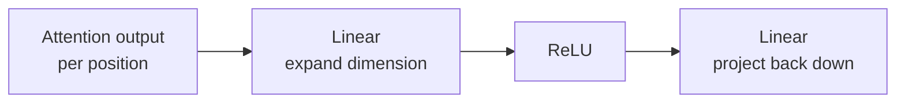

While attention lets tokens exchange information with each other, the feed-forward network processes each token's representation independently afterward — it's where a lot of the model's per-token "reasoning" capacity actually lives.

### Stacking Encoder Layers

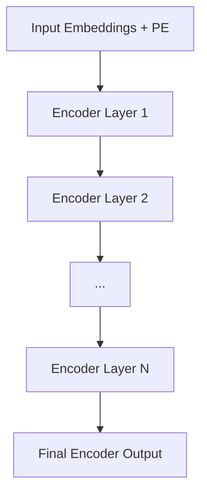

The original paper stacks 6 identical encoder layers (N=6); larger modern models stack far more. Each layer refines the representation further, building progressively richer contextual understanding of every token.

## The Decoder Block

### Structure

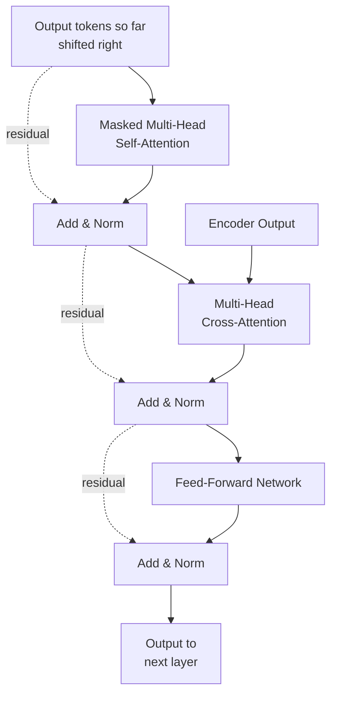

Each decoder layer has **three** sub-layers — one more than the encoder — because it needs to both attend to what it's generated so far *and* attend to the encoder's output.

### Masked Self-Attention

The decoder generates output tokens one at a time, left to right. At training time, it sees the full target sequence at once (for parallel training), but it must be prevented from "cheating" by looking at future tokens it hasn't generated yet.

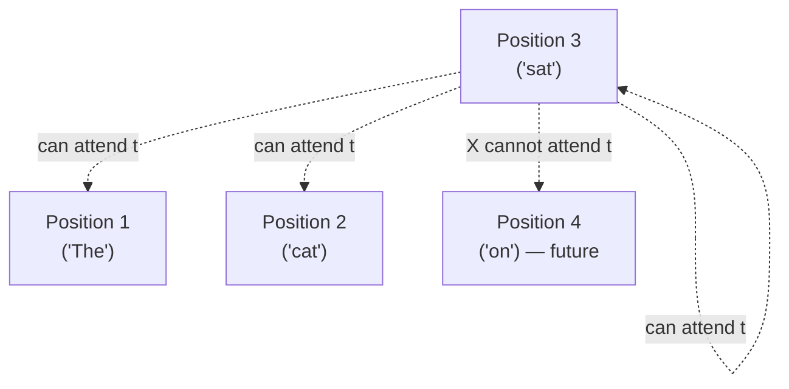

This is enforced with a **causal mask**: before the softmax step in attention, all positions corresponding to future tokens are set to `-infinity`, so after softmax their attention weight becomes exactly 0.

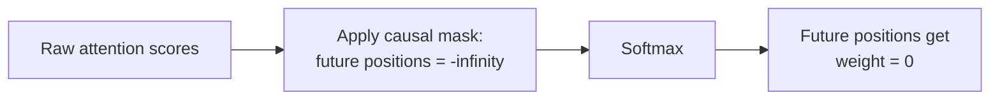

This single mechanism is what makes the decoder autoregressive — each position's output can only depend on positions at or before it, matching how generation actually works at inference time (you can't attend to a word you haven't generated yet).

### Cross-Attention (Encoder-Decoder Attention)

The second sub-layer is where the decoder actually consults the input sequence. Here, the **Query** comes from the decoder's own (masked self-attention) output, but the **Key and Value** come from the encoder's final output.

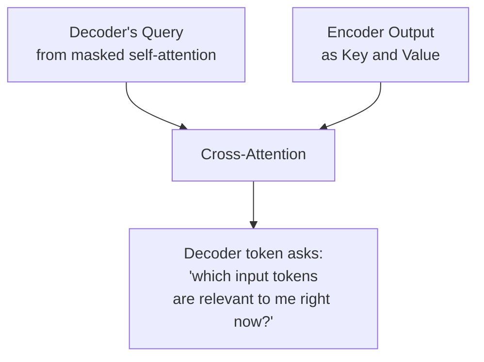

This is the mechanism that actually connects the two halves — without cross-attention, the decoder would be generating output with no knowledge of the input at all. In translation, this is where "the French word I'm generating now" learns to attend to "the relevant English words" from the source sentence.

### Feed-Forward Network and Add & Norm

Identical in structure and purpose to the encoder's version — a two-layer network applied per-position, wrapped in a residual connection and layer normalization.

### Stacking Decoder Layers

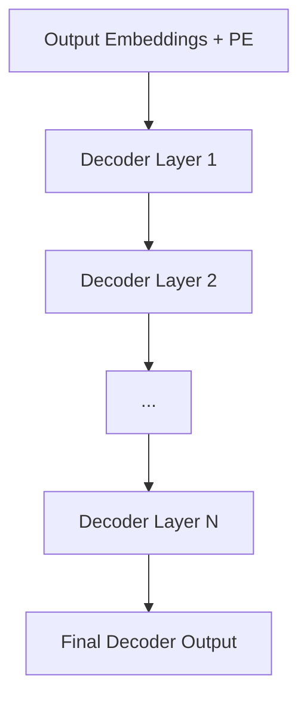

Every decoder layer performs cross-attention against the *same* final encoder output — the encoder runs once, and its output is reused by every decoder layer.

## Step 3: Final Output — Linear + Softmax

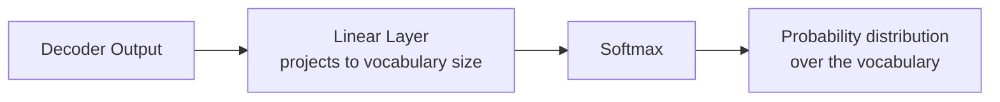

The decoder's final representation for each position is projected (via a linear layer) into a vector the size of the entire vocabulary, then softmax turns that into a probability distribution — the model's predicted next token. During generation, this happens one token at a time, with the newly generated token fed back in as part of the input for predicting the next one.

## Encoder vs. Decoder — Side-by-Side

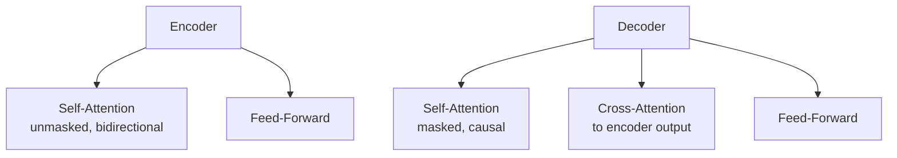

| | Encoder | Decoder |
|---|---|---|
| Sub-layers per block | 2 (self-attention, FFN) | 3 (masked self-attn, cross-attn, FFN) |
| Self-attention type | Unmasked — sees the whole input | Masked/causal — sees only past + present |
| Extra attention type | None | Cross-attention to encoder output |
| Typical use | Understanding tasks (classification, embeddings) — e.g. BERT | Generation tasks (autoregressive text generation) — e.g. GPT |
| Runs once or repeatedly at inference? | Once per input | Repeatedly, one token at a time |

## Why Modern LLMs Are Often Decoder-Only

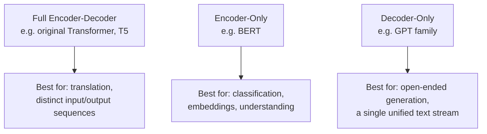

Most modern general-purpose LLMs (GPT-family models, and similar) use **decoder-only** architectures: there's no separate encoder, and the "input" (prompt) and "output" (completion) are just treated as one continuous sequence with causal masking throughout. This works well because a decoder-only model, with sufficiently causal self-attention, is already capable of "understanding" the prompt (through the tokens it can attend to) before generating a response — you don't strictly need a separate encoder pass to get that.

## Summary

- **Shared foundation:** token embeddings + positional encoding, and the same scaled dot-product attention mechanism used throughout
- **Encoder block:** unmasked self-attention (every token sees every other token) + feed-forward network, each wrapped in residual connections and layer norm; stacked N times; well-suited to understanding the full input at once
- **Decoder block:** masked/causal self-attention (only past + present) + cross-attention to the encoder's output + feed-forward network; stacked N times; built for autoregressive generation
- **Cross-attention** is the specific mechanism connecting the two halves — decoder queries, encoder keys/values
- **Final step:** linear projection to vocabulary size, then softmax, to produce the next-token probability distribution
