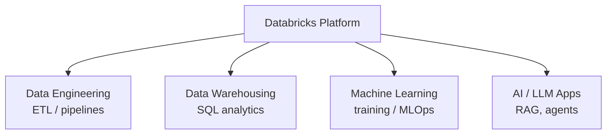
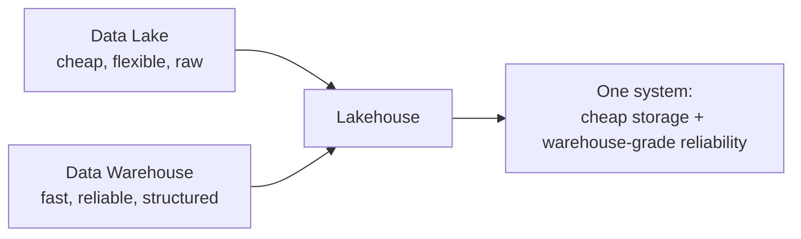
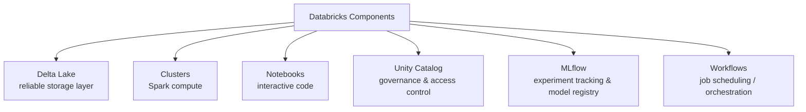
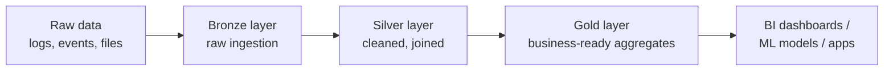

# What Is Databricks?

## Overview

Databricks is a unified data and AI platform built around Apache Spark, designed to handle data engineering, data warehousing, and machine learning in one place — rather than stitching together separate tools for each.

It was founded by the original creators of Apache Spark, and Spark remains the processing engine underneath most of what Databricks does.

## The Core Idea: The Lakehouse

Traditionally, companies ran two separate systems:

- **Data lakes** — cheap storage for raw, unstructured data, but poor query performance and no strong consistency guarantees
- **Data warehouses** — fast, structured, reliable for SQL analytics, but expensive and rigid about data format

Databricks' central architectural bet is the **lakehouse**: combine a data lake's cheap, flexible storage with a warehouse's reliability and query performance, in a single system.

This is made possible primarily by **Delta Lake**, an open-source storage layer that adds ACID transactions, schema enforcement, and versioning on top of plain files sitting in cloud storage (S3, ADLS, GCS).

## Key Building Blocks

| Component | What it does |
|---|---|
| **Delta Lake** | Adds transactional reliability, versioning, and schema enforcement to data stored as files |
| **Clusters** | Managed Spark compute — spin up and tear down as needed, so you pay for what you use |
| **Notebooks** | Interactive environment (Python, SQL, Scala, R) for exploration and pipeline development |
| **Unity Catalog** | Centralized governance — who can access which tables, columns, and models, across the whole platform |
| **MLflow** | Tracks ML experiments, versions models, and manages the path from training to deployment |
| **Workflows** | Schedules and orchestrates jobs — the pipeline equivalent of a cron system, built in |

## A Typical Data Flow

This "bronze/silver/gold" pattern (called the **medallion architecture**) is a common convention on Databricks: each layer refines the data further, with Delta Lake ensuring every stage has reliable, versioned, query-ready tables — not just loose files.

## Why It Matters

- **One platform, fewer handoffs** — the same data doesn't need to be copied between a lake, a warehouse, and a separate ML platform
- **Open formats** — Delta Lake is open-source; data isn't locked into a proprietary format the way some warehouses require
- **Elastic compute** — clusters scale up for heavy jobs and shut down when idle, rather than paying for a warehouse running 24/7
- **Collaboration** — data engineers, analysts, and ML engineers work in the same notebooks/environment instead of separate siloed tools

## How It Compares

| | Traditional Data Warehouse (e.g. Snowflake) | Traditional Data Lake | Databricks (Lakehouse) |
|---|---|---|---|
| Storage format | Proprietary | Open (files) | Open (Delta Lake) |
| Query performance | High | Lower | High (via Delta + caching) |
| ML/AI support | Limited/bolted-on | Manual | Native (MLflow, notebooks) |
| Cost model | Often always-on | Storage-cheap | Elastic compute, pay-as-used |

## Summary

Databricks' core pitch is that data engineering, analytics, and ML shouldn't require three separate systems and three copies of your data. The lakehouse architecture — cheap, open storage (Delta Lake) plus warehouse-grade reliability and performance — is the technical bet that makes combining them practical, with Spark as the processing engine underneath it all.
